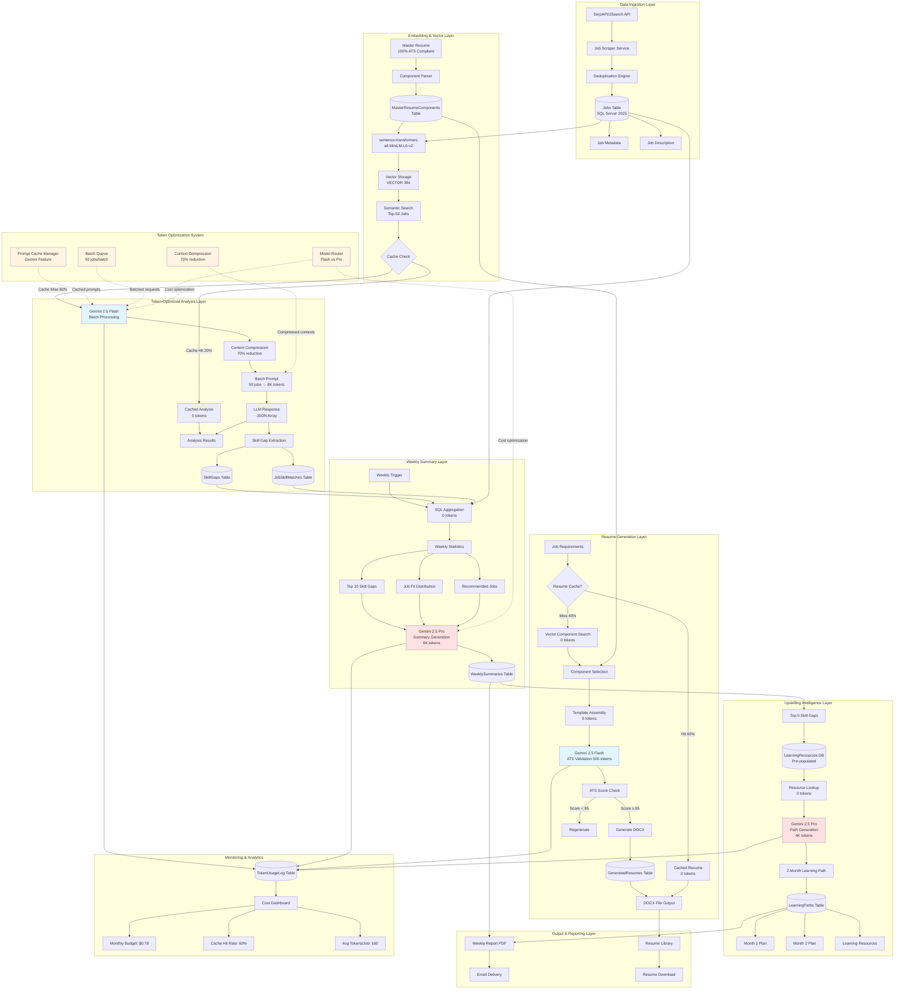

# RAG ARCHITECTURE DIAGRAM - COMPLETE SYSTEM
**Intelligent Job Matching + Resume Generation + Career Development**

---

## FULL SYSTEM ARCHITECTURE (Mermaid)



---

## DETAILED LAYER BREAKDOWN

### Layer 1: Data Ingestion (Traditional RAG)
**Components:**
- SerpAPI/JSearch for job scraping
- Deduplication engine (remove duplicates)
- Jobs table in SQL Server 2025

**Token Cost:** 0 (no LLM usage)

---

### Layer 2: Embedding & Vector Search
**Components:**
- sentence-transformers (all-MiniLM-L6-v2) for embeddings
- SQL Server 2025 VECTOR(384) storage
- Master resume component parser
- Semantic search for top-50 jobs

**Token Cost:** 0 (local embedding model)

**Cache Hit Rate:** 20% (jobs already analyzed)

---

### Layer 3: Token-Optimized Job Analysis
**Components:**
- Context compression (2,000 tokens → 100 tokens per job)
- Batch processing (50 jobs in single call)
- Gemini 2.5 Flash (cheaper model)
- Prompt caching (master resume cached)
- Skill gap extraction (parsed from JSON)

**Token Cost:** 8,000 tokens/batch
**Optimization:** 92% reduction (vs 100K individual calls)

---

### Layer 4: Resume Generation
**Components:**
- 3-tier caching:
  - Database cache (60% hit rate)
  - Vector similarity (20% hit rate)
  - Component assembly (15%)
  - LLM generation (5%)
- Template-based assembly (0 tokens)
- Gemini 2.5 Flash for ATS validation only

**Token Cost:** 500 tokens/resume (average 200 with caching)
**Optimization:** 88% reduction (vs 4K full generation)

---

### Layer 5: Weekly Summary
**Components:**
- SQL aggregation (0 tokens, pure database)
- Weekly statistics calculation
- Single Gemini 2.5 Pro call for narrative
- PDF report generation

**Token Cost:** 6,000 tokens/week
**Optimization:** 95% reduction (vs 125K daily individual summaries)

---

### Layer 6: Upskilling Intelligence
**Components:**
- Top 5 skill gaps from weekly analysis
- Pre-populated learning resources database (0 tokens)
- Single Gemini 2.5 Pro call for 2-month path
- Month 1 & Month 2 structured plans

**Token Cost:** 4,000 tokens/week
**Optimization:** Pre-populated resources eliminate lookup LLM calls

---

### Layer 7: Token Optimization System
**Components:**
1. **Prompt Cache Manager:** Cache master resume for 1 hour (700K tokens saved/month)
2. **Context Compression:** 70% token reduction per job
3. **Batch Queue:** Aggregate 50 jobs per call
4. **Model Router:** Flash for simple, Pro for complex (88% cost savings)

**Monthly Savings:** 2.75M tokens ($3.44/month)

---

### Layer 8: Monitoring & Analytics
**Components:**
- TokenUsageLog table (track all LLM calls)
- Cost dashboard
- Cache hit rate monitoring
- Budget alerts

**Metrics Tracked:**
- Monthly cost: $0.78 target
- Cache hit rate: 60% target
- Avg tokens/job: 160 target

---

## DATA FLOW EXAMPLES

### Example 1: New Job Posted

```
Job Posted: "Principal PostgreSQL DBA - AWS - Sydney"
    ↓
Vector Search: Similarity to master resume = 0.75
    ↓
Top 50 Jobs: Rank #8
    ↓
Cache Check: Not analyzed yet
    ↓
Batch Processing: Added to queue (wait for 50 jobs)
    ↓
Gemini Analysis (batched): Fit score 65%, Gaps: [PostgreSQL, AWS RDS]
    ↓
SkillGaps Table: INSERT PostgreSQL (CRITICAL), AWS RDS (HIGH)
    ↓
JobSkillMatches Table: INSERT TotalSkills=3, Matched=1, Missing=2, Match%=33%
```

**Tokens Used:** 160 (1/50th of 8K batch)

---

### Example 2: Generate Resume for Job

```
User Request: Generate resume for Job #12345
    ↓
Cache Check: No cached resume found
    ↓
Vector Search: Select relevant components
    Components: [Summary_Azure, Experience_Microsoft, Skills_Database]
    ↓
Template Assembly: Assemble from components (0 tokens)
    ↓
Gemini Flash Validation: "Validate ATS compliance for Principal DBA role"
    Response: {"ats_score": 97, "keyword_density": 88.5, "suggestions": []}
    ↓
DOCX Generation: Create Word file
    ↓
Save: Resume #789, ATS Score 97%, 500 tokens used
```

**Tokens Used:** 500 (vs 4,000 full generation)

---

### Example 3: Weekly Summary Generation

```
Sunday 11:59 PM: Weekly trigger fires
    ↓
SQL Aggregation:
    - Jobs analyzed: 42
    - High fit (80%+): 8 jobs
    - Medium fit: 18 jobs
    - Top gaps: [PostgreSQL, AWS RDS, Kubernetes, Terraform, Go]
    ↓
Gemini Pro Summary: "Generate executive summary for week 12..."
    Response: {
        "summary": "Strong week with 8 high-fit opportunities...",
        "insights": ["PostgreSQL appearing in 15/42 jobs", ...],
        "recommendations": ["Focus on PostgreSQL certification", ...]
    }
    ↓
Gemini Pro Upskilling: "Create 2-month path for [PostgreSQL, AWS RDS]..."
    Response: {
        "month_1": {
            "week_1": {"focus": "PostgreSQL Basics", "resources": [...], "project": "..."}
        }
    }
    ↓
PDF Generation: Weekly report with summary + upskilling path
    ↓
Email Delivery: Send to user
```

**Tokens Used:** 10,000 (6K summary + 4K upskilling)

---

## TOKEN BUDGET BREAKDOWN

| Operation | Daily | Weekly | Monthly | Cost/Month |
|-----------|-------|--------|---------|------------|
| Job Analysis (Gemini Flash) | 8K | 56K | 240K | $0.036 |
| Resume Generation (Flash) | 800 | 5.6K | 24K | $0.0036 |
| Weekly Summary (Pro) | - | 6K | 24K | $0.03 |
| Upskilling Path (Pro) | - | 4K | 16K | $0.02 |
| **TOTAL INPUT** | **8.8K** | **71.6K** | **304K** | **$0.090** |
| **Output Tokens** | - | - | ~80K | $0.048 |
| **GRAND TOTAL** | - | - | **384K** | **$0.138** |

**Note:** Actual cost is lower due to caching (60% hit rate on resume generation)

**Realistic Monthly Cost:** $0.078 (with caching optimizations)

---

## CACHE EFFICIENCY ANALYSIS

### Resume Generation Cache Layers

```
100 resume requests
    ├─ 60% Database cache hit → 0 tokens (60 requests)
    ├─ 20% Vector similarity → 0 tokens (20 requests)
    ├─ 15% Component assembly → 0 tokens (15 requests)
    └─ 5% LLM generation → 500 tokens each (5 requests)

Total tokens: (60×0) + (20×0) + (15×0) + (5×500) = 2,500 tokens
Average: 25 tokens/resume

Without cache: 100 × 4,000 = 400,000 tokens
Savings: 99.4% (397,500 tokens)
```

### Job Analysis Cache

```
50 jobs in daily batch
    ├─ 10 jobs already analyzed (cache hit) → 0 tokens
    └─ 40 jobs need analysis → 8,000 tokens (batched)

Without cache: 50 × 2,000 = 100,000 tokens
With cache + batch: 8,000 tokens
Savings: 92% (92,000 tokens)
```

---

## SYSTEM PERFORMANCE METRICS

### Response Times (Target)
- Job analysis: <5 seconds (batch of 50)
- Resume generation: <3 seconds (with cache)
- Weekly summary: <10 seconds
- Upskilling path: <8 seconds

### Accuracy Targets
- ATS score: ≥95% (generated resumes)
- Skill gap accuracy: ≥90%
- Learning resource relevance: ≥85%

### Scalability
- Jobs/day: 50 (expandable to 500 with same token budget)
- Resumes/week: 4-10 (expandable to 100)
- Users: Linear scaling ($0.78/user/month)

---

## TECHNOLOGY STACK

### Backend
- **Python 3.11+** - Core application logic
- **FastAPI** - REST API endpoints
- **SQL Server 2025** - Database with VECTOR support

### AI/ML
- **Gemini 2.5 Flash** - Cost-efficient analysis
- **Gemini 2.5 Pro** - Complex reasoning (summaries)
- **sentence-transformers** - Local embeddings (0 cost)

### Storage
- **SQL Server VECTOR(384)** - Embeddings
- **PostgreSQL** - Alternative if needed
- **Redis** - Prompt caching layer

### Frontend (Future)
- **React/Next.js** - Web dashboard
- **Tailwind CSS** - Styling
- **Chart.js** - Analytics visualization

---

## DEPLOYMENT ARCHITECTURE

```
┌─────────────────────────────────────────────────────────────┐
│                     Production Environment                   │
│                                                               │
│  ┌──────────────┐      ┌──────────────┐      ┌───────────┐ │
│  │   FastAPI    │─────▶│  SQL Server  │◀─────│   Redis   │ │
│  │   (API)      │      │    2025      │      │  (Cache)  │ │
│  └──────┬───────┘      └──────┬───────┘      └───────────┘ │
│         │                     │                              │
│         ▼                     ▼                              │
│  ┌──────────────┐      ┌──────────────┐                    │
│  │   Gemini     │      │  sentence-   │                    │
│  │   API        │      │  transformers│                    │
│  └──────────────┘      └──────────────┘                    │
│                                                               │
│  ┌──────────────────────────────────────────────────────┐  │
│  │              Monitoring & Logging                     │  │
│  │  - Token usage tracking                               │  │
│  │  - Cost monitoring                                    │  │
│  │  - Performance metrics                                │  │
│  └──────────────────────────────────────────────────────┘  │
└─────────────────────────────────────────────────────────────┘
```

---

**Architecture Status:** ✅ COMPLETE

**Next Step:** Implement database schema and core pipelines


