# RAG JOB SEARCH SYSTEM - DATA FLOW DIAGRAMS (DFD)
## Mermaid Diagram Collection

---

## HOW TO USE THESE DIAGRAMS

**Rendering Options:**

1. **VS Code** - Install "Markdown Preview Mermaid Support" extension
2. **GitHub/GitLab** - Paste into README.md (auto-renders)
3. **Mermaid Live Editor** - https://mermaid.live/ (copy-paste code)
4. **Obsidian** - Enable Mermaid plugin
5. **Confluence** - Use Mermaid macro

**To render:**
- Open this file in VS Code with Mermaid extension
- Or copy any diagram block to https://mermaid.live/
- Export as PNG/SVG for documentation

---

## DIAGRAM 1: LEVEL 0 DFD (CONTEXT DIAGRAM)
### High-Level System Overview

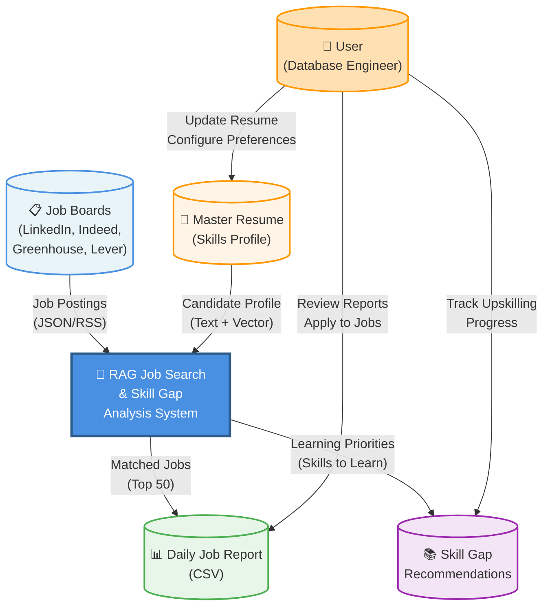

**Description:**
- **External Entities:** Job boards (data sources) and User (job seeker)
- **Process:** RAG system that matches jobs to candidate profile
- **Data Stores:** Master resume with candidate skills
- **Outputs:** Daily matched job reports and skill gap analysis

---

## DIAGRAM 2: LEVEL 1 DFD (DETAILED SYSTEM)
### Component-Level Data Flows

```mermaid
flowchart TB
    %% External Sources
    subgraph Sources["📡 Data Sources"]
        JSearch["JSearch API<br/>(LinkedIn, Indeed)"]
        Greenhouse["Greenhouse API<br/>(Tech Jobs)"]
        Lever["Lever API<br/>(Startups)"]
        RSS["RSS Feeds<br/>(WWR, Remotive)"]
    end

    %% Process 1: Data Ingestion
    subgraph P1["🔄 Process 1: Data Ingestion"]
        Fetch["1.1 Fetch Jobs<br/>(Python ETL)"]
        Clean["1.2 Clean & Normalize<br/>(Data Quality)"]
        Dedupe["1.3 Deduplicate<br/>(Hash Matching)"]
    end

    %% Data Store 1: Raw Jobs
    DS1[("D1: Raw Jobs<br/>(SQL Server)")]

    %% Process 2: Embedding Generation
    subgraph P2["🧠 Process 2: Vectorization"]
        LoadModel["2.1 Load Model<br/>(all-MiniLM-L6-v2)"]
        GenEmbed["2.2 Generate Embeddings<br/>(384 dimensions)"]
        StoreVec["2.3 Store Vectors<br/>(VECTOR type)"]
    end

    %% Data Store 2: Vector Jobs
    DS2[("D2: Jobs<br/>with Vectors<br/>(SQL Server)")]

    %% Data Store 3: Master Resume
    DS3[("D3: Master Resume<br/>+ Vector<br/>(SQL Server)")]

    %% Process 3: Semantic Search
    subgraph P3["🔍 Process 3: Semantic Search"]
        GetResume["3.1 Get Resume Vector<br/>(Query D3)"]
        CalcSim["3.2 Calculate Similarity<br/>(VECTOR_DISTANCE)"]
        Rank["3.3 Rank Jobs<br/>(Top 50)"]
    end

    %% Data Store 4: Job Matches
    DS4[("D4: Job Matches<br/>+ Similarity Scores<br/>(SQL Server)")]

    %% Process 4: AI Analysis
    subgraph P4["🤖 Process 4: LLM Analysis"]
        BuildPrompt["4.1 Build Prompt<br/>(Job + Resume)"]
        CallGemini["4.2 Call Gemini API<br/>(Skill Gap Analysis)"]
        ParseJSON["4.3 Parse Response<br/>(Structured Output)"]
    end

    %% Data Store 5: Analysis Results
    DS5[("D5: Analysis Results<br/>(Fit Scores + Skills)<br/>(SQL Server)")]

    %% Process 5: Report Generation
    subgraph P5["📊 Process 5: Reporting"]
        GenCSV["5.1 Generate CSV<br/>(Pandas)"]
        Prioritize["5.2 Prioritize Skills<br/>(Learning Roadmap)"]
        Notify["5.3 Notify User<br/>(Email/Dashboard)"]
    end

    %% Output
    Output[("📈 Daily Reports<br/>(CSV Files)")]

    %% User
    User[("👤 User")]

    %% Data Flows
    JSearch --> Fetch
    Greenhouse --> Fetch
    Lever --> Fetch
    RSS --> Fetch

    Fetch --> Clean
    Clean --> Dedupe
    Dedupe --> DS1

    DS1 --> LoadModel
    LoadModel --> GenEmbed
    GenEmbed --> StoreVec
    StoreVec --> DS2

    DS3 --> GetResume
    DS2 --> CalcSim
    GetResume --> CalcSim
    CalcSim --> Rank
    Rank --> DS4

    DS4 --> BuildPrompt
    DS3 --> BuildPrompt
    BuildPrompt --> CallGemini
    CallGemini --> ParseJSON
    ParseJSON --> DS5

    DS5 --> GenCSV
    GenCSV --> Prioritize
    Prioritize --> Notify
    Notify --> Output

    User -->|Update Resume| DS3
    Output --> User

    %% Styling
    style P1 fill:#E3F2FD,stroke:#1976D2,stroke-width:2px
    style P2 fill:#F3E5F5,stroke:#7B1FA2,stroke-width:2px
    style P3 fill:#E8F5E9,stroke:#388E3C,stroke-width:2px
    style P4 fill:#FFF3E0,stroke:#F57C00,stroke-width:2px
    style P5 fill:#FCE4EC,stroke:#C2185B,stroke-width:2px
    style Sources fill:#ECEFF1,stroke:#607D8B,stroke-width:2px
```

**Description:**
- **Process 1:** ETL pipeline fetching jobs from multiple sources
- **Process 2:** Embedding generation using sentence-transformers
- **Process 3:** Vector similarity search in SQL Server
- **Process 4:** LLM-based skill gap analysis via Gemini API
- **Process 5:** CSV report generation with learning priorities

---

## DIAGRAM 3: SYSTEM ARCHITECTURE
### Component & Technology Stack

```mermaid
graph TB
    %% Layer 1: Data Sources
    subgraph L1["Layer 1: Data Ingestion"]
        API1["JSearch API<br/>(RapidAPI)"]
        API2["Greenhouse API"]
        API3["Lever API"]
        API4["RSS Parser<br/>(feedparser)"]
    end

    %% Layer 2: ETL Processing
    subgraph L2["Layer 2: Python ETL Pipeline"]
        ETL["ETL Engine<br/>(requests, bs4)"]
        Valid["Data Validation<br/>(JSON Schema)"]
        Cache["Response Cache<br/>(File System)"]
    end

    %% Layer 3: Embedding
    subgraph L3["Layer 3: Vector Embedding"]
        Model["sentence-transformers<br/>(all-MiniLM-L6-v2)"]
        Batch["Batch Processor<br/>(32 jobs/batch)"]
    end

    %% Layer 4: Storage
    subgraph L4["Layer 4: SQL Server 2025"]
        Jobs[("Jobs Table<br/>VECTOR(384)")]
        Resume[("Master Resume<br/>VECTOR(384)")]
        Matches[("Job Matches<br/>Similarity Scores)")]
    end

    %% Layer 5: Semantic Search
    subgraph L5["Layer 5: Vector Search"]
        Query["T-SQL Query<br/>(VECTOR_DISTANCE)"]
        Index["Vector Index<br/>(Performance)"]
    end

    %% Layer 6: AI Analysis
    subgraph L6["Layer 6: LLM Integration"]
        Gemini["Gemini 2.5 Pro<br/>(Google AI Studio)"]
        Schema["Structured Output<br/>(JSON Schema)"]
    end

    %% Layer 7: Output
    subgraph L7["Layer 7: Reporting"]
        CSV["CSV Generator<br/>(Pandas)"]
        Email["Email Notifier<br/>(Optional)"]
    end

    %% User Interface
    UI["👤 User<br/>(Review & Apply)"]

    %% Data Flow
    L1 --> ETL
    ETL --> Valid
    Valid --> Cache
    Cache --> Model
    Model --> Batch
    Batch --> Jobs

    Resume --> Query
    Jobs --> Query
    Query --> Index
    Index --> Matches

    Matches --> Gemini
    Resume --> Gemini
    Gemini --> Schema
    Schema --> CSV
    CSV --> Email
    Email --> UI

    %% Reverse Flows
    UI -.->|Update Profile| Resume

    %% Styling
    style L1 fill:#E3F2FD,stroke:#1976D2,stroke-width:2px
    style L2 fill:#F3E5F5,stroke:#7B1FA2,stroke-width:2px
    style L3 fill:#E8F5E9,stroke:#388E3C,stroke-width:2px
    style L4 fill:#FFF3E0,stroke:#F57C00,stroke-width:2px
    style L5 fill:#FCE4EC,stroke:#C2185B,stroke-width:2px
    style L6 fill:#FFF9C4,stroke:#F9A825,stroke-width:2px
    style L7 fill:#E0F2F1,stroke:#00897B,stroke-width:2px
```

**Description:**
- **7 Layers:** From data ingestion to final reporting
- **Technologies:** Python, SQL Server 2025, sentence-transformers, Gemini API
- **Data Flow:** Jobs → Embeddings → Vector Search → LLM Analysis → Reports

---

## DIAGRAM 4: SEQUENCE DIAGRAM
### Daily Pipeline Execution Flow

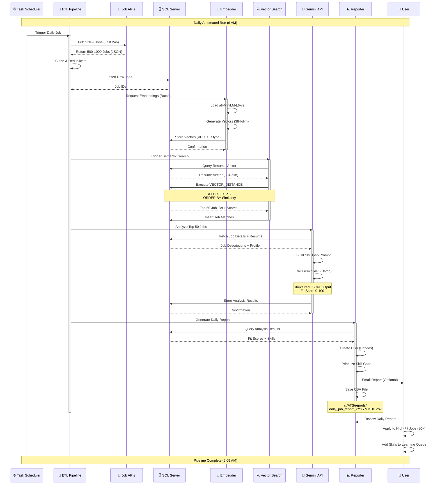

**Description:**
- **Timeline:** Automated daily run (5-minute execution)
- **Sequence:** Fetch → Embed → Search → Analyze → Report
- **Outcome:** User receives daily CSV with top-matched jobs

---

## DIAGRAM 5: DATA MODEL (ER DIAGRAM)
### SQL Server Database Schema

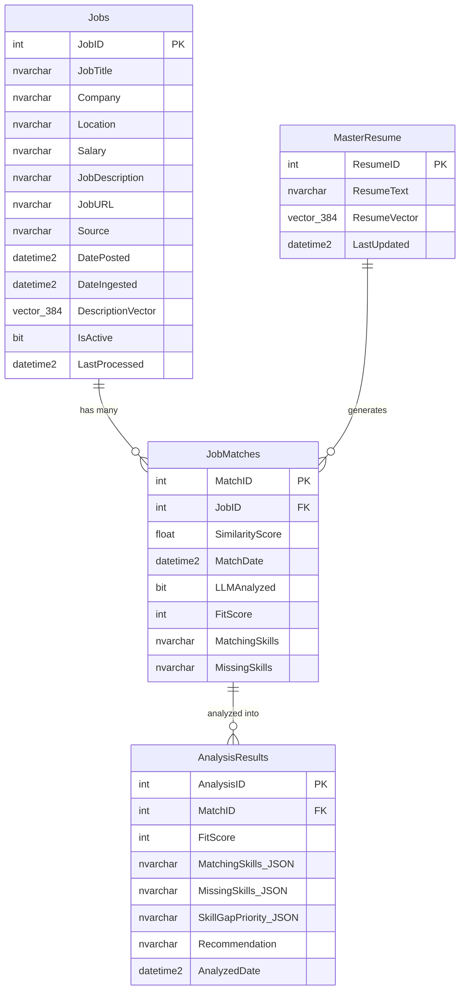

**Description:**
- **Jobs:** Stores job postings with 384-dim vectors
- **MasterResume:** Stores candidate profile with vector
- **JobMatches:** Links jobs to resume with similarity scores
- **AnalysisResults:** Stores Gemini LLM analysis output

---

## DIAGRAM 6: DEPLOYMENT ARCHITECTURE
### System Infrastructure

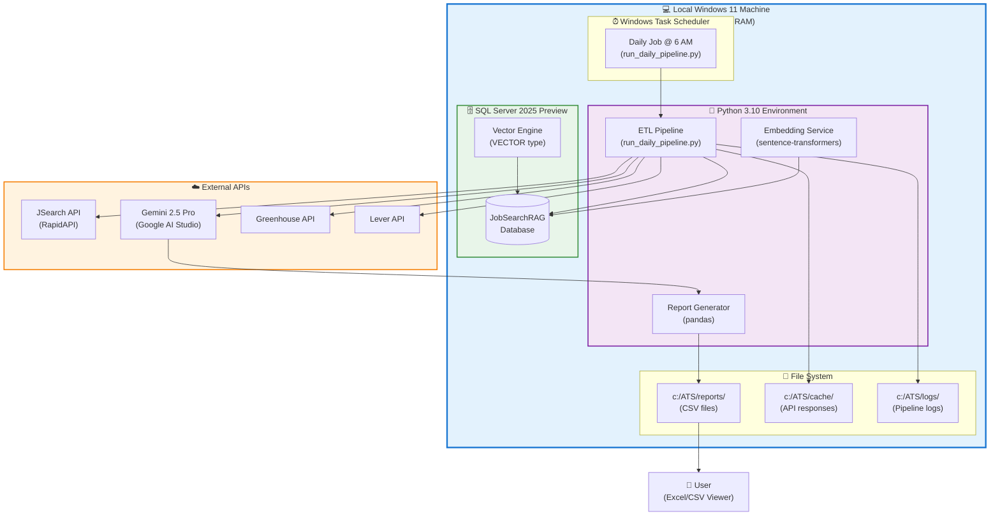

**Description:**
- **Local Deployment:** All processing runs on Windows 11 machine
- **External Dependencies:** Only API calls (JSearch, Gemini)
- **Automation:** Windows Task Scheduler triggers daily pipeline
- **Output:** CSV reports saved to local file system

---

## DIAGRAM 7: SKILL GAP ANALYSIS FLOW
### LLM Processing Details

```mermaid
flowchart TB
    Start([Start: Top 50 Jobs<br/>from Vector Search])

    %% Input Preparation
    LoadResume["Load Candidate Fact Base<br/>(verified database, AI/ML, and SQL evidence)"]
    LoadJobs["Load Job Details<br/>(Title, Desc, Salary)"]

    %% Prompt Engineering
    BuildPrompt["Build Structured Prompt:<br/>• Job Requirements<br/>• Candidate Profile<br/>• Similarity Score"]

    %% LLM Call
    CallGemini{"Call Gemini API<br/>(JSON Schema)"}

    %% Analysis Components
    subgraph Analysis["🤖 Gemini Analysis"]
        CalcFit["Calculate Fit Score<br/>(0-100)"]
        MatchSkills["Identify Matching Skills<br/>(Query Store, APRC, AI/ML)"]
        GapSkills["Identify Missing Skills<br/>(Kubernetes, Terraform, etc.)"]
        Priority["Prioritize Skill Gaps<br/>(Critical, High, Medium, Low)"]
        Resources["Suggest Learning Resources<br/>(Courses, Docs, Certs)"]
    end

    %% Decision
    Decision{"Fit Score?"}

    %% Recommendations
    ApplyNow["Recommendation:<br/>APPLY NOW<br/>(Score: 80-100)"]
    LearnFirst["Recommendation:<br/>LEARN SKILLS FIRST<br/>(Score: 60-79)"]
    NotFit["Recommendation:<br/>NOT A GOOD FIT<br/>(Score: 0-59)"]

    %% Output
    SaveResults[("Save to Database<br/>(JobMatches table)")]

    NextJob{More Jobs?}

    End([Generate CSV Report])

    %% Flow
    Start --> LoadResume
    Start --> LoadJobs
    LoadResume --> BuildPrompt
    LoadJobs --> BuildPrompt

    BuildPrompt --> CallGemini

    CallGemini --> Analysis

    Analysis --> CalcFit
    CalcFit --> MatchSkills
    MatchSkills --> GapSkills
    GapSkills --> Priority
    Priority --> Resources

    Resources --> Decision

    Decision -->|"80-100"| ApplyNow
    Decision -->|"60-79"| LearnFirst
    Decision -->|"0-59"| NotFit

    ApplyNow --> SaveResults
    LearnFirst --> SaveResults
    NotFit --> SaveResults

    SaveResults --> NextJob

    NextJob -->|Yes| LoadJobs
    NextJob -->|No (All 50 Done)| End

    %% Styling
    style Start fill:#4CAF50,stroke:#2E7D32,stroke-width:2px,color:#fff
    style End fill:#4CAF50,stroke:#2E7D32,stroke-width:2px,color:#fff
    style Analysis fill:#FFF3E0,stroke:#F57C00,stroke-width:2px
    style ApplyNow fill:#C8E6C9,stroke:#4CAF50,stroke-width:2px
    style LearnFirst fill:#FFF9C4,stroke:#FBC02D,stroke-width:2px
    style NotFit fill:#FFCDD2,stroke:#E53935,stroke-width:2px
    style CallGemini fill:#E1BEE7,stroke:#8E24AA,stroke-width:2px
```

**Description:**
- **Input:** Top 50 jobs from vector search + master resume
- **Process:** Gemini API analyzes each job for fit score and skill gaps
- **Output:** Categorized recommendations (Apply Now / Learn First / Not a Fit)
- **Result:** Structured data saved to database for reporting

---

## DIAGRAM 8: VECTOR SIMILARITY SEARCH
### SQL Server 2025 Vector Operations

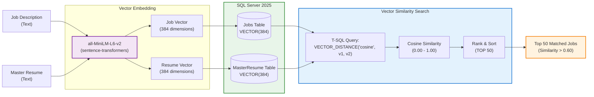

**Description:**
- **Embedding:** Convert text to 384-dim vectors using all-MiniLM-L6-v2
- **Storage:** Store vectors in SQL Server 2025 VECTOR(384) columns
- **Search:** Calculate cosine similarity using VECTOR_DISTANCE function
- **Output:** Top 50 jobs ranked by semantic similarity

---

## DIAGRAM 9: ERROR HANDLING & RETRY LOGIC
### Pipeline Resilience

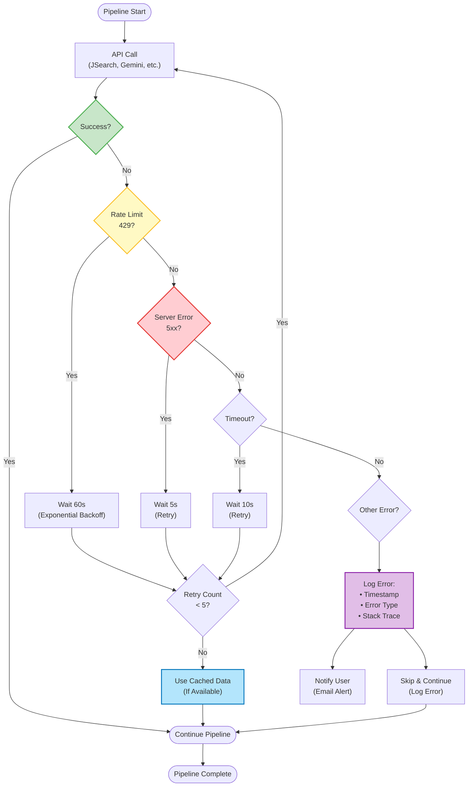

**Description:**
- **Error Detection:** Classify errors (rate limit, server error, timeout)
- **Retry Strategy:** Exponential backoff with max 5 retries
- **Fallback:** Use cached data when available
- **Logging:** Comprehensive error tracking for debugging
- **Notification:** Alert user on critical failures

---

## DIAGRAM 10: DAILY WORKFLOW
### User Interaction Flow

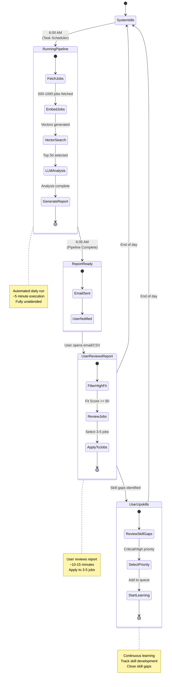

**Description:**
- **6:00 AM:** Automated pipeline runs (5 minutes)
- **6:05 AM:** User receives email notification
- **Morning:** User reviews report, applies to high-fit jobs (80+)
- **Ongoing:** User tracks skill gaps and upskills
- **Next Day:** Process repeats

---

## QUICK REFERENCE TABLE

| Diagram | Use Case | View In |
|---------|----------|---------|
| **Level 0 DFD** | High-level system overview for stakeholders | Presentations |
| **Level 1 DFD** | Detailed process flows for developers | Technical docs |
| **Architecture** | Technology stack and components | Architecture reviews |
| **Sequence** | Daily pipeline execution timeline | Process documentation |
| **Data Model** | Database schema and relationships | Database design |
| **Deployment** | Infrastructure and deployment | DevOps planning |
| **Skill Gap** | LLM analysis workflow | Feature documentation |
| **Vector Search** | Embedding and similarity logic | Technical deep-dive |
| **Error Handling** | Resilience and retry strategy | SRE/Operations |
| **Daily Workflow** | User journey and interaction | User guides |

---

## RENDERING INSTRUCTIONS

### **Option 1: VS Code**
```bash
# Install extension
code --install-extension bierner.markdown-mermaid

# Open this file
code c:\ATS\RAG_SYSTEM_DFD_DIAGRAMS.md

# Click "Open Preview" (Ctrl+Shift+V)
```

### **Option 2: Mermaid Live Editor**
1. Go to: https://mermaid.live/
2. Copy any diagram code block
3. Paste in left pane
4. View rendered diagram in right pane
5. Export as PNG/SVG

### **Option 3: GitHub**
1. Create repo
2. Add this file as README.md
3. GitHub auto-renders Mermaid diagrams

### **Option 4: Export to PNG**
```bash
# Install mermaid-cli
npm install -g @mermaid-js/mermaid-cli

# Convert to PNG
mmdc -i RAG_SYSTEM_DFD_DIAGRAMS.md -o output.png
```

---

## DIAGRAM UPDATES

**When to update these diagrams:**
- Adding new data source (new API)
- Changing LLM provider (Gemini → Claude, etc.)
- Modifying database schema
- Adding new features (email alerts, dashboard, etc.)
- Performance optimizations (caching, indexing)

**How to update:**
1. Edit Mermaid code in this file
2. Re-render to verify changes
3. Export new PNG/SVG if needed
4. Update documentation

---

## REUSE TEMPLATES

**Copy-paste these for new projects:**

**Basic Flowchart:**
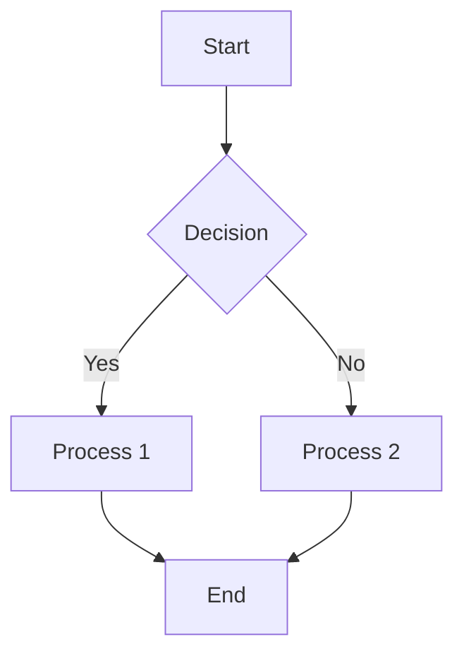

**Sequence Diagram:**
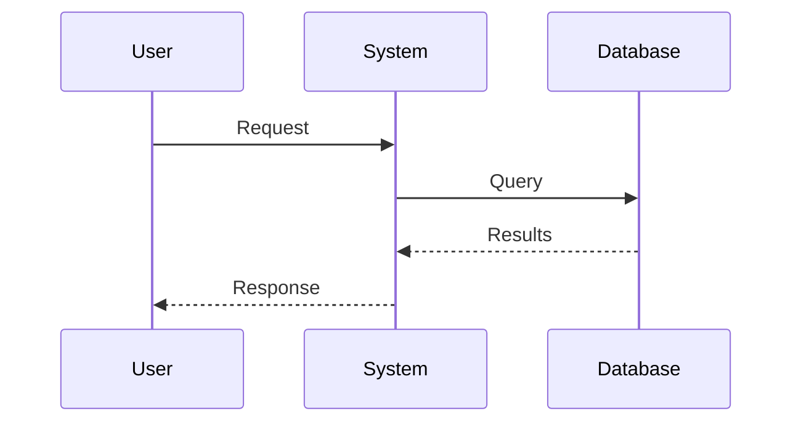

**State Diagram:**
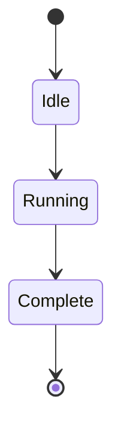

---

**All diagrams saved and ready for reuse!** 🎨

Use these for:
- Project documentation
- Technical presentations
- Architecture reviews
- Developer onboarding
- System design discussions

