# ATS Local Job Assistant — Design Documentation Index

**Status:** Development baseline  
**Version:** 1.0  
**Date:** 2026-08-01  
**Implementation root:** `C:\ATS`  
**Package:** `src\ats_local`  
**Primary interface:** `ats` CLI  

## 1. Purpose

This documentation set is the implementation baseline for a fully local, human-approved job discovery and resume-tailoring assistant. It covers architecture, DFDs, storage, APIs, AI/RAG algorithms, security, operations, dependencies, testing, migration, and reuse of the current `C:\ATS` assets.

The product:

- discovers and normalizes jobs from governed sources;
- identifies ten high-value opportunities per day;
- explains mandatory, partial, missing, and uncertain matches;
- generates tailored resumes only from proven candidate facts;
- verifies claims and requires human approval;
- records applications and outcomes for later calibration;
- runs local inference without per-token cloud charges;
- never auto-applies or fabricates experience.

## 2. Canonical decisions

These decisions override conflicting historical proposals:

| Concern | Canonical MVP decision |
|---|---|
| Operating system | Windows 11 |
| Python | CPython 3.11 x64 |
| Package | `src\ats_local` |
| CLI | `ats` |
| HTTP API | Deferred; typed in-process services and CLI JSON are authoritative |
| Relational store | Existing SQL Server 2022 |
| Relational schema | `rag.*` domain tables and `ops.*` operational tables |
| Dense vector store | Local Qdrant on loopback; rebuildable from SQL chunks |
| Lexical retrieval | Versioned local `bm25s` projection |
| Embeddings | Nomic Embed v1.5, 768 dimensions on CPU; BGE-M3, 1024 dimensions on suitable GPU |
| Vector versioning | Separate Qdrant collection per model, dimension, and version |
| Generation | Local Qwen3 through Ollama |
| Reranking | Qwen3-Reranker 0.6B or approved equivalent |
| Claim verification | Deterministic entity/number checks, DeBERTa NLI, human approval |
| Scheduling | Windows Task Scheduler invoking CLI commands |
| Migrations | Checksummed `001_core.sql` through `006_security.sql` |
| Secrets | Windows Credential Manager through `keyring` |
| LinkedIn automation | Disabled by default; manually governed URL adapter only |

## 3. Document map and authority

Read in this order:

1. [`01-SYSTEM-ARCHITECTURE-AND-DFD.md`](01-SYSTEM-ARCHITECTURE-AND-DFD.md)  
   System context, containers, components, deployment, DFD levels 0-2, trust boundaries, sequences, state machines, failure flows, and architecture decisions.

2. [`02-DATA-AND-API-DESIGN.md`](02-DATA-AND-API-DESIGN.md)  
   **Authoritative for relational schemas and DTO contracts.** Contains ERD, complete DDL, indexes, checks, lineage, CLI contracts, deferred REST contracts, events, states, and configuration.

3. [`03-AI-RAG-PIPELINE-SPEC.md`](03-AI-RAG-PIPELINE-SPEC.md)  
   **Authoritative for algorithms and model routing.** Covers parsing, taxonomy, hybrid retrieval, RRF, reranking, hard gates, scoring, MMR, explanations, grounded generation, verification, ATS simulation, evaluation, and pseudocode.

4. [`04-SECURITY-OPERATIONS-DEPENDENCIES.md`](04-SECURITY-OPERATIONS-DEPENDENCIES.md)  
   **Authoritative for security and runtime operations.** Covers threat model, PII, secrets, dependencies/licenses, deployment, observability, retries, DLQ, backup/DR, health checks, runbooks, and troubleshooting.

5. [`05-IMPLEMENTATION-PLAN.md`](05-IMPLEMENTATION-PLAN.md)  
   **Authoritative for repository structure and delivery order.** Contains epics, stories, acceptance criteria, test strategy, CI/CD, migration/cutover, ADRs, risks, and the first 30 tasks.

6. [`06-CURRENT-COMPONENT-REUSE-MATRIX.md`](06-CURRENT-COMPONENT-REUSE-MATRIX.md)  
   Function-level inventory of current `C:\ATS` files with reuse/refactor/replace/archive decisions and defects.

7. [`07-RESEARCH-FOUNDATION.md`](07-RESEARCH-FOUNDATION.md)  
   Evidence, assumptions, ATS/job-matching findings, local SLM recommendations, self-challenge, and citations. It is contextual rather than normative.

If documents conflict, this file's canonical decisions win, followed by the concern-specific authority above.

## 4. Target solution summary

```mermaid
flowchart LR
    Sources[Governed job sources] --> Ingest[Ingestion and canonicalization]
    Ingest --> SQL[(SQL Server 2022)]
    SQL --> Parse[Job and candidate parsers]
    Parse --> BM25[(bm25s)]
    Parse --> QD[(Qdrant)]
    BM25 --> RRF[RRF fusion]
    QD --> RRF
    RRF --> Gate[Eligibility and mandatory gates]
    Gate --> Rerank[Cross-encoder reranking]
    Rerank --> Score[Structured scoring]
    Score --> MMR[MMR and top 10]
    MMR --> Explain[Evidence-backed explanations]
    Explain --> Evidence[Candidate fact retrieval]
    Evidence --> Generate[Local constrained generation]
    Generate --> Verify[Entity, number, NLI, ATS checks]
    Verify --> Human[Human approval]
    Human --> DOCX[DOCX and provenance]
    DOCX --> Outcomes[Application and outcome tracking]
    Outcomes --> Calibrate[Measured calibration]
```



## 5. Reuse and refactor summary

### Reuse after extraction or cleanup

| Existing asset | Valuable capability | Target |
|---|---|---|
| `google_jobs_scraper_FIXED.py` | Canonical SerpAPI queries and result parsing | `ats_local\ingestion\serpapi.py` |
| `google_jobs_scraper_beast_mode.py` | Duplicate removal and region classification | `ats_local\ingestion\dedupe.py`, `normalization.py` |
| `smart_scheduler.py` | Credit budgeting strategy | `ats_local\scheduling\credit_ledger.py` |
| `comprehensive_ats_validation_all_platforms.py` | Broad deterministic ATS rule set | `ats_local\validation\ats_rules.py` |
| `ats_comprehensive_validator.py` | Prohibited-character and quantity patterns | Shared validation rules |
| `ats_score_calculator.py` | Pure keyword checking function | `ats_local\validation\keyword.py` |
| `keyword_density_analysis.py` | Density analysis | `ats_local\validation\keyword.py` |
| `extract_all_resumes.py` | DOCX/PDF extraction concepts | `ats_local\documents\extract.py` |
| `extract_keywords_and_search.py` | Keyword extraction concepts | Parser/query-builder modules |
| `legacy_resume_builder.py` | DOCX headings, bullets, margins | `ats_local\generation\docx_builder.py` |
| `create_final_resume_v2.py` | Text-to-DOCX conversion | DOCX builder adapter |
| `RAG_MASTER_PROMPT.md` | Prompt requirements | Versioned prompt assets |
| `MASTER_ATS_VALIDATION_PROMPT.md` | ATS critique prompt | Versioned prompt assets |

### Refactor requirements

- remove hardcoded credentials and global mutable state;
- replace script-level execution with typed functions/classes;
- inject configuration, paths, clients, clocks, and repositories;
- add timeouts, bounded retries, structured errors, and idempotency;
- replace hardcoded resume content with fact IDs and templates;
- remove runtime package installation;
- consolidate duplicated validators and DOCX scripts;
- validate all model outputs with strict schemas;
- add unit, contract, integration, and golden-output tests.

### Replace

- Gemini-dependent validation/generation in the default path;
- monolithic MiniLM document vectors;
- pure vector similarity ranking;
- LLM self-assigned ATS and fit scores;
- SQL f-string vector insertion examples;
- separate one-off resume generator scripts;
- any LinkedIn search automation based on currently broken selectors.

### Archive

- obsolete scraper variants after fixtures and useful predicates are extracted;
- duplicate validator scripts after rule consolidation;
- generated resumes and reports that are not source facts;
- patch/fix scripts after their changes are incorporated into maintained modules.

## 6. Development start sequence

Do not begin with model prompts or UI work. Implement in this order:

1. Rotate exposed keys and remove credentials from source/history where applicable.
2. Create the `src\ats_local` package, test layout, configuration loader, and `ats doctor`.
3. Add locked dependencies, license inventory, secret scanning, linting, typing, and tests.
4. Create SQL Server schemas and the checksummed migration runner.
5. Implement artifact storage, provenance, hashes, and PII controls.
6. Refactor SerpAPI ingestion behind a `JobSource` protocol.
7. Implement canonicalization, exact dedupe, near-duplicate clustering, and ingestion idempotency.
8. Build the candidate fact base and human fact-review command.
9. Implement deterministic job parsing and local-SLM ambiguity resolution.
10. Build `bm25s` and Qdrant projections with reconciliation.
11. Implement RRF, hard gates, reranking, structured scoring, MMR, and explanations.
12. Build grounded resume selection, constrained rewriting, and provenance.
13. Add deterministic entity/number checks, NLI, ATS simulation, readability, and approval.
14. Add application, interaction, and outcome tracking.
15. Collect outcomes before training callback or learning-to-rank models.

## 7. Minimum development dependencies

Exact versions belong in lock files and must be selected through compatibility testing.

### Runtime

- Python 3.11 x64
- SQL Server 2022 and ODBC Driver 18
- Qdrant and `qdrant-client`
- Ollama
- `pydantic`, `typer`, `pyodbc`, `httpx`
- `tenacity`, `filelock`, `keyring`, `structlog`
- `python-docx`, `pypdf`
- `bm25s`
- `sentence-transformers` or FastEmbed
- approved NLI, embedding, reranking, and Qwen3 model revisions

### Development

- `pytest`, `pytest-cov`, `hypothesis`
- `ruff`, `mypy`
- dependency audit and secret scanning
- CycloneDX SBOM generation

FastAPI/Uvicorn are not MVP dependencies. Add them only after approving the REST ADR.

## 8. MVP completion gates

The MVP is not complete until:

- no secrets or PII appear in source, logs, fixtures, or generated telemetry;
- all ingestion writes are idempotent and parameterized;
- SQL data can rebuild both bm25s and Qdrant projections;
- top-10 Precision@10 is at least 0.60 on the labeled benchmark;
- top-10 contains no exact duplicates or explicit mandatory conflicts;
- every generated claim has provenance;
- unsupported and contradicted claims are blocked;
- DOCX parser round-trip succeeds;
- a human explicitly approves export;
- applications and outcomes are recorded with score/model/prompt versions;
- backup restore and projection rebuild are tested.

## 9. First command-line surface

```text
ats doctor
ats db migrate
ats ingest serpapi
ats ingest file <path>
ats candidate import <resume>
ats candidate facts review
ats index rebuild --all
ats rank run --top 10
ats rank explain <job-id>
ats resume generate <job-id>
ats resume review <variant-id>
ats application record <job-id> <variant-id>
ats outcome record <application-id>
```

## 10. Non-goals

- automatic application submission;
- bypassing site controls or scraping restrictions;
- invented experience or metrics;
- cloud inference in the default data path;
- vendor-specific ATS score claims;
- callback prediction before adequate labeled outcomes;
- multi-user/SaaS operation in the MVP;
- REST service deployment in the MVP.


