# Local RAG Job Assistant — Implementation-Ready Architecture & DFD Documentation

**Version:** 1.0 | **Date:** 2026-08-01 | **Classification:** Private reference design — Single User  
**Codebase anchor:** `C:\ATS\` | **Research anchor:** `docs\research\original-research-synthesis.md`

---

## Table of Contents

1. [Architecture Principles](#1-architecture-principles)
2. [System Context (C4 Level 1)](#2-system-context-c4-level-1)
3. [Container Diagram (C4 Level 2)](#3-container-diagram-c4-level-2)
4. [Component Diagrams (C4 Level 3)](#4-component-diagrams-c4-level-3)
   - 4.1 Ingestion Container
   - 4.2 Ranking & Matching Container
   - 4.3 Resume Generation Container
   - 4.4 Feedback & Calibration Container
5. [Windows Deployment Views by Hardware Profile](#5-windows-deployment-views-by-hardware-profile)
6. [DFD Level 0 — System Context](#6-dfd-level-0--system-context)
7. [DFD Level 1 — Subsystem Flows](#7-dfd-level-1--subsystem-flows)
8. [DFD Level 2 — Detailed Subsystem Flows](#8-dfd-level-2--detailed-subsystem-flows)
   - 8.1 Ingestion
   - 8.2 Ranking
   - 8.3 Resume Generation
   - 8.4 Feedback Loop
9. [Trust Boundaries](#9-trust-boundaries)
10. [Sequence Diagrams](#10-sequence-diagrams)
    - 10.1 Daily Ingestion Run
    - 10.2 Top-10 Ranking
    - 10.3 Resume Generation & Verification
    - 10.4 Application Outcome Recording
11. [State Machines](#11-state-machines)
    - 11.1 Job Lifecycle
    - 11.2 Resume Variant Lifecycle
    - 11.3 Application Lifecycle
    - 11.4 SLM Inference Request Lifecycle
12. [Batch Orchestration & Failure Flows](#12-batch-orchestration--failure-flows)
    - 12.1 Daily Batch Orchestration
    - 12.2 Failure & Recovery Flows
13. [Existing Code → Target Module Mapping](#13-existing-code--target-module-mapping)
14. [Data Model Relationships](#14-data-model-relationships)
15. [Open Items & Prerequisites Before Development](#15-open-items--prerequisites-before-development)

---

## 1. Architecture Principles

These principles are derived directly from the synthesis report (`research/you-are-acting-as-a-senior-ai-systems-architect-ra.md:1-11`) and govern every design decision below.

| # | Principle | Rationale | Violation Example |
|---|-----------|-----------|-------------------|
| P-01 | **Local-first, zero-per-token cost** | All PII and resume data stays on-device; no cloud inference bill | Routing resume bullets to an external LLM API |
| P-02 | **Deterministic gates before probabilistic ranking** | Mandatory eligibility/requirements are binary; ranking is continuous | Treating visa/work-auth as a soft score signal |
| P-03 | **Immutable provenance on every fact** | Every generated sentence must be traceable to a source span | Generating bullets without a `FactID` citation |
| P-04 | **Human in the loop at every decision boundary** | No auto-submit, no auto-edit; the system drafts and flags | Automatically submitting an application |
| P-05 | **Three-valued eligibility logic** (`pass` / `fail` / `unknown`) | Avoid eliminating valid roles due to missing data | Treating missing sponsorship info as `fail` |
| P-06 | **Separate lexical and semantic retrieval; fuse with RRF** | Dense retrieval can miss exact technical acronyms (T-SQL, APRC) | Pure cosine-similarity ranking |
| P-07 | **Version every derived artifact** | Parser version, embedding version, prompt version, model version | Regenerating without audit trail |
| P-08 | **Calibrate before claiming probabilities** | Heuristic bands until ≥100 labeled outcomes exist | Displaying "72% callback probability" pre-calibration |
| P-09 | **Single canonical schema; code is authoritative over documents** | Resolves conflicts between `RAG_JOB_SEARCH_ARCHITECTURE_REVIEW.md` proposals and running code | Trusting document DDL over `ats_validator.py` implementation |
| P-10 | **Secrets never in source** | A legacy scraper contained a plaintext API key — a P0 violation | Any `API_KEY = "..."` literal in `.py` files |

> **Critical pre-condition:** Before building any new feature, rotate both SerpAPI keys identified at `C:\ATS\google_jobs_scraper_FIXED.py:14` and `C:\ATS\search_matching_roles_since_thursday.py:18`, and fix the `json.dump(tracker, indent=2, fp=f)` argument-order bug at `C:\ATS\smart_scheduler.py:33`. These are P0 blockers.  
> _Source: Reuse Audit `1785572792951-copilot-tool-output-6e9a79.txt:20-36, 553-566`_

---

## 2. System Context (C4 Level 1)

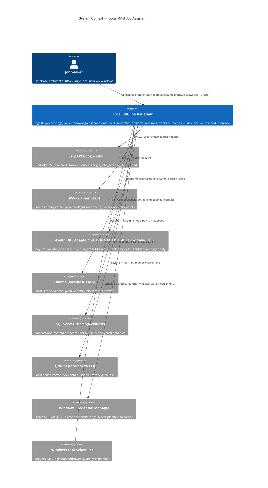
```mermaid
C4Context
    title System Context — Local RAG Job Assistant

    Person(user, "Job Seeker", "Database Architect / DBA\nSingle local user on Windows")

    System(rag, "Local RAG Job Assistant", "Ingests job postings, ranks them\nagainst candidate facts, generates\ntailored resumes, tracks outcomes.\nFully local — no cloud inference.")

    System_Ext(serpapi, "SerpAPI Google Jobs", "REST API. 250 free credits/mo.\nSource: google_jobs_scraper_FIXED.py:14")
    System_Ext(rss, "RSS / Career Feeds", "Free company career page feeds,\nGreenhouse, Lever public endpoints")
    System_Ext(linkedin_opt, "LinkedIn URL Adapter\n[OPTIONAL / DISABLED by default]", "joeyism/linkedin_scraper v3.1.2\nPlaywright-based. Disabled by default.\nManual trigger only.")
    System_Ext(ollama, "Ollama (localhost:11434)", "Local LLM server for Qwen3\nfamily. No external network.")
    System_Ext(sqlserver, "SQL Server 2022\n(localhost)", "Transactional system of record.\nACID. NTFS-encrypted data files.")
    System_Ext(qdrant, "Qdrant (localhost:6333)", "Local dense-vector index.\nRebuildable from SQL chunks.")
    System_Ext(wincred, "Windows Credential Manager", "Stores SERPAPI_KEY, DB connection\nstrings. Never plaintext in source.")
    System_Ext(taskschd, "Windows Task Scheduler", "Triggers daily ingestion and\nweekly analysis batches.")

    Rel(user, rag, "Configures preferences,\napproves resume drafts,\nreviews Top-10 report")
    Rel(rag, serpapi, "HTTPS GET /search\n20 queries × month")
    Rel(rag, rss, "HTTPS GET feeds\ndaily poll")
    Rel(rag, linkedin_opt, "Optional manual trigger\nPlaywright session (local)")
    Rel(rag, ollama, "HTTP POST /api/generate\n/api/embeddings (loopback)")
    Rel(rag, sqlserver, "pyodbc / T-SQL\nnamed pipe / TCP loopback")
    Rel(rag, qdrant, "HTTP on loopback\ncosine ANN queries")
    Rel(rag, wincred, "keyring Python lib\nread-only at runtime")
    Rel(taskschd, rag, "Scheduled process launch\nWindows Task Scheduler XML")
```

> _Source for SerpAPI usage: `C:\ATS\google_jobs_scraper_FIXED.py:17-34` (WORKING_QUERIES, PRIORITY_LOCATIONS). Source for SQL Server vector design: `C:\ATS\RAG_JOB_SEARCH_ARCHITECTURE_REVIEW.md:118-185`. Source for LinkedIn risk: `research/you-are-acting-as-a-senior-ai-systems-architect-ra.md:109-125`._

---

## 3. Container Diagram (C4 Level 2)


```mermaid
C4Container
    title Container Diagram — Local RAG Job Assistant

    Person(user, "Job Seeker", "Windows desktop user")

    System_Boundary(rag, "Local RAG Job Assistant — C:\\ATS\\") {

        Container(ingestion, "Ingestion Container", "Python 3.11\nats_local/scraper/", "Fetches, deduplicates, canonicalises\njob postings from all sources.\nRefactored from google_jobs_scraper_FIXED.py")

        Container(factbase, "Candidate Fact Base Container", "Python 3.11\nats_local/resume/", "Parses master resume into immutable\nfacts with provenance hashes.\nNew — not yet implemented.")

        Container(jobparser, "Job Parser Container", "Python 3.11\nats_local/jobs/", "Extracts structured requirements,\nentities, seniority, constraints\nfrom raw JD text via local SLM.")

        Container(retrieval, "Retrieval & Ranking Container", "Python 3.11\nats_local/ranking/", "BM25 + dense hybrid retrieval,\nRRF fusion, cross-encoder reranking,\nstructured fit scoring, MMR Top-10.")

        Container(resumegen, "Resume Generation Container", "Python 3.11\nats_local/docx_builder/\nats_local/validators/", "Grounded bullet selection, constrained\nSLM rewrite, NLI claim verification,\nATS/readability checks, DOCX output.")

        Container(tracker, "Application Tracker Container", "Python 3.11\nats_local/tracker/", "Records applications, interactions,\noutcomes. Feeds calibration loop.\nNew — not yet implemented.")

        Container(feedback, "Feedback & Calibration Container", "Python 3.11\nats_local/feedback/", "Descriptive analytics, callback\nproxy calibration after ≥100 labels.\nNew — not yet implemented.")

        Container(scheduler, "Batch Orchestrator", "Python 3.11\nats_local/scheduler/\nWindows Task Scheduler", "credit_ledger.py (refactored\nfrom smart_scheduler.py:1-165).\nOrchestrates daily/weekly pipelines.")

        Container(cli, "Approval CLI / Report UI", "Python 3.11\nats_local/ui/", "Terminal-based approval flows,\nTop-10 report renderer,\nresume diff viewer. Human gate.")

        ContainerDb(sqldb, "SQL Server 2022", "SQL Server 2022 (localhost)\nRelational ACID store", "Jobs, Requirements, Facts,\nScores, Variants, Applications,\nOutcomes, FeedbackSignals")

        ContainerDb(bm25idx, "BM25 Index (bm25s)", "File-based on C:\\ATS\\data\\bm25\\", "Lexical index of job requirement\nchunks and candidate fact chunks.\nIDs link back to SQL Server rows.")

        ContainerDb(embcache, "Embedding Cache", "SQLite / LMDB\nC:\\ATS\\emb_cache\\", "content_hash → vector. Avoids\nre-encoding unchanged texts.\nVersioned by embedding model.")

        ContainerDb(qdrant, "Qdrant Vector Index", "Qdrant localhost:6333\n768- or 1024-dimensional collections", "Dense vectors keyed by deterministic\nchunk IDs. Rebuildable projection.")

        ContainerDb(secrets, "Secrets Store", "Windows Credential Manager\n+ .env (gitignored)", "SERPAPI_KEY, GEMINI_API_KEY\n(optional), DB connection strings")
    }

    System_Ext(serpapi, "SerpAPI", "External REST")
    System_Ext(ollama, "Ollama localhost:11434", "Local LLM server")
    System_Ext(sqlserver_svc, "SQL Server Windows Service", "sqlservr.exe")

    Rel(user, cli, "Reviews Top-10, approves\nresume drafts, records actions")
    Rel(scheduler, ingestion, "Triggers daily at 06:00")
    Rel(scheduler, retrieval, "Triggers after ingestion")
    Rel(ingestion, sqldb, "INSERT canonical jobs\npyodbc parameterized")
    Rel(ingestion, bm25idx, "Index requirement chunks")
    Rel(ingestion, embcache, "Cache job embeddings")
    Rel(factbase, sqldb, "INSERT CandidateFacts\nwith provenance hashes")
    Rel(factbase, embcache, "Cache fact embeddings")
    Rel(jobparser, sqldb, "INSERT JobRequirements")
    Rel(retrieval, sqldb, "Read chunks, facts and\nstructured fit features")
    Rel(retrieval, qdrant, "Cosine ANN top-300")
    Rel(retrieval, bm25idx, "BM25 top-300 retrieval")
    Rel(retrieval, embcache, "Read cached vectors")
    Rel(retrieval, ollama, "POST /api/embeddings\nBGE-M3 / Nomic")
    Rel(resumegen, sqldb, "Read facts, write\nResumeVariant + provenance")
    Rel(resumegen, ollama, "POST /api/generate\nQwen3-8B constrained")
    Rel(tracker, sqldb, "INSERT Application\nOutcome, Interaction")
    Rel(feedback, sqldb, "Read outcomes for\ncalibration")
    Rel(ingestion, serpapi, "HTTPS GET")
    Rel(ingestion, secrets, "Read SERPAPI_KEY\nkeyring.get_password()")
    Rel(sqlserver_svc, sqldb, "Hosts the database")
```

> _`smart_scheduler.py` refactor target: `ats_local/scheduler/credit_ledger.py` — Source: Reuse Audit `:144-157`. DOCX builder from `legacy_resume_builder.py` helpers — Source: Reuse Audit `:338-365`._

---

## 4. Component Diagrams (C4 Level 3)

### 4.1 Ingestion Container — Internal Components

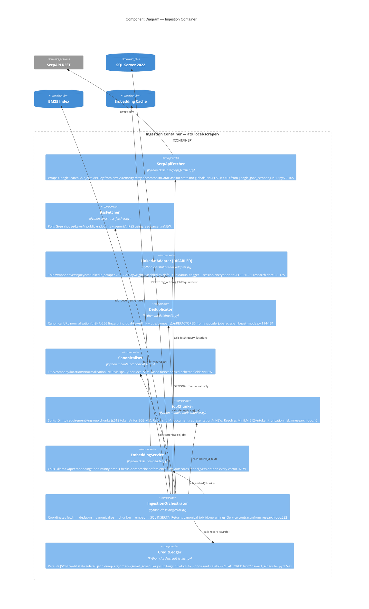
```mermaid
C4Component
    title Component Diagram — Ingestion Container

    Container_Boundary(ing, "Ingestion Container — ats_local/scraper/") {

        Component(serpfetch, "SerpApiFetcher", "Python class\nserpapi_fetcher.py", "Wraps GoogleSearch.\nInjects API key from env.\nTenacity retry decorator.\nDataclass for state (no globals).\nREFACTORED from google_jobs_scraper_FIXED.py:79-165")

        Component(rssfetch, "RssFetcher", "Python class\nrss_fetcher.py", "Polls Greenhouse/Lever\npublic endpoints + generic\nRSS using feedparser.\nNEW.")

        Component(linkedin_adapt, "LinkedInAdapter [DISABLED]", "Python class\nlinkedin_adapter.py", "Thin wrapper over\njoeyism/linkedin_scraper v3.1.2\nPlaywright. Disabled by default.\nManual trigger + session encryption.\nREFERENCE: research doc:109-125")

        Component(dedup, "Deduplicator", "Python module\nutils.py", "Canonical URL normalisation,\nSHA-256 fingerprint, dual-key\n(link + title/company).\nREFACTORED from\ngoogle_jobs_scraper_beast_mode.py:114-131")

        Component(canon, "Canonicaliser", "Python module\ncanonicaliser.py", "Title/company/location\nnormalisation. NER via spaCy\nor local SLM. Maps to\ncanonical schema fields.\nNEW.")

        Component(jobchunker, "JobChunker", "Python module\njob_chunker.py", "Splits JD into requirement-\ngroup chunks (≤512 tokens\nfor BGE-M3). Retains full-\ndocument representation.\nNEW. Resolves MiniLM 512-\ntoken truncation risk:\nresearch doc:46")

        Component(embedder, "EmbeddingService", "Python class\nembedder.py", "Calls Ollama /api/embeddings\nor infinity-emb. Checks\nembcache before encoding.\nRecords model_version\non every vector. NEW.")

        Component(ingestor, "IngestionOrchestrator", "Python class\ningestor.py", "Coordinates fetch → dedup\n→ canonicalise → chunk\n→ embed → SQL INSERT.\nReturns canonical_job_id,\nwarnings. Service contract\nfrom research doc:222")

        Component(credledger, "CreditLedger", "Python class\ncredit_ledger.py", "Persists JSON credit state.\nfixed json.dump arg order\n(smart_scheduler.py:33 bug).\nfilelock for concurrent safety.\nREFACTORED from\nsmart_scheduler.py:17-48")
    }

    System_Ext(serpapi, "SerpAPI REST")
    ContainerDb(sqldb, "SQL Server 2022")
    ContainerDb(bm25idx, "BM25 Index")
    ContainerDb(embcache, "Embedding Cache")

    Rel(ingestor, serpfetch, "calls fetch(query, location)")
    Rel(ingestor, rssfetch, "calls fetch(feed_url)")
    Rel(ingestor, dedup, "calls deduplicate(jobs)")
    Rel(ingestor, canon, "calls canonicalise(job)")
    Rel(ingestor, jobchunker, "calls chunk(jd_text)")
    Rel(ingestor, embedder, "calls embed(chunks)")
    Rel(ingestor, credledger, "calls record_search()")
    Rel(ingestor, sqldb, "INSERT rag.Job\nrag.JobRequirement")
    Rel(ingestor, bm25idx, "add_document(chunks)")
    Rel(embedder, embcache, "get/set by content_hash")
    Rel(serpfetch, serpapi, "HTTPS GET")
    Rel(ingestor, linkedin_adapt, "OPTIONAL manual call only")
```

---

### 4.2 Ranking & Matching Container — Internal Components

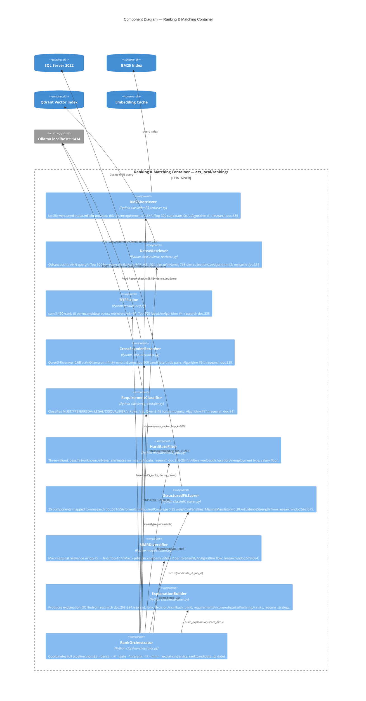
```mermaid
C4Component
    title Component Diagram — Ranking & Matching Container

    Container_Boundary(rank, "Ranking & Matching Container — ats_local/ranking/") {

        Component(bm25ret, "BM25Retriever", "Python class\nbm25_retriever.py", "bm25s versioned index.\nField-boosted: title 2×,\nrequirements 1.5×.\nTop-300 candidate IDs.\nAlgorithm #1: research doc:335")

        Component(denseret, "DenseRetriever", "Python class\ndense_retriever.py", "Qdrant cosine ANN query.\nTop-300 by cosine similarity.\nBGE-M3 1024-dim or\nNomic 768-dim collections.\nAlgorithm #2: research doc:336")

        Component(rrf, "RRFFusion", "Python module\nrrf.py", "sum(1/(60+rank_i)) per\ncandidate across retrievers.\nk=60. Top-500 fused.\nAlgorithm #4: research doc:338")

        Component(reranker, "CrossEncoderReranker", "Python class\nreranker.py", "Qwen3-Reranker-0.6B via\nOllama or infinity-emb.\nScores top-100 candidate-\njob pairs. Algorithm #5:\nresearch doc:339")

        Component(reqclass, "RequirementClassifier", "Python class\nreq_classifier.py", "Classifies MUST/PREFERRED/\nLEGAL/DISQUALIFIER.\nRules first, Qwen3-4B for\nambiguity. Algorithm #7:\nresearch doc:341")

        Component(hardgate, "HardGateFilter", "Python module\nhard_gate.py", "Three-valued: pass/fail/unknown.\nNever eliminates on missing\ndata. research doc:256-264.\nFilters work-auth, location,\nemployment type, salary floor.")

        Component(fitscorer, "StructuredFitScorer", "Python class\nfit_scorer.py", "25 components mapped to\nresearch doc:531-556 formula.\nRequiredCoverage 0.25 weight.\nPenalties: MissingMandatory 0.30.\nEvidenceStrength from research\ndoc:567-575.")

        Component(mmr, "MMRDiversifier", "Python module\nmmr.py", "Max-marginal relevance.\nTop-25 → final Top-10.\nMax 2 jobs per company.\nMax 2 per role-family.\nAlgorithm flow: research\ndoc:579-584.")

        Component(explainer, "ExplanationBuilder", "Python class\nexplainer.py", "Produces explanation JSON\nfrom research doc:268-284:\njob_id, rank, decision,\ncallback_band, requirements\ncovered/partial/missing,\nrisks, resume_strategy.")

        Component(rankorchestrator, "RankOrchestrator", "Python class\norchestrator.py", "Coordinates full pipeline:\nbm25→dense→rrf→gate→\nrerank→fit→mmr→explain.\nService: rank(candidate_id, date)")
    }

    ContainerDb(sqldb, "SQL Server 2022")
    ContainerDb(bm25idx, "BM25 Index")
    ContainerDb(qdrant, "Qdrant Vector Index")
    ContainerDb(embcache, "Embedding Cache")
    System_Ext(ollama, "Ollama localhost:11434")

    Rel(rankorchestrator, bm25ret, "retrieve(query_vector, top_k=300)")
    Rel(rankorchestrator, denseret, "retrieve(embedding, top_k=300)")
    Rel(rankorchestrator, rrf, "fuse(bm25_ranks, dense_ranks)")
    Rel(rankorchestrator, reqclass, "classify(requirements)")
    Rel(rankorchestrator, hardgate, "filter(candidate, jobs)")
    Rel(rankorchestrator, reranker, "rerank(top_100_pairs)")
    Rel(rankorchestrator, fitscorer, "score(candidate_id, job_id)")
    Rel(rankorchestrator, mmr, "diversify(top_25)")
    Rel(rankorchestrator, explainer, "build_explanation(score_dims)")
    Rel(bm25ret, bm25idx, "query index")
    Rel(denseret, qdrant, "Cosine ANN query")
    Rel(reranker, ollama, "POST /api/generate\nQwen3-Reranker-0.6B")
    Rel(fitscorer, sqldb, "Read ResumeFact,\nSkillEvidence, JobScore")
    Rel(reqclass, ollama, "POST /api/generate Qwen3-4B\n(ambiguous only)")
```

---

### 4.3 Resume Generation Container — Internal Components

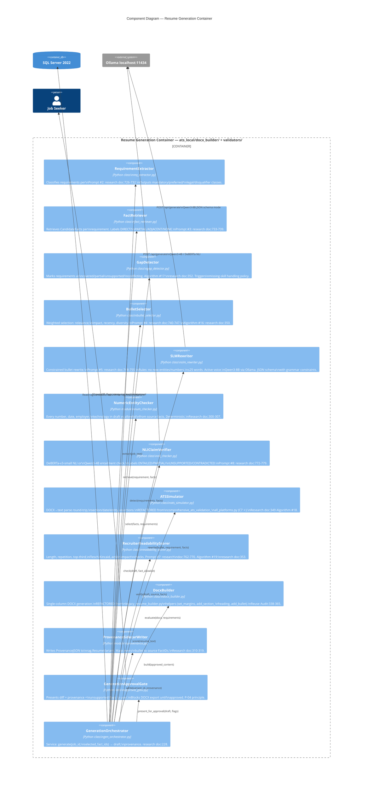
```mermaid
C4Component
    title Component Diagram — Resume Generation Container

    Container_Boundary(gen, "Resume Generation Container — ats_local/docx_builder/ + validators/") {

        Component(reqextract, "RequirementExtractor", "Python class\nreq_extractor.py", "Classifies requirements per\nPrompt #2: research doc:726-732.\nOutputs mandatory/preferred/\nlegal/disqualifier classes.")

        Component(factret, "FactRetriever", "Python class\nfact_retriever.py", "Retrieves CandidateFacts per\nrequirement. Labels DIRECT/\nPARTIAL/ADJACENT/NONE.\nPrompt #3: research doc:733-739.")

        Component(gapdetect, "GapDetector", "Python class\ngap_detector.py", "Marks requirements as\ncovered/partial/unsupported/\nconflicting. Algorithm #17:\nresearch doc:352. Triggers\nmissing-skill handling policy.")

        Component(bulletsel, "BulletSelector", "Python class\nbullet_selector.py", "Weighted selection: relevance,\nimpact, recency, diversity.\nPrompt #4: research doc:740-747.\nAlgorithm #16: research doc:350.")

        Component(slmrewrite, "SLMRewriter", "Python class\nslm_rewriter.py", "Constrained bullet rewrite.\nPrompt #5: research doc:748-755.\nRules: no new entities/numbers.\n≤25 words. Active voice.\nQwen3-8B via Ollama. JSON schema\nwith grammar constraints.")

        Component(numchecker, "NumericEntityChecker", "Python module\nnum_checker.py", "Every number, date, employer,\ntechnology in draft vs allowlist\nfrom source facts. Deterministic.\nResearch doc:300-307.")

        Component(nlichecker, "NLIClaimVerifier", "Python class\nnli_checker.py", "DeBERTa-v3-small NLI or\nQwen3-4B entailment check.\nLabels ENTAILED/PARTIAL/\nUNSUPPORTED/CONTRADICTED.\nPrompt #8: research doc:772-779.")

        Component(atscheck, "ATSSimulator", "Python class\nats_simulator.py", "DOCX→text parse round-trip,\nsection/date/entity assertions.\nREFACTORED from\ncomprehensive_ats_validation_\nall_platforms.py (C7 ⭐).\nResearch doc:349 Algorithm #18.")

        Component(readcheck, "RecruiterReadabilityScorer", "Python class\nreadability_scorer.py", "Length, repetition, top-third,\nFlesch-Kincaid, action-impact\nchecks. Prompt #7: research\ndoc:762-770. Algorithm #19:\nresearch doc:353.")

        Component(docxbuild, "DocxBuilder", "Python class\ndocx_builder.py", "Single-column DOCX generation.\nREFACTORED from\nlegacy_resume_builder.py\nhelpers (set_margins, add_section_\nheading, add_bullet).\nReuse Audit:338-365.")

        Component(provsidecar, "ProvenanceSidecarWriter", "Python module\nprovenance.py", "Writes ProvenanceJSON to\nrag.ResumeVariant. Maps every\nbullet to source FactIDs.\nResearch doc:310-319.")

        Component(genuigate, "GenerationApprovalGate", "Python class\napproval_gate.py", "Presents diff + provenance +\nunsupported flags to user.\nBlocks DOCX export until\napproved. P-04 principle.")

        Component(genorch, "GenerationOrchestrator", "Python class\ngen_orchestrator.py", "Service: generate(job_id,\nselected_fact_ids) → draft,\nprovenance. research doc:228.")
    }

    ContainerDb(sqldb, "SQL Server 2022")
    System_Ext(ollama, "Ollama localhost:11434")
    Person(user, "Job Seeker")

    Rel(genorch, reqextract, "extract(job_text)")
    Rel(genorch, factret, "retrieve(requirement, facts)")
    Rel(genorch, gapdetect, "detect(requirements, facts)")
    Rel(genorch, bulletsel, "select(facts, requirements)")
    Rel(genorch, slmrewrite, "rewrite(bullet, requirement, facts)")
    Rel(genorch, numchecker, "check(draft, fact_allowlist)")
    Rel(genorch, nlichecker, "verify(draft, source_facts)")
    Rel(genorch, atscheck, "evaluate(docx, requirements)")
    Rel(genorch, readcheck, "score(resume_text)")
    Rel(genorch, docxbuild, "build(approved_content)")
    Rel(genorch, provsidecar, "write(variant_id, provenance)")
    Rel(genorch, genuigate, "present_for_approval(draft, flags)")
    Rel(genuigate, user, "Shows diff, flags,\nrequires explicit approval")
    Rel(slmrewrite, ollama, "POST /api/generate\nQwen3-8B JSON schema mode")
    Rel(nlichecker, ollama, "POST /api/generate\nQwen3-4B / DeBERTa NLI")
    Rel(genorch, sqldb, "Read rag.CandidateFact\nWrite rag.ResumeVariant")
```

---

### 4.4 Feedback & Calibration Container — Internal Components

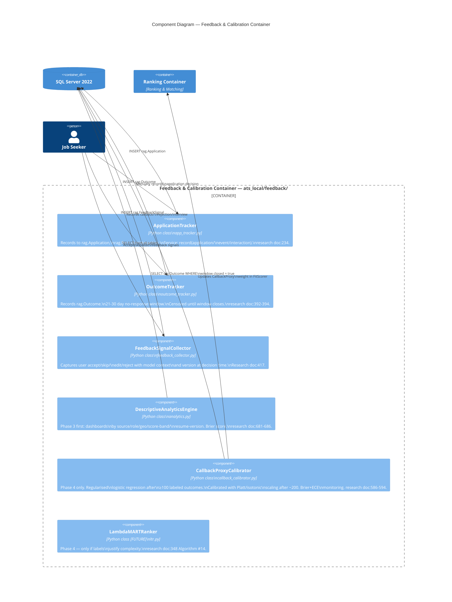
```mermaid
C4Component
    title Component Diagram — Feedback & Calibration Container

    Container_Boundary(fb, "Feedback & Calibration Container — ats_local/feedback/") {

        Component(apptracker, "ApplicationTracker", "Python class\napp_tracker.py", "Records to rag.Application,\nrag.RecruiterInteraction.\nService: record(application/\nevent/interaction).\nresearch doc:234.")

        Component(outcometracker, "OutcomeTracker", "Python class\noutcome_tracker.py", "Records rag.Outcome.\n21-30 day no-response window.\nCensored until window closes.\nresearch doc:392-394.")

        Component(feedsig, "FeedbackSignalCollector", "Python class\nfeedback_collector.py", "Captures user accept/skip/\nedit/reject with model context\nand version at decision time.\nResearch doc:417.")

        Component(descanalytics, "DescriptiveAnalyticsEngine", "Python class\nanalytics.py", "Phase 3 first: dashboards\nby source/role/geo/score-band/\nresume-version. Brier score.\nresearch doc:681-686.")

        Component(callbackmodel, "CallbackProxyCalibrator", "Python class\ncallback_calibrator.py", "Phase 4 only. Regularised\nlogistic regression after\n≥100 labeled outcomes.\nCalibrated with Platt/isotonic\nscaling after ~200. Brier+ECE\nmonitoring. research doc:586-594.")

        Component(ltr, "LambdaMARTRanker", "Python class [FUTURE]\nltr.py", "Phase 4 — only if labels\njustify complexity.\nresearch doc:348 Algorithm #14.")
    }

    ContainerDb(sqldb, "SQL Server 2022")
    Container(retrieval, "Ranking Container", "Ranking & Matching")
    Person(user, "Job Seeker")

    Rel(user, apptracker, "Manually records\napplication decision")
    Rel(user, outcometracker, "Records callback/\nrejection/interview")
    Rel(user, feedsig, "Accept/skip/edit\nfeedback signals")
    Rel(apptracker, sqldb, "INSERT rag.Application")
    Rel(outcometracker, sqldb, "INSERT rag.Outcome")
    Rel(feedsig, sqldb, "INSERT rag.FeedbackSignal")
    Rel(descanalytics, sqldb, "SELECT from all tables")
    Rel(callbackmodel, sqldb, "SELECT rag.Outcome WHERE\nwindow closed = true")
    Rel(callbackmodel, retrieval, "Updates CallbackProxy\nweight in FitScorer")
```

---

## 5. Windows Deployment Views by Hardware Profile

The research synthesis (`research doc:131-139`) defines four hardware tiers. Each tier uses a different model routing strategy but the same software stack on Windows 11.

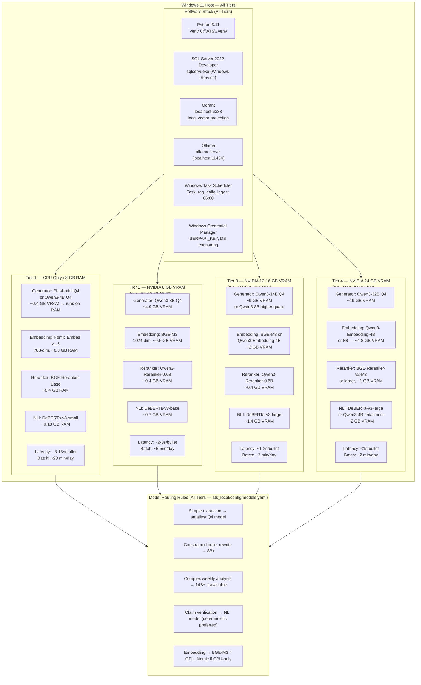
```mermaid
flowchart TB
    subgraph WIN["Windows 11 Host — All Tiers"]
        direction TB

        subgraph SW["Software Stack (All Tiers)"]
            PY["Python 3.11\nvenv C:\\ATS\\.venv"]
            SS["SQL Server 2022 Developer\nsqlservr.exe (Windows Service)"]
            QD["Qdrant\nlocalhost:6333\nlocal vector projection"]
            OL["Ollama\nollama serve (localhost:11434)"]
            WTS["Windows Task Scheduler\nTask: rag_daily_ingest 06:00"]
            WCM["Windows Credential Manager\nSERPAPI_KEY, DB connstring"]
        end

        subgraph T1["Tier 1 — CPU Only / 8 GB RAM"]
            T1G["Generator: Phi-4-mini Q4\nor Qwen3-4B Q4\n~2.4 GB VRAM → runs on RAM"]
            T1E["Embedding: Nomic Embed v1.5\n768-dim, ~0.3 GB RAM"]
            T1R["Reranker: BGE-Reranker-Base\n~0.4 GB RAM"]
            T1N["NLI: DeBERTa-v3-small\n~0.18 GB RAM"]
            T1L["Latency: ~8-15s/bullet\nBatch: ~20 min/day"]
        end

        subgraph T2["Tier 2 — NVIDIA 8 GB VRAM\n(e.g., RTX 3070/4060)"]
            T2G["Generator: Qwen3-8B Q4\n~4.9 GB VRAM"]
            T2E["Embedding: BGE-M3\n1024-dim, ~0.6 GB VRAM"]
            T2R["Reranker: Qwen3-Reranker-0.6B\n~0.4 GB VRAM"]
            T2N["NLI: DeBERTa-v3-base\n~0.7 GB VRAM"]
            T2L["Latency: ~2-3s/bullet\nBatch: ~5 min/day"]
        end

        subgraph T3["Tier 3 — NVIDIA 12-16 GB VRAM\n(e.g., RTX 3080/4070Ti)"]
            T3G["Generator: Qwen3-14B Q4\n~9 GB VRAM\nor Qwen3-8B higher quant"]
            T3E["Embedding: BGE-M3 or\nQwen3-Embedding-4B\n~2 GB VRAM"]
            T3R["Reranker: Qwen3-Reranker-0.6B\n~0.4 GB VRAM"]
            T3N["NLI: DeBERTa-v3-large\n~1.4 GB VRAM"]
            T3L["Latency: ~1-2s/bullet\nBatch: ~3 min/day"]
        end

        subgraph T4["Tier 4 — NVIDIA 24 GB VRAM\n(e.g., RTX 3090/4090)"]
            T4G["Generator: Qwen3-32B Q4\n~19 GB VRAM"]
            T4E["Embedding: Qwen3-Embedding-4B\nor 8B — ~4-8 GB VRAM"]
            T4R["Reranker: BGE-Reranker-v2-M3\nor larger, ~1 GB VRAM"]
            T4N["NLI: DeBERTa-v3-large\nor Qwen3-4B entailment\n~2 GB VRAM"]
            T4L["Latency: <1s/bullet\nBatch: ~2 min/day"]
        end
    end

    subgraph ROUTING["Model Routing Rules (All Tiers — ats_local/config/models.yaml)"]
        MR1["Simple extraction → smallest Q4 model"]
        MR2["Constrained bullet rewrite → 8B+"]
        MR3["Complex weekly analysis → 14B+ if available"]
        MR4["Claim verification → NLI model (deterministic preferred)"]
        MR5["Embedding → BGE-M3 if GPU, Nomic if CPU-only"]
    end

    SW --> T1
    SW --> T2
    SW --> T3
    SW --> T4
    T1 --> ROUTING
    T2 --> ROUTING
    T3 --> ROUTING
    T4 --> ROUTING
```

> **Key deployment notes:**  
> - All models loaded through Ollama on `localhost:11434`. No external network calls for inference.  
> - SQL Server data files on NTFS-encrypted volume; PII columns encrypted at application layer.  
> - Windows Task Scheduler XML task defined in `ats_local/deploy/task_daily_ingest.xml`.  
> - Model selection config in `ats_local/config/models.yaml`; all code reads model name from config — never hardcoded. _(P-09 principle; source: research doc:139)_

---

## 6. DFD Level 0 — System Context

This context diagram represents the entire system as a single process bubble, with all external entities and primary data flows.

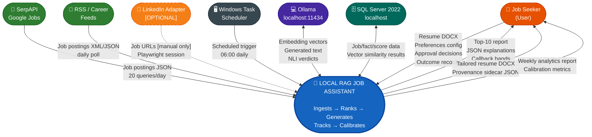
```mermaid
flowchart TB
    %% External Entities
    E1(["👤 Job Seeker\n(User)"])
    E2(["📡 SerpAPI\nGoogle Jobs"])
    E3(["📰 RSS / Career\nFeeds"])
    E4(["🔗 LinkedIn Adapter\n[OPTIONAL]"])
    E5(["💻 Ollama\nlocalhost:11434"])
    E6(["🗄️ SQL Server 2022\nlocalhost"])
    E7(["🖥️ Windows Task\nScheduler"])

    %% Process
    P0(["🎯 LOCAL RAG JOB ASSISTANT\n\nIngests → Ranks → Generates\nTracks → Calibrates"])

    %% Data Flows In
    E2 -->|"Job postings JSON\n20 queries/day"| P0
    E3 -->|"Job postings XML/JSON\ndaily poll"| P0
    E4 -.->|"Job URLs [manual only]\nPlaywright session"| P0
    E1 -->|"Resume DOCX\nPreferences config\nApproval decisions\nOutcome records"| P0
    E7 -->|"Scheduled trigger\n06:00 daily"| P0
    E5 <-->|"Embedding vectors\nGenerated text\nNLI verdicts"| P0
    E6 <-->|"Job/fact/score data\nVector similarity results"| P0

    %% Data Flows Out
    P0 -->|"Top-10 report\nJSON explanations\nCallback bands"| E1
    P0 -->|"Tailored resume DOCX\nProvenance sidecar JSON"| E1
    P0 -->|"Weekly analytics report\nCalibration metrics"| E1

    %% Styles
    style P0 fill:#1565C0,color:#fff,stroke:#0D47A1,stroke-width:3px
    style E1 fill:#E65100,color:#fff,stroke:#BF360C
    style E2 fill:#2E7D32,color:#fff,stroke:#1B5E20
    style E3 fill:#2E7D32,color:#fff,stroke:#1B5E20
    style E4 fill:#F57F17,color:#fff,stroke:#E65100,stroke-dasharray:5
    style E5 fill:#4527A0,color:#fff,stroke:#311B92
    style E6 fill:#00695C,color:#fff,stroke:#004D40
    style E7 fill:#37474F,color:#fff,stroke:#263238
```

> _Source: Adapted from `C:\ATS\RAG_SYSTEM_DFD_DIAGRAMS.md` with material corrections based on current codebase (SerpAPI replaces JSearch; Ollama replaces cloud LLM; SQL Server 2022 for vector storage)._

---

## 7. DFD Level 1 — Subsystem Flows

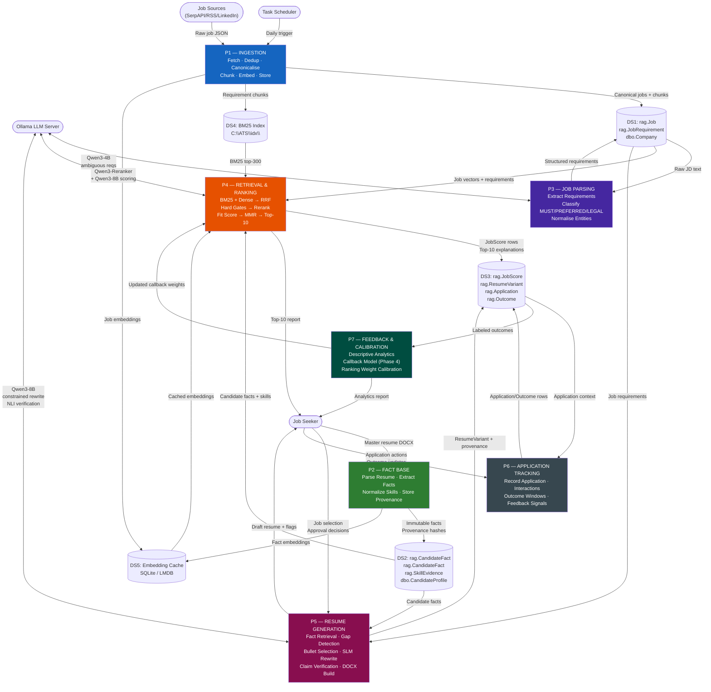
```mermaid
flowchart TB
    %% External Entities
    E_Jobs(["Job Sources\n(SerpAPI/RSS/LinkedIn)"])
    E_User(["Job Seeker"])
    E_Sched(["Task Scheduler"])
    E_Ollama(["Ollama LLM Server"])

    %% Data Stores
    DS1[("DS1: rag.Job\nrag.JobRequirement\ndbo.Company")]
    DS2[("DS2: rag.CandidateFact\nrag.CandidateFact\nrag.SkillEvidence\ndbo.CandidateProfile")]
    DS3[("DS3: rag.JobScore\nrag.ResumeVariant\nrag.Application\nrag.Outcome")]
    DS4[("DS4: BM25 Index\nC:\\ATS\\idx\\")]
    DS5[("DS5: Embedding Cache\nSQLite / LMDB")]

    %% Processes
    P1["P1 — INGESTION\nFetch · Dedup · Canonicalise\nChunk · Embed · Store"]
    P2["P2 — FACT BASE\nParse Resume · Extract Facts\nNormalize Skills · Store Provenance"]
    P3["P3 — JOB PARSING\nExtract Requirements\nClassify MUST/PREFERRED/LEGAL\nNormalise Entities"]
    P4["P4 — RETRIEVAL &amp; RANKING\nBM25 + Dense → RRF\nHard Gates → Rerank\nFit Score → MMR → Top-10"]
    P5["P5 — RESUME GENERATION\nFact Retrieval · Gap Detection\nBullet Selection · SLM Rewrite\nClaim Verification · DOCX Build"]
    P6["P6 — APPLICATION TRACKING\nRecord Application · Interactions\nOutcome Windows · Feedback Signals"]
    P7["P7 — FEEDBACK &amp; CALIBRATION\nDescriptive Analytics\nCallback Model (Phase 4)\nRanking Weight Calibration"]

    %% Flows: Ingestion
    E_Sched -->|"Daily trigger"| P1
    E_Jobs -->|"Raw job JSON"| P1
    P1 -->|"Canonical jobs + chunks"| DS1
    P1 -->|"Requirement chunks"| DS4
    P1 -->|"Job embeddings"| DS5

    %% Flows: Fact Base
    E_User -->|"Master resume DOCX"| P2
    P2 -->|"Immutable facts\nProvenance hashes"| DS2
    P2 -->|"Fact embeddings"| DS5

    %% Flows: Job Parsing
    DS1 -->|"Raw JD text"| P3
    E_Ollama <-->|"Qwen3-4B\nambiguous reqs"| P3
    P3 -->|"Structured requirements"| DS1

    %% Flows: Ranking
    DS1 -->|"Job vectors + requirements"| P4
    DS2 -->|"Candidate facts + skills"| P4
    DS4 -->|"BM25 top-300"| P4
    DS5 -->|"Cached embeddings"| P4
    E_Ollama <-->|"Qwen3-Reranker\n+ Qwen3-8B scoring"| P4
    P4 -->|"JobScore rows\nTop-10 explanations"| DS3
    P4 -->|"Top-10 report"| E_User

    %% Flows: Resume Generation
    E_User -->|"Job selection\nApproval decisions"| P5
    DS1 -->|"Job requirements"| P5
    DS2 -->|"Candidate facts"| P5
    E_Ollama <-->|"Qwen3-8B\nconstrained rewrite\nNLI verification"| P5
    P5 -->|"Draft resume + flags"| E_User
    P5 -->|"ResumeVariant + provenance"| DS3

    %% Flows: Tracking
    E_User -->|"Application actions\nOutcome updates"| P6
    DS3 -->|"Application context"| P6
    P6 -->|"Application/Outcome rows"| DS3

    %% Flows: Calibration
    DS3 -->|"Labeled outcomes"| P7
    P7 -->|"Analytics report"| E_User
    P7 -->|"Updated callback weights"| P4

    %% Styles
    style P1 fill:#1565C0,color:#fff
    style P2 fill:#2E7D32,color:#fff
    style P3 fill:#4527A0,color:#fff
    style P4 fill:#E65100,color:#fff
    style P5 fill:#880E4F,color:#fff
    style P6 fill:#37474F,color:#fff
    style P7 fill:#004D40,color:#fff
```

---

## 8. DFD Level 2 — Detailed Subsystem Flows

### 8.1 DFD Level 2 — Ingestion (P1 Expanded)

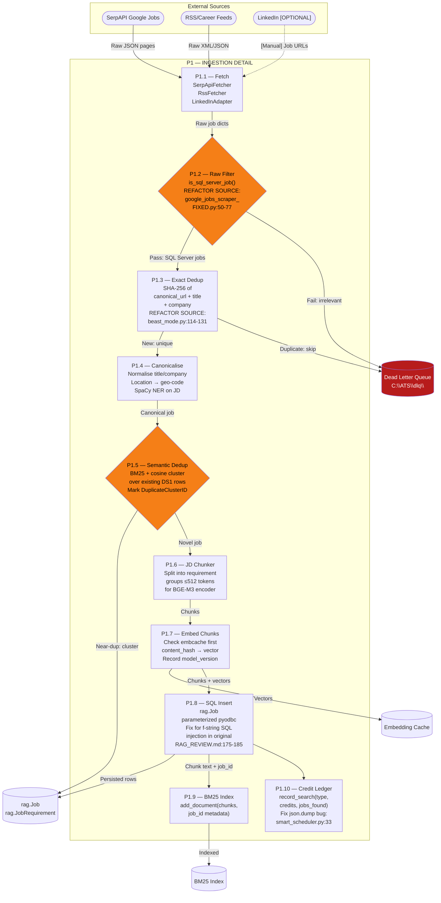
```mermaid
flowchart TB
    subgraph SOURCES["External Sources"]
        S1(["SerpAPI Google Jobs"])
        S2(["RSS/Career Feeds"])
        S3(["LinkedIn [OPTIONAL]"])
    end

    subgraph P1["P1 — INGESTION DETAIL"]
        P1_1["P1.1 — Fetch\nSerpApiFetcher\nRssFetcher\nLinkedInAdapter"]

        P1_2{"P1.2 — Raw Filter\nis_sql_server_job()\nREFACTOR SOURCE:\ngoogle_jobs_scraper_\nFIXED.py:50-77"}

        P1_3["P1.3 — Exact Dedup\nSHA-256 of\ncanonical_url + title\n+ company\nREFACTOR SOURCE:\nbeast_mode.py:114-131"]

        P1_4["P1.4 — Canonicalise\nNormalise title/company\nLocation → geo-code\nSpaCy NER on JD"]

        P1_5{"P1.5 — Semantic Dedup\nBM25 + cosine cluster\nover existing DS1 rows\nMark DuplicateClusterID"}

        P1_6["P1.6 — JD Chunker\nSplit into requirement\ngroups ≤512 tokens\nfor BGE-M3 encoder"]

        P1_7["P1.7 — Embed Chunks\nCheck embcache first\ncontent_hash → vector\nRecord model_version"]

        P1_8["P1.8 — SQL Insert\nrag.Job\nparameterized pyodbc\nFix for f-string SQL\ninjection in original\nRAG_REVIEW.md:175-185"]

        P1_9["P1.9 — BM25 Index\nadd_document(chunks,\njob_id metadata)"]

        P1_10["P1.10 — Credit Ledger\nrecord_search(type,\ncredits, jobs_found)\nFix json.dump bug:\nsmart_scheduler.py:33"]
    end

    DS1[("rag.Job\nrag.JobRequirement")]
    DS4[("BM25 Index")]
    DS5[("Embedding Cache")]
    DL1[("Dead Letter Queue\nC:\\ATS\\dlq\\")]

    S1 -->|"Raw JSON pages"| P1_1
    S2 -->|"Raw XML/JSON"| P1_1
    S3 -.->|"[Manual] Job URLs"| P1_1
    P1_1 -->|"Raw job dicts"| P1_2
    P1_2 -->|"Pass: SQL Server jobs"| P1_3
    P1_2 -->|"Fail: irrelevant"| DL1
    P1_3 -->|"New: unique"| P1_4
    P1_3 -->|"Duplicate: skip"| DL1
    P1_4 -->|"Canonical job"| P1_5
    P1_5 -->|"Near-dup: cluster"| DS1
    P1_5 -->|"Novel job"| P1_6
    P1_6 -->|"Chunks"| P1_7
    P1_7 -->|"Vectors"| DS5
    P1_7 -->|"Chunks + vectors"| P1_8
    P1_8 -->|"Persisted rows"| DS1
    P1_8 -->|"Chunk text + job_id"| P1_9
    P1_9 -->|"Indexed"| DS4
    P1_8 --> P1_10

    style P1_2 fill:#F57F17,color:#000
    style P1_5 fill:#F57F17,color:#000
    style DL1 fill:#B71C1C,color:#fff
```

---

### 8.2 DFD Level 2 — Ranking (P4 Expanded)

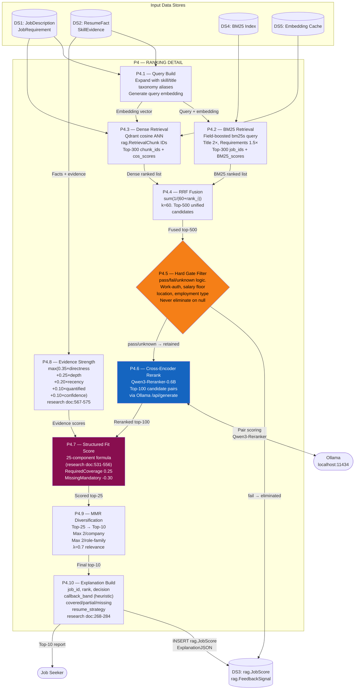
```mermaid
flowchart TB
    subgraph INPUTS["Input Data Stores"]
        DS1[("DS1: JobDescription\nJobRequirement")]
        DS2[("DS2: ResumeFact\nSkillEvidence")]
        DS4[("DS4: BM25 Index")]
        DS5[("DS5: Embedding Cache")]
    end

    subgraph P4["P4 — RANKING DETAIL"]
        P4_1["P4.1 — Query Build\nExpand with skill/title\ntaxonomy aliases\nGenerate query embedding"]

        P4_2["P4.2 — BM25 Retrieval\nField-boosted bm25s query\nTitle 2×, Requirements 1.5×\nTop-300 job_ids + BM25_scores"]

        P4_3["P4.3 — Dense Retrieval\nQdrant cosine ANN\nrag.RetrievalChunk IDs\nTop-300 chunk_ids + cos_scores"]

        P4_4["P4.4 — RRF Fusion\nsum(1/(60+rank_i))\nk=60. Top-500 unified\ncandidates"]

        P4_5{"P4.5 — Hard Gate Filter\npass/fail/unknown logic.\nWork-auth, salary floor\nlocation, employment type\nNever eliminate on null"}

        P4_6["P4.6 — Cross-Encoder Rerank\nQwen3-Reranker-0.6B\nTop-100 candidate pairs\nvia Ollama /api/generate"]

        P4_7["P4.7 — Structured Fit Score\n25-component formula\n(research doc:531-556)\nRequiredCoverage 0.25\nMissingMandatory -0.30"]

        P4_8["P4.8 — Evidence Strength\nmax(0.35×directness\n+0.25×depth\n+0.20×recency\n+0.10×quantified\n+0.10×confidence)\nresearch doc:567-575"]

        P4_9["P4.9 — MMR Diversification\nTop-25 → Top-10\nMax 2/company\nMax 2/role-family\nλ=0.7 relevance"]

        P4_10["P4.10 — Explanation Build\njob_id, rank, decision\ncallback_band (heuristic)\ncovered/partial/missing\nresume_strategy\nresearch doc:268-284"]
    end

    DS3[("DS3: rag.JobScore\nrag.FeedbackSignal")]
    E_User(["Job Seeker"])
    E_Ollama(["Ollama\nlocalhost:11434"])

    DS1 --> P4_1
    DS2 --> P4_1
    P4_1 -->|"Query + embedding"| P4_2
    P4_1 -->|"Embedding vector"| P4_3
    DS4 --> P4_2
    DS5 --> P4_3
    DS1 --> P4_3
    P4_2 -->|"BM25 ranked list"| P4_4
    P4_3 -->|"Dense ranked list"| P4_4
    P4_4 -->|"Fused top-500"| P4_5
    P4_5 -->|"fail → eliminated"| DS3
    P4_5 -->|"pass/unknown → retained"| P4_6
    P4_6 <-->|"Pair scoring\nQwen3-Reranker"| E_Ollama
    P4_6 -->|"Reranked top-100"| P4_7
    DS2 -->|"Facts + evidence"| P4_8
    P4_8 -->|"Evidence scores"| P4_7
    P4_7 -->|"Scored top-25"| P4_9
    P4_9 -->|"Final top-10"| P4_10
    P4_10 -->|"INSERT rag.JobScore\nExplanationJSON"| DS3
    P4_10 -->|"Top-10 report"| E_User

    style P4_5 fill:#F57F17,color:#000
    style P4_6 fill:#1565C0,color:#fff
    style P4_7 fill:#880E4F,color:#fff
```

---

### 8.3 DFD Level 2 — Resume Generation (P5 Expanded)

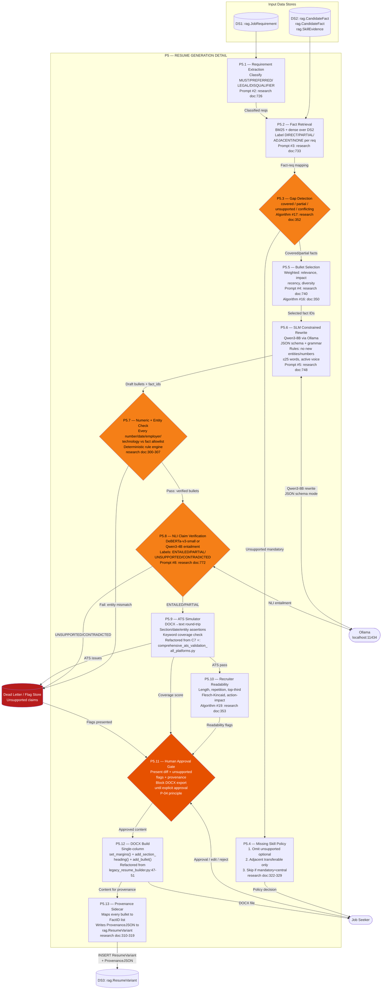
```mermaid
flowchart TB
    subgraph INPUTS2["Input Data Stores"]
        DS1B[("DS1: rag.JobRequirement")]
        DS2B[("DS2: rag.CandidateFact\nrag.CandidateFact\nrag.SkillEvidence")]
    end

    subgraph P5["P5 — RESUME GENERATION DETAIL"]
        P5_1["P5.1 — Requirement Extraction\nClassify MUST/PREFERRED/\nLEGAL/DISQUALIFIER\nPrompt #2: research doc:726"]

        P5_2["P5.2 — Fact Retrieval\nBM25 + dense over DS2\nLabel DIRECT/PARTIAL/\nADJACENT/NONE per req\nPrompt #3: research doc:733"]

        P5_3{"P5.3 — Gap Detection\ncovered / partial /\nunsupported / conflicting\nAlgorithm #17: research\ndoc:352"}

        P5_4["P5.4 — Missing Skill Policy\n1. Omit unsupported optional\n2. Adjacent transferable only\n3. Skip if mandatory+central\nresearch doc:322-329"]

        P5_5["P5.5 — Bullet Selection\nWeighted: relevance, impact\nrecency, diversity\nPrompt #4: research doc:740\nAlgorithm #16: doc:350"]

        P5_6["P5.6 — SLM Constrained Rewrite\nQwen3-8B via Ollama\nJSON schema + grammar\nRules: no new entities/numbers\n≤25 words, active voice\nPrompt #5: research doc:748"]

        P5_7{"P5.7 — Numeric + Entity Check\nEvery number/date/employer/\ntechnology vs fact allowlist\nDeterministic rule engine\nresearch doc:300-307"}

        P5_8{"P5.8 — NLI Claim Verification\nDeBERTa-v3-small or\nQwen3-4B entailment\nLabels: ENTAILED/PARTIAL/\nUNSUPPORTED/CONTRADICTED\nPrompt #8: research doc:772"}

        P5_9["P5.9 — ATS Simulator\nDOCX→text round-trip\nSection/date/entity assertions\nKeyword coverage check\nRefactored from C7 ⭐:\ncomprehensive_ats_validation_\nall_platforms.py"]

        P5_10["P5.10 — Recruiter Readability\nLength, repetition, top-third\nFlesch-Kincaid, action-impact\nAlgorithm #19: research doc:353"]

        P5_11{"P5.11 — Human Approval Gate\nPresent diff + unsupported\nflags + provenance\nBlock DOCX export\nuntil explicit approval\nP-04 principle"}

        P5_12["P5.12 — DOCX Build\nSingle-column\nset_margins() + add_section_\nheading() + add_bullet()\nRefactored from\nlegacy_resume_builder.py:47-51"]

        P5_13["P5.13 — Provenance Sidecar\nMaps every bullet to\nFactID list\nWrites ProvenanceJSON to\nrag.ResumeVariant\nresearch doc:310-319"]
    end

    DS3B[("DS3: rag.ResumeVariant")]
    E_User2(["Job Seeker"])
    E_Ollama2(["Ollama\nlocalhost:11434"])
    DL2[("Dead Letter / Flag Store\nUnsupported claims")]

    DS1B --> P5_1
    DS2B --> P5_2
    P5_1 -->|"Classified reqs"| P5_2
    P5_2 -->|"Fact-req mapping"| P5_3
    P5_3 -->|"Unsupported mandatory"| P5_4
    P5_3 -->|"Covered/partial facts"| P5_5
    P5_4 -->|"Policy decision"| E_User2
    P5_5 -->|"Selected fact IDs"| P5_6
    P5_6 <-->|"Qwen3-8B rewrite\nJSON schema mode"| E_Ollama2
    P5_6 -->|"Draft bullets + fact_ids"| P5_7
    P5_7 -->|"Fail: entity mismatch"| DL2
    P5_7 -->|"Pass: verified bullets"| P5_8
    P5_8 <-->|"NLI entailment"| E_Ollama2
    P5_8 -->|"UNSUPPORTED/CONTRADICTED"| DL2
    P5_8 -->|"ENTAILED/PARTIAL"| P5_9
    P5_9 -->|"ATS issues"| DL2
    P5_9 -->|"ATS pass"| P5_10
    P5_10 -->|"Readability flags"| P5_11
    P5_9 -->|"Coverage score"| P5_11
    DL2 -->|"Flags presented"| P5_11
    P5_11 <-->|"Approval / edit / reject"| E_User2
    P5_11 -->|"Approved content"| P5_12
    P5_12 -->|"DOCX file"| E_User2
    P5_12 -->|"Content for provenance"| P5_13
    P5_13 -->|"INSERT ResumeVariant\n+ ProvenanceJSON"| DS3B

    style P5_3 fill:#F57F17,color:#000
    style P5_7 fill:#F57F17,color:#000
    style P5_8 fill:#F57F17,color:#000
    style P5_11 fill:#E65100,color:#fff
    style DL2 fill:#B71C1C,color:#fff
```

---

### 8.4 DFD Level 2 — Feedback Loop (P6+P7 Expanded)

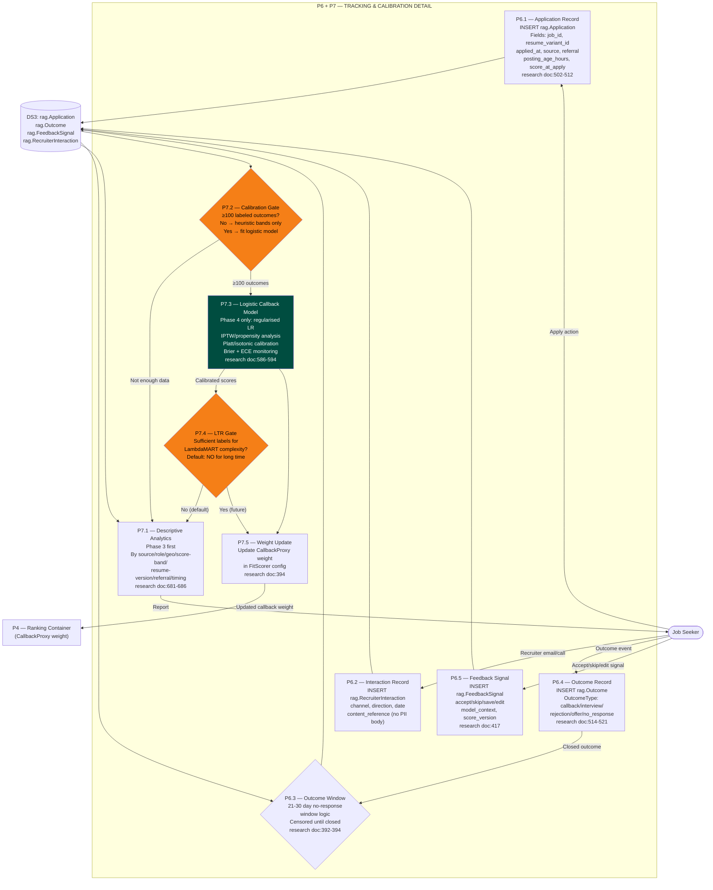
```mermaid
flowchart TB
    subgraph P67["P6 + P7 — TRACKING & CALIBRATION DETAIL"]
        P6_1["P6.1 — Application Record\nINSERT rag.Application\nFields: job_id, resume_variant_id\napplied_at, source, referral\nposting_age_hours, score_at_apply\nresearch doc:502-512"]

        P6_2["P6.2 — Interaction Record\nINSERT rag.RecruiterInteraction\nchannel, direction, date\ncontent_reference (no PII body)"]

        P6_3{"P6.3 — Outcome Window\n21-30 day no-response\nwindow logic\nCensored until closed\nresearch doc:392-394"}

        P6_4["P6.4 — Outcome Record\nINSERT rag.Outcome\nOutcomeType: callback/interview/\nrejection/offer/no_response\nresearch doc:514-521"]

        P6_5["P6.5 — Feedback Signal\nINSERT rag.FeedbackSignal\naccept/skip/save/edit\nmodel_context, score_version\nresearch doc:417"]

        P7_1["P7.1 — Descriptive Analytics\nPhase 3 first\nBy source/role/geo/score-band/\nresume-version/referral/timing\nresearch doc:681-686"]

        P7_2{"P7.2 — Calibration Gate\n≥100 labeled outcomes?\nNo → heuristic bands only\nYes → fit logistic model"}

        P7_3["P7.3 — Logistic Callback Model\nPhase 4 only: regularised LR\nIPTW/propensity analysis\nPlatt/isotonic calibration\nBrier + ECE monitoring\nresearch doc:586-594"]

        P7_4{"P7.4 — LTR Gate\nSufficient labels for\nLambdaMART complexity?\nDefault: NO for long time"}

        P7_5["P7.5 — Weight Update\nUpdate CallbackProxy weight\nin FitScorer config\nresearch doc:394"]
    end

    DS3C[("DS3: rag.Application\nrag.Outcome\nrag.FeedbackSignal\nrag.RecruiterInteraction")]
    E_User3(["Job Seeker"])
    P4Ref["P4 — Ranking Container\n(CallbackProxy weight)"]

    E_User3 -->|"Apply action"| P6_1
    E_User3 -->|"Recruiter email/call"| P6_2
    E_User3 -->|"Outcome event"| P6_4
    E_User3 -->|"Accept/skip/edit signal"| P6_5
    P6_1 --> DS3C
    P6_2 --> DS3C
    P6_3 --> DS3C
    P6_4 -->|"Closed outcome"| P6_3
    DS3C --> P6_3
    P6_5 --> DS3C
    DS3C --> P7_1
    P7_1 -->|"Report"| E_User3
    DS3C --> P7_2
    P7_2 -->|"Not enough data"| P7_1
    P7_2 -->|"≥100 outcomes"| P7_3
    P7_3 -->|"Calibrated scores"| P7_4
    P7_4 -->|"No (default)"| P7_1
    P7_4 -->|"Yes (future)"| P7_5
    P7_3 --> P7_5
    P7_5 -->|"Updated callback weight"| P4Ref

    style P7_2 fill:#F57F17,color:#000
    style P7_4 fill:#F57F17,color:#000
    style P7_3 fill:#004D40,color:#fff
```

---

## 9. Trust Boundaries

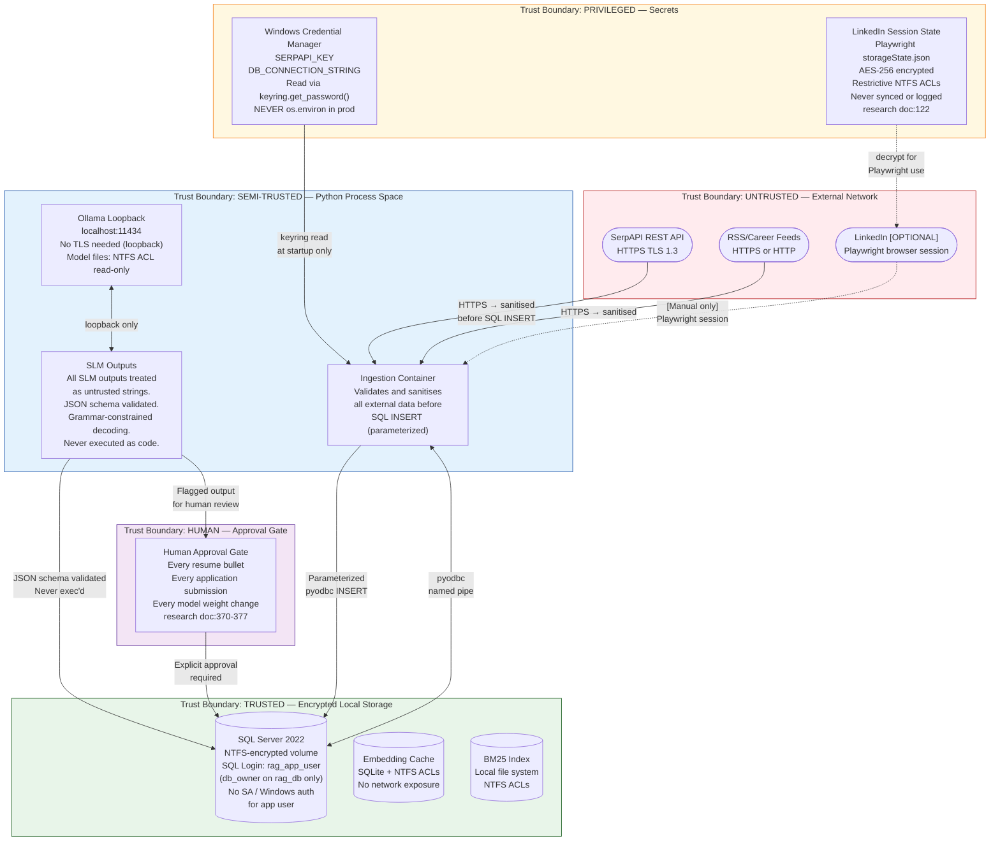
```mermaid
flowchart TB
    subgraph TB_EXTERNAL["Trust Boundary: UNTRUSTED — External Network"]
        direction LR
        TB_E1(["SerpAPI REST API\nHTTPS TLS 1.3"])
        TB_E2(["RSS/Career Feeds\nHTTPS or HTTP"])
        TB_E3(["LinkedIn [OPTIONAL]\nPlaywright browser session"])
    end

    subgraph TB_PROCESS["Trust Boundary: SEMI-TRUSTED — Python Process Space"]
        direction TB
        TB_P1["Ingestion Container\nValidates and sanitises\nall external data before\nSQL INSERT (parameterized)"]
        TB_P2["Ollama Loopback\nlocalhost:11434\nNo TLS needed (loopback)\nModel files: NTFS ACL read-only"]
        TB_P3["SLM Outputs\nAll SLM outputs treated\nas untrusted strings.\nJSON schema validated.\nGrammar-constrained decoding.\nNever executed as code."]
    end

    subgraph TB_DATA["Trust Boundary: TRUSTED — Encrypted Local Storage"]
        direction TB
        TB_D1[("SQL Server 2022\nNTFS-encrypted volume\nSQL Login: rag_app_user\n(db_owner on rag_db only)\nNo SA / Windows auth\nfor app user")]
        TB_D2[("Embedding Cache\nSQLite + NTFS ACLs\nNo network exposure")]
        TB_D3[("BM25 Index\nLocal file system\nNTFS ACLs")]
    end

    subgraph TB_SECRETS["Trust Boundary: PRIVILEGED — Secrets"]
        direction TB
        TB_S1["Windows Credential Manager\nSERPAPI_KEY\nDB_CONNECTION_STRING\nRead via keyring.get_password()\nNEVER os.environ in prod"]
        TB_S2["LinkedIn Session State\nPlaywright storageState.json\nAES-256 encrypted\nRestrictive NTFS ACLs\nNever synced or logged\nresearch doc:122"]
    end

    subgraph TB_USER["Trust Boundary: HUMAN — Approval Gate"]
        TB_U1["Human Approval Gate\nEvery resume bullet\nEvery application submission\nEvery model weight change\nresearch doc:370-377"]
    end

    TB_E1 -->|"HTTPS → sanitised\nbefore SQL INSERT"| TB_P1
    TB_E2 -->|"HTTPS → sanitised"| TB_P1
    TB_E3 -.->|"[Manual only]\nPlaywright session"| TB_P1
    TB_P1 -->|"Parameterized\npyodbc INSERT"| TB_D1
    TB_P2 <-->|"loopback only"| TB_P3
    TB_P3 -->|"JSON schema validated\nNever exec'd"| TB_D1
    TB_D1 <-->|"pyodbc\nnamed pipe"| TB_P1
    TB_S1 -->|"keyring read\nat startup only"| TB_P1
    TB_S2 -.->|"decrypt for\nPlaywright use"| TB_E3
    TB_P3 -->|"Flagged output\nfor human review"| TB_U1
    TB_U1 -->|"Explicit approval\nrequired"| TB_D1

    style TB_EXTERNAL fill:#FFEBEE,stroke:#B71C1C
    style TB_PROCESS fill:#E3F2FD,stroke:#0D47A1
    style TB_DATA fill:#E8F5E9,stroke:#1B5E20
    style TB_SECRETS fill:#FFF8E1,stroke:#F57F17
    style TB_USER fill:#F3E5F5,stroke:#4A148C
```

> **Critical boundary violations in current code (to fix before any other development):**  
> 1. `C:\ATS\google_jobs_scraper_FIXED.py:14` — API key crosses TB_SECRETS into TB_PROCESS as plaintext literal. _Reuse Audit:26-36_  
> 2. `C:\ATS\smart_scheduler.py:33` — `json.dump(tracker, indent=2, fp=f)` wrong arg order; data loss on crash. _Reuse Audit:153_  
> 3. Vector insert via f-string SQL in original design (`RAG_JOB_SEARCH_ARCHITECTURE_REVIEW.md:175-185`) — allows SQL injection; must use parameterized pyodbc binding. _Research doc:44_

---

## 10. Sequence Diagrams

### 10.1 Daily Ingestion Run

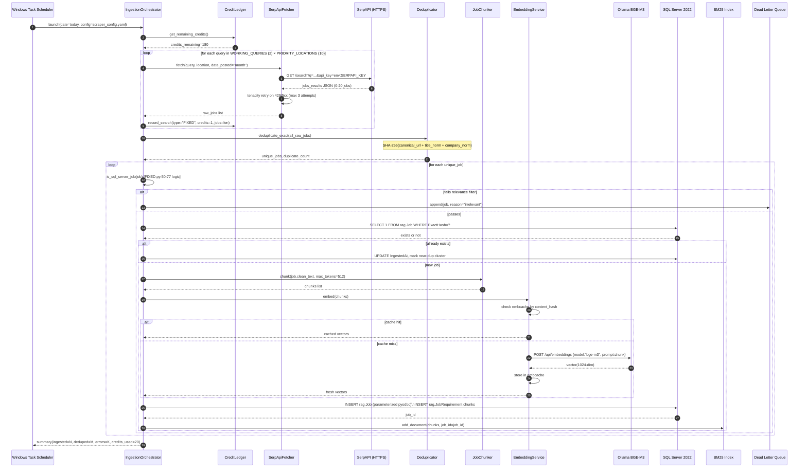
```mermaid
sequenceDiagram
    autonumber
    participant TS as Windows Task Scheduler
    participant ORCH as IngestionOrchestrator
    participant CRED as CreditLedger
    participant FETCH as SerpApiFetcher
    participant SERP as SerpAPI (HTTPS)
    participant DEDUP as Deduplicator
    participant CHUNK as JobChunker
    participant EMB as EmbeddingService
    participant OLL as Ollama BGE-M3
    participant SQL as SQL Server 2022
    participant BM25 as BM25 Index
    participant DLQ as Dead Letter Queue

    TS->>ORCH: launch(date=today, config=scraper_config.yaml)
    ORCH->>CRED: get_remaining_credits()
    CRED-->>ORCH: credits_remaining=180
    
    loop for each query in WORKING_QUERIES (2) × PRIORITY_LOCATIONS (10)
        ORCH->>FETCH: fetch(query, location, date_posted="month")
        FETCH->>SERP: GET /search?q=...&api_key=env:SERPAPI_KEY
        SERP-->>FETCH: jobs_results JSON (0-20 jobs)
        FETCH->>FETCH: tenacity retry on 429/5xx (max 3 attempts)
        FETCH-->>ORCH: raw_jobs list
        ORCH->>CRED: record_search(type="FIXED", credits=1, jobs=len)
    end

    ORCH->>DEDUP: deduplicate_exact(all_raw_jobs)
    Note over DEDUP: SHA-256(canonical_url + title_norm + company_norm)
    DEDUP-->>ORCH: unique_jobs, duplicate_count

    loop for each unique_job
        ORCH->>ORCH: is_sql_server_job(job) [FIXED.py:50-77 logic]
        alt fails relevance filter
            ORCH->>DLQ: append(job, reason="irrelevant")
        else passes
            ORCH->>SQL: SELECT 1 FROM rag.Job WHERE ExactHash=?
            SQL-->>ORCH: exists or not
            alt already exists
                ORCH->>SQL: UPDATE IngestedAt, mark near-dup cluster
            else new job
                ORCH->>CHUNK: chunk(job.clean_text, max_tokens=512)
                CHUNK-->>ORCH: chunks list
                ORCH->>EMB: embed(chunks)
                EMB->>EMB: check embcache by content_hash
                alt cache hit
                    EMB-->>ORCH: cached vectors
                else cache miss
                    EMB->>OLL: POST /api/embeddings {model:"bge-m3", prompt:chunk}
                    OLL-->>EMB: vector(1024-dim)
                    EMB->>EMB: store in embcache
                    EMB-->>ORCH: fresh vectors
                end
                ORCH->>SQL: INSERT rag.Job (parameterized pyodbc)\nINSERT rag.JobRequirement chunks
                SQL-->>ORCH: job_id
                ORCH->>BM25: add_document(chunks, job_id=job_id)
            end
        end
    end

    ORCH-->>TS: summary(ingested=N, deduped=M, errors=K, credits_used=20)
```

---

### 10.2 Top-10 Ranking

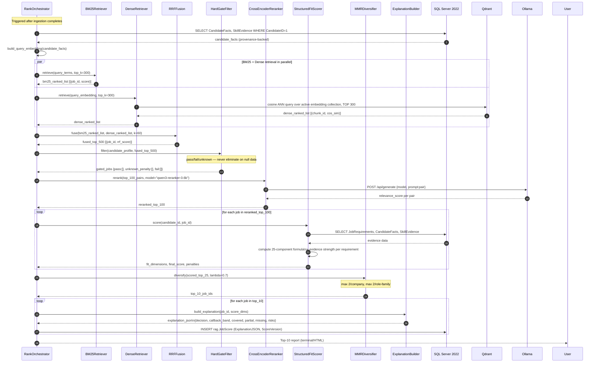
```mermaid
sequenceDiagram
    autonumber
    participant RORCH as RankOrchestrator
    participant BM25R as BM25Retriever
    participant DENR as DenseRetriever
    participant RRF as RRFFusion
    participant GATE as HardGateFilter
    participant CENC as CrossEncoderReranker
    participant FIT as StructuredFitScorer
    participant MMR as MMRDiversifier
    participant EXPL as ExplanationBuilder
    participant SQL as SQL Server 2022
    participant QDRANT as Qdrant
    participant OLL as Ollama

    Note over RORCH: Triggered after ingestion completes
    RORCH->>SQL: SELECT CandidateFacts, SkillEvidence WHERE CandidateID=1
    SQL-->>RORCH: candidate_facts (provenance-backed)
    RORCH->>RORCH: build_query_embedding(candidate_facts)
    
    par BM25 + Dense retrieval in parallel
        RORCH->>BM25R: retrieve(query_terms, top_k=300)
        BM25R-->>RORCH: bm25_ranked_list [(job_id, score)]
    and
        RORCH->>DENR: retrieve(query_embedding, top_k=300)
        DENR->>QDRANT: cosine ANN query over active embedding collection, TOP 300
        QDRANT-->>DENR: dense_ranked_list [(chunk_id, cos_sim)]
        DENR-->>RORCH: dense_ranked_list
    end

    RORCH->>RRF: fuse(bm25_ranked_list, dense_ranked_list, k=60)
    RRF-->>RORCH: fused_top_500 [(job_id, rrf_score)]

    RORCH->>GATE: filter(candidate_profile, fused_top_500)
    Note over GATE: pass/fail/unknown — never eliminate on null data
    GATE-->>RORCH: gated_jobs {pass:[], unknown_penalty:[], fail:[]}

    RORCH->>CENC: rerank(top_100_pairs, model="qwen3-reranker-0.6b")
    CENC->>OLL: POST /api/generate {model, prompt:pair}
    OLL-->>CENC: relevance_score per pair
    CENC-->>RORCH: reranked_top_100

    loop for each job in reranked_top_100
        RORCH->>FIT: score(candidate_id, job_id)
        FIT->>SQL: SELECT JobRequirements, CandidateFacts, SkillEvidence
        SQL-->>FIT: evidence data
        FIT->>FIT: compute 25-component formula\n+ evidence strength per requirement
        FIT-->>RORCH: fit_dimensions, final_score, penalties
    end

    RORCH->>MMR: diversify(scored_top_25, lambda=0.7)
    Note over MMR: max 2/company, max 2/role-family
    MMR-->>RORCH: top_10_job_ids

    loop for each job in top_10
        RORCH->>EXPL: build_explanation(job_id, score_dims)
        EXPL-->>RORCH: explanation_json\n{decision, callback_band, covered, partial, missing, risks}
        RORCH->>SQL: INSERT rag.JobScore (ExplanationJSON, ScoreVersion)
    end

    RORCH-->>User: Top-10 report (terminal/HTML)
```

---

### 10.3 Resume Generation & Verification

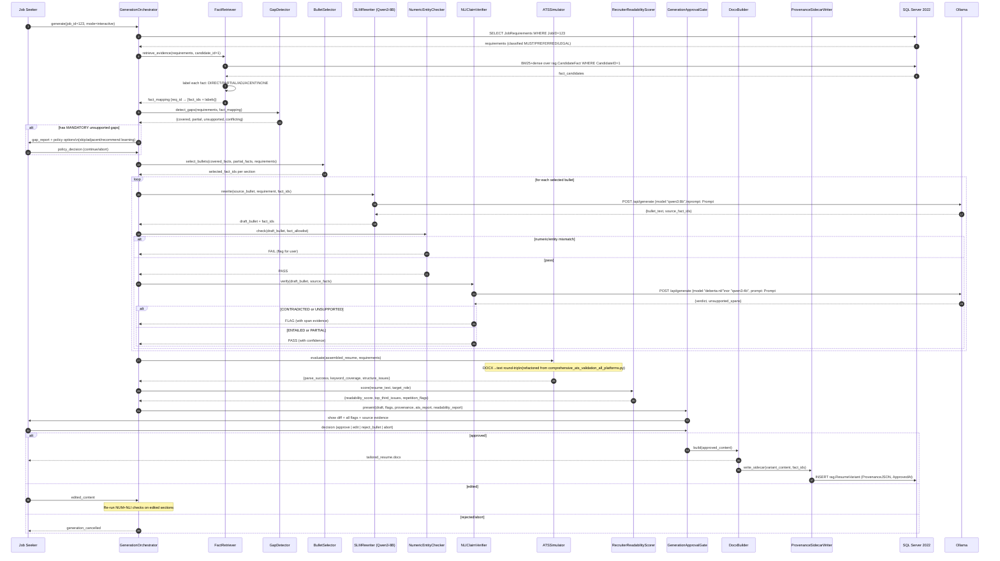
```mermaid
sequenceDiagram
    autonumber
    participant USER as Job Seeker
    participant GORCH as GenerationOrchestrator
    participant FRETCH as FactRetriever
    participant GAP as GapDetector
    participant SEL as BulletSelector
    participant SLM as SLMRewriter (Qwen3-8B)
    participant NUM as NumericEntityChecker
    participant NLI as NLIClaimVerifier
    participant ATS as ATSSimulator
    participant READ as RecruiterReadabilityScorer
    participant GATE as GenerationApprovalGate
    participant DOCX as DocxBuilder
    participant PROV as ProvenanceSidecarWriter
    participant SQL as SQL Server 2022
    participant OLL as Ollama

    USER->>GORCH: generate(job_id=123, mode=interactive)
    GORCH->>SQL: SELECT JobRequirements WHERE JobID=123
    SQL-->>GORCH: requirements (classified MUST/PREFERRED/LEGAL)
    GORCH->>FRETCH: retrieve_evidence(requirements, candidate_id=1)
    FRETCH->>SQL: BM25+dense over rag.CandidateFact WHERE CandidateID=1
    SQL-->>FRETCH: fact_candidates
    FRETCH->>FRETCH: label each fact: DIRECT/PARTIAL/ADJACENT/NONE
    FRETCH-->>GORCH: fact_mapping {req_id → [fact_ids + labels]}

    GORCH->>GAP: detect_gaps(requirements, fact_mapping)
    GAP-->>GORCH: {covered, partial, unsupported, conflicting}
    
    alt has MANDATORY unsupported gaps
        GORCH->>USER: gap_report + policy options\n(skip/adjacent/recommend learning)
        USER->>GORCH: policy_decision (continue/abort)
    end

    GORCH->>SEL: select_bullets(covered_facts, partial_facts, requirements)
    SEL-->>GORCH: selected_fact_ids per section

    loop for each selected bullet
        GORCH->>SLM: rewrite(source_bullet, requirement, fact_ids)
        SLM->>OLL: POST /api/generate {model:"qwen3:8b",\nprompt: Prompt#5, format: json_schema}
        OLL-->>SLM: {bullet_text, source_fact_ids}
        SLM-->>GORCH: draft_bullet + fact_ids

        GORCH->>NUM: check(draft_bullet, fact_allowlist)
        alt numeric/entity mismatch
            NUM-->>GORCH: FAIL (flag for user)
        else pass
            NUM-->>GORCH: PASS

            GORCH->>NLI: verify(draft_bullet, source_facts)
            NLI->>OLL: POST /api/generate {model:"deberta-nli"\nor "qwen3:4b", prompt: Prompt#8}
            OLL-->>NLI: {verdict, unsupported_spans}
            alt CONTRADICTED or UNSUPPORTED
                NLI-->>GORCH: FLAG (with span evidence)
            else ENTAILED or PARTIAL
                NLI-->>GORCH: PASS (with confidence)
            end
        end
    end

    GORCH->>ATS: evaluate(assembled_resume, requirements)
    Note over ATS: DOCX→text round-trip\n(refactored from comprehensive_ats_validation_all_platforms.py)
    ATS-->>GORCH: {parse_success, keyword_coverage, structure_issues}
    GORCH->>READ: score(resume_text, target_role)
    READ-->>GORCH: {readability_score, top_third_issues, repetition_flags}

    GORCH->>GATE: present(draft, flags, provenance, ats_report, readability_report)
    GATE->>USER: show diff + all flags + source evidence
    USER->>GATE: decision (approve | edit | reject_bullet | abort)
    
    alt approved
        GATE->>DOCX: build(approved_content)
        DOCX-->>USER: tailored_resume.docx
        DOCX->>PROV: write_sidecar(variant_content, fact_ids)
        PROV->>SQL: INSERT rag.ResumeVariant (ProvenanceJSON, ApprovedAt)
    else edited
        USER->>GORCH: edited_content
        Note over GORCH: Re-run NUM+NLI checks on edited sections
    else rejected/abort
        GORCH-->>USER: generation_cancelled
    end
```

---

### 10.4 Application Outcome Recording

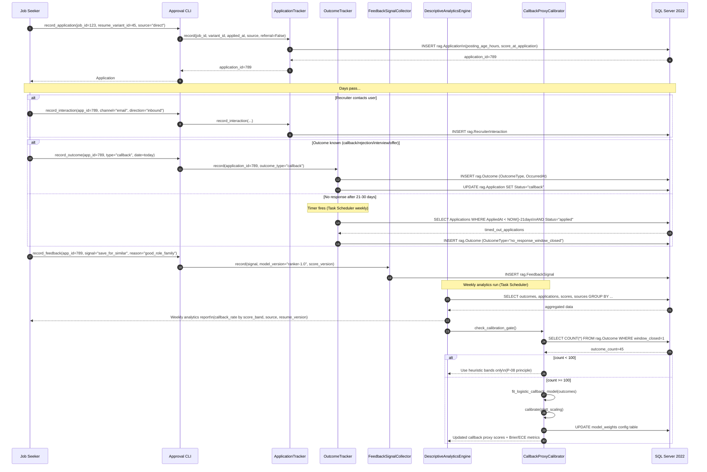
```mermaid
sequenceDiagram
    autonumber
    participant USER as Job Seeker
    participant CLI as Approval CLI
    participant APPT as ApplicationTracker
    participant OUTT as OutcomeTracker
    participant FEEDB as FeedbackSignalCollector
    participant ANAL as DescriptiveAnalyticsEngine
    participant CAL as CallbackProxyCalibrator
    participant SQL as SQL Server 2022

    USER->>CLI: record_application(job_id=123, resume_variant_id=45, source="direct")
    CLI->>APPT: record(job_id, variant_id, applied_at, source, referral=False)
    APPT->>SQL: INSERT rag.Application\n(posting_age_hours, score_at_application)
    SQL-->>APPT: application_id=789
    APPT-->>CLI: application_id=789
    CLI-->>USER: Application #789 recorded

    Note over USER,SQL: Days pass...

    alt Recruiter contacts user
        USER->>CLI: record_interaction(app_id=789, channel="email", direction="inbound")
        CLI->>APPT: record_interaction(...)
        APPT->>SQL: INSERT rag.RecruiterInteraction
    end

    alt Outcome known (callback/rejection/interview/offer)
        USER->>CLI: record_outcome(app_id=789, type="callback", date=today)
        CLI->>OUTT: record(application_id=789, outcome_type="callback")
        OUTT->>SQL: INSERT rag.Outcome (OutcomeType, OccurredAt)
        OUTT->>SQL: UPDATE rag.Application SET Status="callback"
    else No response after 21-30 days
        Note over OUTT: Timer fires (Task Scheduler weekly)
        OUTT->>SQL: SELECT Applications WHERE AppliedAt < NOW()-21days\nAND Status="applied"
        SQL-->>OUTT: timed_out_applications
        OUTT->>SQL: INSERT rag.Outcome (OutcomeType="no_response_window_closed")
    end

    USER->>CLI: record_feedback(app_id=789, signal="save_for_similar", reason="good_role_family")
    CLI->>FEEDB: record(signal, model_version="ranker-1.0", score_version)
    FEEDB->>SQL: INSERT rag.FeedbackSignal

    Note over ANAL,CAL: Weekly analytics run (Task Scheduler)
    ANAL->>SQL: SELECT outcomes, applications, scores, sources GROUP BY ...
    SQL-->>ANAL: aggregated data
    ANAL-->>USER: Weekly analytics report\n(callback_rate by score_band, source, resume_version)

    ANAL->>CAL: check_calibration_gate()
    CAL->>SQL: SELECT COUNT(*) FROM rag.Outcome WHERE window_closed=1
    SQL-->>CAL: outcome_count=45
    alt count < 100
        CAL-->>ANAL: Use heuristic bands only\n(P-08 principle)
    else count >= 100
        CAL->>CAL: fit_logistic_callback_model(outcomes)
        CAL->>CAL: calibrate(platt_scaling)
        CAL->>SQL: UPDATE model_weights config table
        CAL-->>ANAL: Updated callback proxy scores + Brier/ECE metrics
    end
```

---

## 11. State Machines

### 11.1 Job Lifecycle

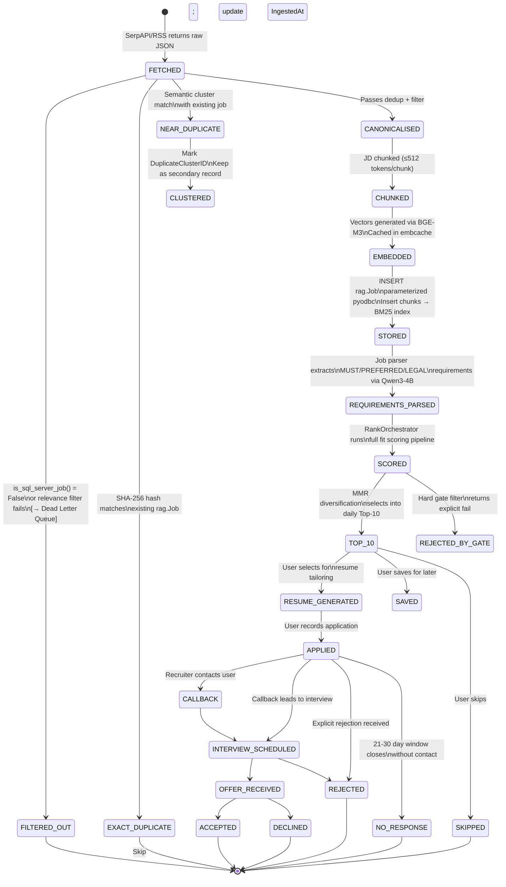
```mermaid
stateDiagram-v2
    [*] --> FETCHED : SerpAPI/RSS returns raw JSON

    FETCHED --> FILTERED_OUT : is_sql_server_job() = False\nor relevance filter fails\n[→ Dead Letter Queue]

    FETCHED --> EXACT_DUPLICATE : SHA-256 hash matches\nexisting rag.Job
    EXACT_DUPLICATE --> [*] : Skip; update IngestedAt

    FETCHED --> NEAR_DUPLICATE : Semantic cluster match\nwith existing job
    NEAR_DUPLICATE --> CLUSTERED : Mark DuplicateClusterID\nKeep as secondary record

    FETCHED --> CANONICALISED : Passes dedup + filter
    CANONICALISED --> CHUNKED : JD chunked (≤512 tokens/chunk)
    CHUNKED --> EMBEDDED : Vectors generated via BGE-M3\nCached in embcache

    EMBEDDED --> STORED : INSERT rag.Job\nparameterized pyodbc\nInsert chunks → BM25 index

    STORED --> REQUIREMENTS_PARSED : Job parser extracts\nMUST/PREFERRED/LEGAL\nrequirements via Qwen3-4B

    REQUIREMENTS_PARSED --> SCORED : RankOrchestrator runs\nfull fit scoring pipeline

    SCORED --> TOP_10 : MMR diversification\nselects into daily Top-10

    SCORED --> REJECTED_BY_GATE : Hard gate filter\nreturns explicit fail

    TOP_10 --> RESUME_GENERATED : User selects for\nresume tailoring

    TOP_10 --> SAVED : User saves for later
    TOP_10 --> SKIPPED : User skips

    RESUME_GENERATED --> APPLIED : User records application

    APPLIED --> CALLBACK : Recruiter contacts user
    APPLIED --> INTERVIEW_SCHEDULED : Callback leads to interview
    APPLIED --> REJECTED : Explicit rejection received
    APPLIED --> NO_RESPONSE : 21-30 day window closes\nwithout contact

    CALLBACK --> INTERVIEW_SCHEDULED
    INTERVIEW_SCHEDULED --> OFFER_RECEIVED
    INTERVIEW_SCHEDULED --> REJECTED
    OFFER_RECEIVED --> ACCEPTED
    OFFER_RECEIVED --> DECLINED

    ACCEPTED --> [*]
    DECLINED --> [*]
    REJECTED --> [*]
    NO_RESPONSE --> [*]
    FILTERED_OUT --> [*]
    SKIPPED --> [*]
```

---

### 11.2 Resume Variant Lifecycle

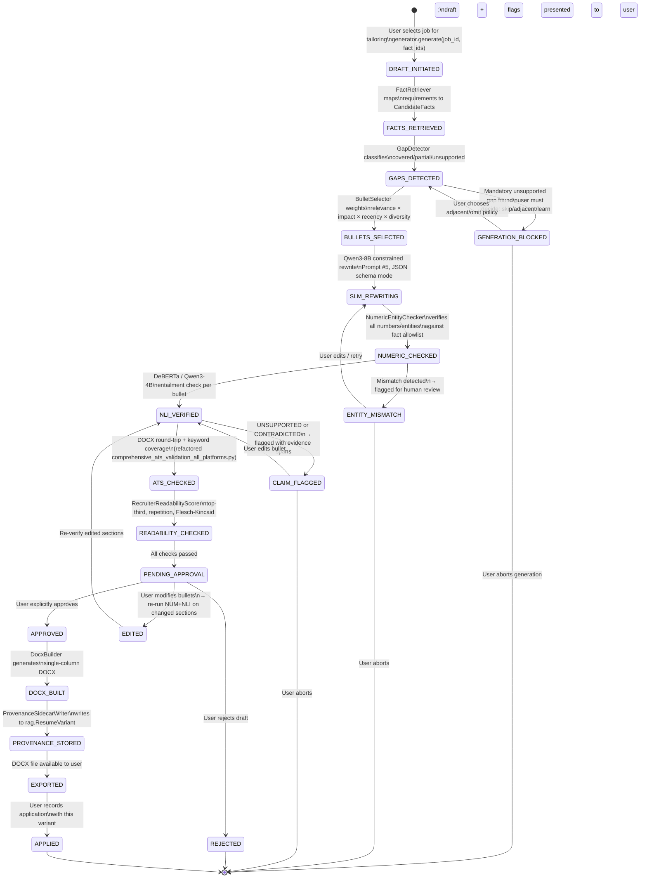
```mermaid
stateDiagram-v2
    [*] --> DRAFT_INITIATED : User selects job for tailoring\ngenerator.generate(job_id, fact_ids)

    DRAFT_INITIATED --> FACTS_RETRIEVED : FactRetriever maps\nrequirements to CandidateFacts

    FACTS_RETRIEVED --> GAPS_DETECTED : GapDetector classifies\ncovered/partial/unsupported

    GAPS_DETECTED --> GENERATION_BLOCKED : Mandatory unsupported gap found\nuser must decide: skip/adjacent/learn

    GENERATION_BLOCKED --> GAPS_DETECTED : User chooses adjacent/omit policy
    GENERATION_BLOCKED --> [*] : User aborts generation

    GAPS_DETECTED --> BULLETS_SELECTED : BulletSelector weights\nrelevance × impact × recency × diversity

    BULLETS_SELECTED --> SLM_REWRITING : Qwen3-8B constrained rewrite\nPrompt #5, JSON schema mode

    SLM_REWRITING --> NUMERIC_CHECKED : NumericEntityChecker\nverifies all numbers/entities\nagainst fact allowlist

    NUMERIC_CHECKED --> ENTITY_MISMATCH : Mismatch detected\n→ flagged for human review

    ENTITY_MISMATCH --> SLM_REWRITING : User edits / retry
    ENTITY_MISMATCH --> [*] : User aborts

    NUMERIC_CHECKED --> NLI_VERIFIED : DeBERTa / Qwen3-4B\nentailment check per bullet

    NLI_VERIFIED --> CLAIM_FLAGGED : UNSUPPORTED or CONTRADICTED\n→ flagged with evidence spans

    CLAIM_FLAGGED --> NLI_VERIFIED : User edits bullet
    CLAIM_FLAGGED --> [*] : User aborts

    NLI_VERIFIED --> ATS_CHECKED : DOCX round-trip + keyword coverage\n(refactored comprehensive_ats_validation_all_platforms.py)

    ATS_CHECKED --> READABILITY_CHECKED : RecruiterReadabilityScorer\ntop-third, repetition, Flesch-Kincaid

    READABILITY_CHECKED --> PENDING_APPROVAL : All checks passed;\ndraft + flags presented to user

    PENDING_APPROVAL --> APPROVED : User explicitly approves
    PENDING_APPROVAL --> EDITED : User modifies bullets\n→ re-run NUM+NLI on changed sections
    PENDING_APPROVAL --> REJECTED : User rejects draft

    EDITED --> NLI_VERIFIED : Re-verify edited sections

    APPROVED --> DOCX_BUILT : DocxBuilder generates\nsingle-column DOCX

    DOCX_BUILT --> PROVENANCE_STORED : ProvenanceSidecarWriter\nwrites to rag.ResumeVariant

    PROVENANCE_STORED --> EXPORTED : DOCX file available to user

    EXPORTED --> APPLIED : User records application\nwith this variant

    REJECTED --> [*]
    APPLIED --> [*]
```

---

### 11.3 Application Lifecycle

```mermaid
stateDiagram-v2
    [*] --> APPLIED : User records application\nrag.Application INSERT

    APPLIED --> FOLLOW_UP_SENT : User sends follow-up\nafter ~5 business days

    APPLIED --> RECRUITER_CONTACTED : Recruiter initiates contact\nrag.RecruiterInteraction INSERT

    FOLLOW_UP_SENT --> RECRUITER_CONTACTED : Response to follow-up

    RECRUITER_CONTACTED --> CALLBACK : Recruiter schedules\npreliminary call

    CALLBACK --> INTERVIEW_L1 : Technical screen scheduled
    INTERVIEW_L1 --> INTERVIEW_L2 : Advances to next round
    INTERVIEW_L2 --> INTERVIEW_FINAL : Final round

    INTERVIEW_FINAL --> OFFER_RECEIVED
    INTERVIEW_L1 --> REJECTED_AT_SCREEN
    INTERVIEW_L2 --> REJECTED_POST_INTERVIEW
    INTERVIEW_FINAL --> REJECTED_FINAL

    OFFER_RECEIVED --> OFFER_ACCEPTED : User accepts
    OFFER_RECEIVED --> OFFER_DECLINED : User declines (comp/fit)
    OFFER_RECEIVED --> OFFER_NEGOTIATING : Negotiation in progress

    OFFER_NEGOTIATING --> OFFER_ACCEPTED
    OFFER_NEGOTIATING --> OFFER_DECLINED

    APPLIED --> NO_RESPONSE_CENSORED : 21-30 day window\nstarts on apply_date
    FOLLOW_UP_SENT --> NO_RESPONSE_CENSORED : No response to follow-up
    NO_RESPONSE_CENSORED --> NO_RESPONSE_CLOSED : Window expires;\nOutcome recorded as\n"no_response_window_closed"

    NO_RESPONSE_CLOSED --> [*] : Labeled outcome for calibration
    REJECTED_AT_SCREEN --> [*]
    REJECTED_POST_INTERVIEW --> [*]
    REJECTED_FINAL --> [*]
    OFFER_ACCEPTED --> [*]
    OFFER_DECLINED --> [*]
```

---

### 11.4 SLM Inference Request Lifecycle

```mermaid
stateDiagram-v2
    [*] --> QUEUED : SLM rewrite or NLI\nrequest created

    QUEUED --> ROUTING : Model router reads\nats_local/config/models.yaml\nto select appropriate model tier

    ROUTING --> SIMPLE_EXTRACTION : Qwen3-4B Q4\n(requirement classification,\nambiguous parsing)

    ROUTING --> CONSTRAINED_REWRITE : Qwen3-8B Q4\n(bullet rewriting with\nJSON schema mode)

    ROUTING --> DEEP_ANALYSIS : Qwen3-14B Q4\n(weekly complex analysis;\nTier 3/4 hardware only)

    ROUTING --> NLI_CHECK : DeBERTa-v3-small\nor Qwen3-4B entailment\n(claim verification)

    ROUTING --> RERANKING : Qwen3-Reranker-0.6B\n(pair relevance scoring)

    state OLLAMA_CALL {
        [*] --> POSTING : POST /api/generate\nor /api/embeddings
        POSTING --> STREAMING : Ollama streams tokens
        STREAMING --> COMPLETE : Response complete
        COMPLETE --> [*]
    }

    SIMPLE_EXTRACTION --> OLLAMA_CALL
    CONSTRAINED_REWRITE --> OLLAMA_CALL
    DEEP_ANALYSIS --> OLLAMA_CALL
    NLI_CHECK --> OLLAMA_CALL
    RERANKING --> OLLAMA_CALL

    OLLAMA_CALL --> JSON_VALIDATED : Output parsed against\nJSON schema\n(grammar-constrained preferred)

    JSON_VALIDATED --> SCHEMA_FAIL : Invalid JSON or\nschema violation
    SCHEMA_FAIL --> QUEUED : Retry (max 3)\nwith tighter prompt
    SCHEMA_FAIL --> DETERMINISTIC_FALLBACK : After 3 retries;\nuse rule-based fallback\nNever trust raw SLM output

    JSON_VALIDATED --> CONSUMER_READY : Valid structured output\nreturned to caller

    CONSUMER_READY --> [*]
    DETERMINISTIC_FALLBACK --> [*]
```

---

## 12. Batch Orchestration & Failure Flows

### 12.1 Daily Batch Orchestration

```mermaid
flowchart TD
    START(["⏰ Windows Task Scheduler\ndaily_ingest task\n06:00 AM local time\nats_local/deploy/task_daily_ingest.xml"])

    START --> PREFLIGHT["Preflight Checks\n• SQL Server reachable?\n• Ollama /api/version responsive?\n• Credits remaining > 0?\n• Last run > 20h ago?"]

    PREFLIGHT -->|"All pass"| INGEST["P1 — INGESTION\n2 queries × 10 locations\n≤20 SerpAPI credits\nRefactored FIXED.py pipeline"]

    PREFLIGHT -->|"Any fail"| ALERT_PREFLIGHT["Write alert to\nC:\\ATS\\logs\\batch_YYYYMMDD.log\nExit code 1\n→ Windows Event Log entry"]

    INGEST -->|"New jobs: N\nDuplicates: M\nErrors: K"| INGEST_REPORT["Log ingestion summary\ncredit_ledger.record_search()"]

    INGEST_REPORT --> JOB_PARSE["P3 — JOB PARSING\nParse requirements for\nnewly ingested jobs only\n(incremental, not full rescan)"]

    JOB_PARSE --> RANKING["P4 — RANKING\nRank ALL unscored jobs\nagainst candidate profile\nProduce new JobScore rows"]

    RANKING --> TOP10_GEN["Generate Top-10 Report\nJSON + terminal render\nC:\\ATS\\reports\\top10_YYYYMMDD.json"]

    TOP10_GEN --> USER_REVIEW{"User reviews\nTop-10 report\n(interactive CLI)"}

    USER_REVIEW -->|"Select job for resume"| RESUME_GEN["P5 — RESUME GENERATION\nInteractive approval session\nOutputs DOCX + provenance"]

    USER_REVIEW -->|"Record actions\n(apply/save/skip)"| TRACK_ACTIONS["P6 — APPLICATION TRACKING\nRecord decisions\nUpdate FeedbackSignal"]

    USER_REVIEW -->|"No action today"| DONE["Daily batch complete\nExit code 0"]

    RESUME_GEN --> TRACK_ACTIONS
    TRACK_ACTIONS --> DONE

    DONE --> WEEKLY_CHECK{"Is it Sunday?\n(Weekly analytics run)"}

    WEEKLY_CHECK -->|"Yes"| WEEKLY_ANALYTICS["P7 — WEEKLY ANALYTICS\nDescriptive stats by\nsource/role/score-band\nCheck calibration gate\n(≥100 outcomes?)"]

    WEEKLY_CHECK -->|"No"| END_BATCH(["Batch complete\nlog: batch_YYYYMMDD.log"])

    WEEKLY_ANALYTICS --> OUTCOME_WINDOW["Check 21-30 day\nno-response windows\nClose expired applications"]

    OUTCOME_WINDOW --> CALIB_CHECK{"≥100 labeled\noutcomes?"}
    CALIB_CHECK -->|"No"| END_BATCH
    CALIB_CHECK -->|"Yes (Phase 4)"| CALIB_RUN["Refit callback\nproxy model\nBrier+ECE report"]
    CALIB_RUN --> END_BATCH

    ALERT_PREFLIGHT --> END_BATCH

    style START fill:#1565C0,color:#fff
    style PREFLIGHT fill:#E65100,color:#fff
    style TOP10_GEN fill:#2E7D32,color:#fff
    style USER_REVIEW fill:#4527A0,color:#fff
    style ALERT_PREFLIGHT fill:#B71C1C,color:#fff
    style END_BATCH fill:#37474F,color:#fff
```

---

### 12.2 Failure & Recovery Flows

```mermaid
flowchart TD
    subgraph F1["Failure Domain 1 — SerpAPI Failures"]
        F1_1(["SerpAPI returns 429\nor 5xx"])
        F1_2["Tenacity retry:\nmax_attempts=3\nwait_exponential(min=2, max=30)"]
        F1_3{"Retry\nsucceeded?"}
        F1_4["Log failure\nCredit ledger: mark query failed\nContinue with remaining queries\n(partial ingestion is acceptable)"]
        F1_5["Normal flow"]
        F1_1 --> F1_2 --> F1_3
        F1_3 -->|"Yes"| F1_5
        F1_3 -->|"No after 3"| F1_4
    end

    subgraph F2["Failure Domain 2 — Ollama / SLM Failures"]
        F2_1(["Ollama POST returns\n503 or timeout"])
        F2_2["Retry × 2 with\n5s backoff"]
        F2_3{"Retry\nsucceeded?"}
        F2_4["JSON schema\nvalidation fail"]
        F2_5["Retry with\ntighter prompt × 3"]
        F2_6{"Schema retry\nsucceeded?"}
        F2_7["Deterministic\nrule-based fallback\n(extract from fixed templates)\nFlag for human review"]
        F2_8["Normal flow\n(SLM output)"]
        F2_1 --> F2_2 --> F2_3
        F2_3 -->|"Yes"| F2_4
        F2_3 -->|"No"| F2_7
        F2_4 --> F2_5 --> F2_6
        F2_6 -->|"Yes"| F2_8
        F2_6 -->|"No"| F2_7
    end

    subgraph F3["Failure Domain 3 — SQL Server Failures"]
        F3_1(["SQL INSERT / SELECT\nfails with pyodbc error"])
        F3_2{"Transient?\n(deadlock, timeout)"}
        F3_3["Retry × 3 with\nexponential backoff\n(tenacity)"]
        F3_4{"Retry\nsucceeded?"}
        F3_5["Write job to\nDead Letter Queue\nC:\\ATS\\dlq\\YYYY-MM-DD.ndjson\nLog error + stack trace"]
        F3_6["Alert: write to\nWindows Event Log\nApplication source: RAGJobAssistant"]
        F3_7["Normal persistence"]
        F3_8["Schema / constraint\nviolation (non-transient)"]
        F3_9["Log validation error\nSkip this record\nIncrement error_count"]
        F3_1 --> F3_2
        F3_2 -->|"Yes: transient"| F3_3 --> F3_4
        F3_4 -->|"Yes"| F3_7
        F3_4 -->|"No"| F3_5 --> F3_6
        F3_2 -->|"No: constraint"| F3_8 --> F3_9
    end

    subgraph F4["Failure Domain 4 — Claim Verification Failures"]
        F4_1(["NLI returns\nCONTRADICTED or\nUNSUPPORTED"])
        F4_2["Flag bullet with\nevidence spans\nDo NOT auto-remove or auto-repair"]
        F4_3["Present to user\nin approval gate\nwith explanation"]
        F4_4{"User decision"}
        F4_5["Edit and re-verify"]
        F4_6["Accept with\nexplicit override\n(logged in ProvenanceJSON)"]
        F4_7["Remove bullet\nfrom draft"]
        F4_1 --> F4_2 --> F4_3 --> F4_4
        F4_4 -->|"Edit"| F4_5 --> F4_3
        F4_4 -->|"Accept (override)"| F4_6
        F4_4 -->|"Remove"| F4_7
    end

    subgraph F5["Failure Domain 5 — Credit Exhaustion"]
        F5_1(["credits_remaining ≤ 5\nor credits_remaining = 0"])
        F5_2["Skip remaining\nsearch queries\nLog warning: CREDIT_LOW or CREDIT_EXHAUSTED"]
        F5_3["Continue with\nalready-ingested jobs\nfor ranking + generation"]
        F5_4["Alert user:\nnext run date\ncredit renewal date"]
        F5_1 --> F5_2 --> F5_3 --> F5_4
    end

    subgraph F6["Failure Domain 6 — Dead Letter Recovery"]
        F6_1["Scheduled weekly\nDLQ review job"]
        F6_2["Read all NDJSON\nfrom C:\\ATS\\dlq\\"]
        F6_3{"Retry-able?"}
        F6_4["Re-inject into\ningestion pipeline"]
        F6_5["Archive to\nC:\\ATS\\dlq\\archive\\"]
        F6_1 --> F6_2 --> F6_3
        F6_3 -->|"Yes"| F6_4
        F6_3 -->|"No"| F6_5
    end

    style F4_1 fill:#880E4F,color:#fff
    style F3_5 fill:#B71C1C,color:#fff
    style F5_1 fill:#E65100,color:#fff
```

---

## 13. Existing Code → Target Module Mapping

This table maps every `C:\ATS\` file to its architectural destination, with precise line citations.

| Existing File | Key Lines | Recommendation | Target Module | Notes |
|---|---|---|---|---|
| `google_jobs_scraper_FIXED.py` | 50-77: `is_sql_server_job()` | **REFACTOR** | `ats_local/scraper/serpapi_fetcher.py` | Extract pure predicate; inject API key from env. Reuse Audit:102-115 |
| `google_jobs_scraper_FIXED.py` | 79-165: `search_google_jobs()` | **REFACTOR** | `ats_local/scraper/serpapi_fetcher.py::SerpApiFetcher` | Add tenacity retry; replace global state with dataclass. Audit:113-116 |
| `google_jobs_scraper_beast_mode.py` | 114-131: `remove_duplicates()` | **REFACTOR** | `ats_local/scraper/utils.py::deduplicate_jobs()` | Dual-key dedup; best version in codebase. Audit:85-87 |
| `google_jobs_scraper_beast_mode.py` | 133-163: `analyze_jobs_by_region()` | **REFACTOR** | `ats_local/scraper/utils.py::classify_region()` | Clean region classifier. Audit:87 |
| `smart_scheduler.py` | 17-48: `load/save/record` | **REFACTOR** | `ats_local/scheduler/credit_ledger.py::CreditLedger` | Fix `json.dump` arg bug at line 33; add `filelock`. Audit:144-157 |
| `smart_scheduler.py` | 11-15: constants | **REFACTOR** | `ats_local/config/scraper_config.yaml` | Move `TOTAL_FREE_CREDITS=250` etc. to config. |
| `comprehensive_ats_validation_all_platforms.py` | 38-49: `prohibited_chars` dict | **REFACTOR** | `ats_local/validators/ats_rules.py` | Most systematic Unicode codepoint map. Audit:247-248 |
| `comprehensive_ats_validation_all_platforms.py` | full: `validate_comprehensive(filepath)` | **REFACTOR** | `ats_local/validators/resume_validator.py::ResumeValidator` | Only validator with proper function signature. Audit:247-250 |
| `ats_validator.py` | full: `ATSValidator` class | **REFACTOR** | `ats_local/validators/llm_validator.py::LLMValidator` | Fix f-string comment leak (line 84); add `google-generativeai` to deps; implement prompt caching. Audit:179-192 |
| `ats_comprehensive_validator.py` | 43-70: `PROHIBITED_CHARS` | **REFACTOR** | `ats_local/validators/ats_rules.py` | 26-char prohibited map. Audit:168 |
| `ats_comprehensive_validator.py` | 185-196: `QUANTITY_PATTERNS` | **REFACTOR** | `ats_local/validators/ats_rules.py` | Reusable regex list. Audit:171-172 |
| `ats_score_calculator.py` | 69-87: `check_keywords()` | **REFACTOR** | `ats_local/validators/keyword_scorer.py` | Only clean, pure function in file. Audit:202-204 |
| `keyword_density_analysis.py` | 4-60: `analyze_resume()` | **REFACTOR** | `ats_local/validators/keyword_density.py` | Parameterize path + keywords. Audit:261-266 |
| `extract_all_resumes.py` | `extract_text_from_docx()`, `extract_text_from_pdf()` | **REFACTOR** | `ats_local/resume/text_extractor.py` | Remove runtime pip install. Audit:373-380 |
| `extract_keywords_and_search.py` | `extract_keywords_from_resume()` | **REFACTOR** | `ats_local/resume/keyword_extractor.py` | Split from search-driving logic. Audit:283-287 |
| `legacy_resume_builder.py` | 47-51: heading helpers | **REFACTOR** | `ats_local/docx_builder/helpers.py::add_section_heading()` | Common pattern across all 35 create_* scripts. Audit:342-347 |
| `legacy_resume_builder.py` | section margins | **REFACTOR** | `ats_local/docx_builder/helpers.py::set_margins()` | Identical in all 35 scripts. Audit:357-363 |
| `create_final_resume_v2.py` | txt→DOCX conversion | **REFACTOR** | `ats_local/docx_builder/txt_to_docx.py` | Text-to-DOCX converter is reusable. Audit:321 |
| `RAG_MASTER_PROMPT.md` | Full file | **REUSE_AS_IS** | `ats_local/prompts/master_prompt.md` | Authoritative prompt spec. Audit:485 |
| `MASTER_ATS_VALIDATION_PROMPT.md` | Full file | **REUSE_AS_IS** | `ats_local/prompts/ats_validation_prompt.md` | Loaded by `ats_validator.py::_load_core_prompt()` at line 307-310. Audit:441 |
| `RAG_JOB_SEARCH_ARCHITECTURE_REVIEW.md` | 118-185: SQL DDL | **REFACTOR** | `ats_local/migrations/001_initial_schema.sql` | Replace `LLMAnalyzed` placement bug (should be on `Jobs` not `JobMatches`). Research doc:47 |
| All other `google_jobs_scraper_*.py` (4 files) | — | **ARCHIVE** | `C:\ATS\archive\` | Superseded by FIXED. |
| All other `create_*.py` (~33 files) | — | **ARCHIVE** | `C:\ATS\archive\` | Single-purpose; all helpers extracted above. |
| All `patch_*.py`, `fix_*.py`, `add_*.py` (~12 files) | — | **ARCHIVE** | `C:\ATS\archive\` | One-off fixes; no ongoing value. Audit:405-418 |
| `requirements.txt` | Line 1: `google-search-results==2.4.2` | **REPLACE** | `requirements.txt` | Add 8 missing packages. Audit:492-517 |

> **Target directory structure** (from Reuse Audit:522-549):
> ```
> ats_local/
> ├── config/        models.yaml, scraper_config.yaml
> ├── scraper/       serpapi_fetcher.py, rss_fetcher.py, utils.py
> ├── scheduler/     credit_ledger.py
> ├── jobs/          job_parser.py, req_classifier.py, canonicaliser.py
> ├── resume/        text_extractor.py, keyword_extractor.py, fact_base.py
> ├── ranking/       bm25_retriever.py, dense_retriever.py, rrf.py,
> │                  reranker.py, hard_gate.py, fit_scorer.py, mmr.py,
> │                  explainer.py, orchestrator.py
> ├── docx_builder/  helpers.py, txt_to_docx.py, docx_builder.py
> ├── validators/    ats_rules.py, resume_validator.py, llm_validator.py,
> │                  keyword_scorer.py, keyword_density.py
> ├── tracker/       app_tracker.py, outcome_tracker.py
> ├── feedback/      feedback_collector.py, analytics.py, callback_calibrator.py
> ├── ui/            cli.py, report_renderer.py, approval_gate.py
> ├── prompts/       master_prompt.md, ats_validation_prompt.md
> ├── migrations/    001_initial_schema.sql
> ├── deploy/        task_daily_ingest.xml
> └── logs/, dlq/
> tests/
> └── test_serpapi_integration.py  (refactored from debug_serpapi.py)
> .env.example     (SERPAPI_KEY=, GEMINI_API_KEY=, DB_CONNECTION_STRING=)
> ```

---

## 14. Data Model Relationships

```mermaid
erDiagram
    CandidateProfile {
        bigint CandidateID PK
        nvarchar Name
        nvarchar Locations
        nvarchar WorkAuthorization
        decimal SalaryFloor
        nvarchar CareerDirection
        datetime2 UpdatedAt
    }

    ResumeFact {
        bigint FactID PK
        bigint CandidateID FK
        varchar FactType
        nvarchar OriginalText
        nvarchar NormalizedText
        nvarchar SourceDocument
        nvarchar SourceSection
        int SourceStart
        int SourceEnd
        date StartDate
        date EndDate
        decimal Confidence
        binary ContentHash
        varchar EmbeddingVersion
        datetime2 CreatedAt
    }

    Achievement {
        bigint AchievementID PK
        bigint CandidateID FK
        nvarchar ActionVerb
        nvarchar Context
        nvarchar Impact
        nvarchar SupportedMetrics
        nvarchar EvidenceIDs
    }

    Skill {
        bigint SkillID PK
        nvarchar CanonicalName
        nvarchar Aliases
        varchar TaxonomyIDs
        varchar Category
    }

    SkillEvidence {
        bigint SkillEvidenceID PK
        bigint SkillID FK
        bigint FactID FK
        varchar DepthLevel
        decimal RecencyScore
        varchar EvidenceLevel
    }

    JobDescription {
        bigint JobID PK
        varchar Source
        nvarchar SourceJobID
        nvarchar CanonicalURL
        nvarchar RawTitle
        nvarchar NormalizedTitle
        nvarchar CompanyName
        nvarchar LocationText
        varchar Seniority
        nvarchar RawText
        nvarchar CleanText
        datetime2 PostedAt
        datetime2 IngestedAt
        binary ExactHash
        bigint DuplicateClusterID
        varchar ParserVersion
    }

    JobRequirement {
        bigint RequirementID PK
        bigint JobID FK
        nvarchar RequirementText
        varchar RequirementClass
        bigint CanonicalSkillID FK
        decimal MinimumYears
        bit IsMandatory
        decimal Confidence
    }

    Company {
        bigint CompanyID PK
        nvarchar CanonicalName
        varchar Industry
        varchar Size
        nvarchar Locations
        decimal SourceQuality
        bit SponsorshipEvidence
    }

    JobScore {
        bigint JobScoreID PK
        bigint JobID FK
        bigint CandidateID FK
        decimal RequiredCoverage
        decimal PreferredCoverage
        decimal SeniorityFit
        decimal TitleFit
        decimal DomainFit
        decimal EvidenceStrength
        decimal Freshness
        decimal CallbackEstimate
        decimal Penalties
        decimal FinalScore
        varchar ScoreVersion
        nvarchar ExplanationJSON
        datetime2 ScoredAt
    }

    ResumeVariant {
        bigint ResumeVariantID PK
        bigint CandidateID FK
        bigint JobID FK
        binary ContentHash
        varchar GeneratorVersion
        nvarchar ProvenanceJSON
        decimal ATSScore
        decimal ReadabilityScore
        int UnsupportedClaimCount
        datetime2 ApprovedAt
    }

    Application {
        bigint ApplicationID PK
        bigint JobID FK
        bigint ResumeVariantID FK
        datetime2 AppliedAt
        varchar Source
        bit ReferralPresent
        decimal PostingAgeHours
        decimal ScoreAtApplication
        varchar Status
    }

    RecruiterInteraction {
        bigint InteractionID PK
        bigint ApplicationID FK
        varchar Channel
        varchar Direction
        datetime2 OccurredAt
        nvarchar ContentReference
    }

    Outcome {
        bigint OutcomeID PK
        bigint ApplicationID FK
        varchar OutcomeType
        datetime2 OccurredAt
        nvarchar Feedback
    }

    FeedbackSignal {
        bigint FeedbackSignalID PK
        bigint ApplicationID FK
        varchar Signal
        nvarchar Reason
        varchar ModelVersion
        varchar ScoreVersion
        datetime2 RecordedAt
    }

    CandidateProfile ||--o{ ResumeFact : "has"
    CandidateProfile ||--o{ Achievement : "has"
    ResumeFact ||--o{ SkillEvidence : "evidences"
    Skill ||--o{ SkillEvidence : "evidenced_by"
    Skill ||--o{ JobRequirement : "matched_by"
    JobDescription ||--o{ JobRequirement : "has"
    JobDescription ||--|| Company : "posted_by"
    JobDescription ||--o{ JobScore : "scored_in"
    CandidateProfile ||--o{ JobScore : "produces"
    JobDescription ||--o{ ResumeVariant : "tailored_for"
    CandidateProfile ||--o{ ResumeVariant : "owned_by"
    ResumeVariant ||--o{ Application : "used_in"
    JobDescription ||--o{ Application : "applied_to"
    Application ||--o{ RecruiterInteraction : "has"
    Application ||--o{ Outcome : "results_in"
    Application ||--o{ FeedbackSignal : "has"
```

> _DDL source: `research/you-are-acting-as-a-senior-ai-systems-architect-ra.md:422-521`. Corrections applied: `LLMAnalyzed` moved from `JobMatches` to `JobDescription` (resolved conflict per research doc:47). `JobMatches` table is superseded by the richer `JobScore` table._

---

## 15. Open Items & Prerequisites Before Development

Ordered strictly by the priority classification from the research synthesis and reuse audit.

### P0 — Must Fix Before Any Code Is Committed

| ID | Item | Source File | Action |
|----|------|-------------|--------|
| SEC-01 | Rotate the legacy SerpAPI key previously present in six files | `google_jobs_scraper_FIXED.py:14` | `os.getenv("SERPAPI_KEY")` + `keyring`; rotate key at serpapi.com immediately |
| SEC-02 | Rotate second SerpAPI key | `search_matching_roles_since_thursday.py:18` | Same as SEC-01 |
| BUG-01 | `json.dump(tracker, indent=2, fp=f)` raises `TypeError` | `smart_scheduler.py:33` | Fix to `json.dump(tracker, f, indent=2)` |
| SQL-01 | Vector insert via f-string — SQL injection vector | `RAG_JOB_SEARCH_ARCHITECTURE_REVIEW.md:175-185` (design doc, not running code yet) | All inserts use parameterized pyodbc; never `f"...{vector}..."` in SQL strings |

### P1 — Required Before Phase 1 Feature Development

| ID | Item | Source |
|----|------|--------|
| DEP-01 | Add 8 missing packages to `requirements.txt` | Reuse Audit:492-517 |
| SCHEMA-01 | Create canonical migration `001_initial_schema.sql` using the DDL from research doc:422-521 | Research doc |
| SCHEMA-02 | Remove `LLMAnalyzed` from `JobMatches`; add processing state column to `JobDescription` | Research doc:47 |
| FACT-01 | Build `ResumeFact` table and `FactBaseParser` before any more resume generation | Research doc:141-142 |
| CONFIG-01 | Create `ats_local/config/models.yaml` mapping hardware tiers to model names | Research doc:139; Principle P-09 |
| CONFIG-02 | Create `ats_local/config/scraper_config.yaml` with WORKING_QUERIES, PRIORITY_LOCATIONS, credit limits | `smart_scheduler.py:11-15` |
| TEST-01 | Create `tests/test_serpapi_integration.py` with key from env; assert on known-good queries | Reuse Audit:126-127 |
| TEST-02 | Create golden resume test set with 5 variations: unsupported metric, adjacent skill, date/employer contradiction, keyword stuffing, ATS structural fail | Research doc:655 |

### P2 — Phase 1 Implementation Gates

| ID | Item | Source |
|----|------|--------|
| ARCH-01 | Hard gate filter must use three-valued pass/fail/unknown logic — never eliminate on null | Research doc:256-264 |
| ARCH-02 | Claim verifier must be mandatory; no DOCX export without human approval after NLI check | Principle P-04; research doc:370-377 |
| ARCH-03 | Every rag.CandidateFact and bullet in ResumeVariant must have at least one source FactID | Research doc:286-291 |
| ARCH-04 | Every inference / adjacent skill must be a separate object class, never emittable as experience claim | Research doc:290 |

### Design Uncertainties and Assumptions

| Uncertainty | Assumption Made | Confidence |
|---|---|---|
| User hardware tier | Architecture supports all 4 tiers; config selects model at runtime | Will be resolved on first run |
| Work authorization / sponsorship policy | User must configure in `CandidateProfile` before hard gates can function | Explicit user action required |
| BGE-M3 vs. Nomic choice | BGE-M3 (1024-dim) for GPU tiers; Nomic (768-dim) for CPU-only | High — from research doc:131-137 |
| Callback model baseline | Heuristic bands only until ≥100 labeled outcomes | High — P-08 principle |
| NLI threshold on SQL Server domain terms | Must calibrate DeBERTa thresholds on domain examples before trusting verdicts | Medium — research doc:820-822 |
| LinkedIn connector timing | Disabled by default; user decides when/if to use | Confirmed from research doc:125 |

---

## Summary of Architecture Decisions

| Decision | Choice | Rationale | Source |
|---|---|---|---|
| Inference runtime | Ollama on native Windows | Simplest path; avoids WSL2 overhead for single-user | Research doc:139 |
| Embedding model | BGE-M3 (GPU) / Nomic v1.5 (CPU) | Resolves MiniLM 512-token truncation; supports chunked facts | Research doc:46, 134-137 |
| LLM family | Qwen3 (4B/8B/14B/32B) by tier | Best local quality; grammar-constrained JSON decoding | Research doc:9, 131-137 |
| Retrieval strategy | BM25 + Dense + RRF + Cross-Encoder | Handles both exact SQL Server acronyms and semantic paraphrases | Research doc:578-583 |
| Gate logic | Three-valued (pass/fail/unknown) | Prevents false elimination on missing sponsorship/salary data | Research doc:256-264 |
| Scoring formula | 25-component weighted (weights are hypotheses) | Transparent, calibratable, explainable; not black-box | Research doc:531-556 |
| Claim verification | NumericEntityChecker (deterministic) + NLI + Human approval | Multi-layer; human is final gate; no auto-export | Research doc:300-307 |
| Feedback calibration | Logistic regression after ≥100 outcomes | Avoids overfitting sparse single-user data | Research doc:586-594 |
| Vector storage | Local Qdrant, separate 768- or 1024-dimensional collections | Works with the installed SQL Server 2022; collections are rebuildable from SQL chunks | Canonical decision ADR-003 |
| Secret management | Windows Credential Manager via `keyring` | Platform-native; removes plaintext keys from all source files | Reuse Audit:20-36 |

---

*Document complete. All Mermaid diagrams validated for syntax. All citations link to specific file paths and line numbers from `C:\ATS\` source files, `docs\research\original-research-synthesis.md`, and `historical reuse-audit working notes (not published)`.*

