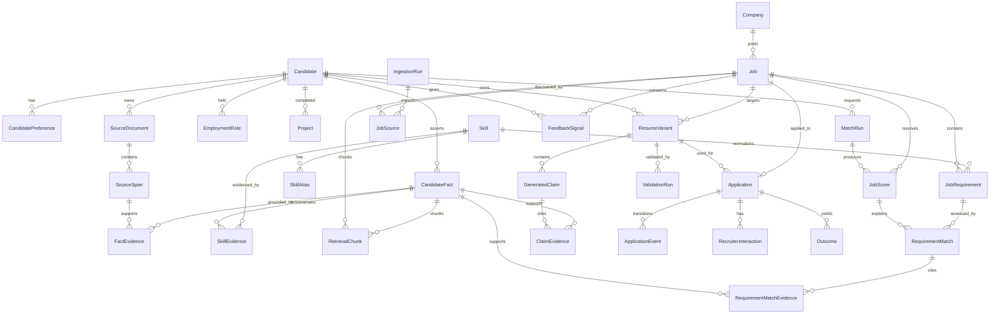

# Local RAG Job Assistant — Data and API Design

**Status:** implementation-ready baseline  
**Target:** local Windows deployment; Python 3.11; SQL Server 2022+  
**Primary interface:** `ats` CLI plus in-process typed services. A loopback-only `/api/v1` adapter is deferred until after MVP.  
**Authority:** SQL Server is the system of record. Retrieval indexes are rebuildable projections.

## 1. Decisions and invariants

1. Candidate claims are immutable, atomic facts with source spans and hashes. Generated claims must cite facts.
2. Eligibility uses three-valued `PASS | FAIL | UNKNOWN`; unknown is never silently treated as false.
3. Required, preferred, legal, context, and disqualifying requirements are distinct.
4. Derived records carry parser, taxonomy, prompt, model, embedding, and scoring versions.
5. Raw documents stay outside the database in an encrypted local artifact store; SQL stores URI, hash, MIME type, size, and lineage.
6. A versioned local `bm25s` projection provides lexical retrieval. A local Qdrant collection provides ANN vectors; SQL chunk IDs are payload keys. Native SQL vectors may be evaluated later without changing domain APIs.
7. Application submission and final resume approval are always human actions.
8. All writes use optimistic concurrency (`rowversion`), an idempotency key where retryable, and an outbox transaction.

## 2. ERD



## 3. Canonical entities

| Entity | Responsibility / immutable key |
|---|---|
| Candidate | Local user identity; one row is supported initially. |
| CandidatePreference | Effective-dated location, work authorization, salary, work-mode, and targeting policy. |
| SourceDocument / SourceSpan | Encrypted artifact metadata and exact character/page provenance. `(document_id,start_offset,end_offset,hash)` is stable. |
| EmploymentRole / Project | Chronology and context referenced by facts; not inferred from generated text. |
| CandidateFact | Atomic, immutable assertion. Supersession creates a new row. |
| FactEvidence | Many-to-many support from source spans with `DIRECT|INFERRED`; only `DIRECT` may ground experience claims. |
| Skill / SkillAlias / SkillEvidence | Versioned normalization and evidence depth/recency. |
| Company | Canonical employer, source quality, and non-sensitive company metadata. |
| Job / JobSource | Canonical posting and each discovered source representation. Exact identity uses normalized content hash; source identity is unique per adapter. |
| JobRequirement | Atomic `REQUIRED|PREFERRED|LEGAL|DISQUALIFIER|CONTEXT` requirement with source span. |
| RetrievalChunk | Rebuildable lexical/vector unit; never the authoritative source text. |
| MatchRun / JobScore | Immutable scored snapshot and explanation/version envelope. |
| RequirementMatch | `COVERED|PARTIAL|MISSING|CONFLICT|UNKNOWN` plus evidence. |
| ResumeVariant / GeneratedClaim | State-controlled artifact and sentence/bullet claims. |
| ValidationRun | Deterministic/SLM check outputs and pass/fail gate. |
| Application / ApplicationEvent | Current state plus append-only transition history. One application per canonical job/candidate. |
| Outcome | Append-only observations; no-response remains censored until its window closes. |
| FeedbackSignal | `APPLY|SAVE|SKIP|EDIT|ACCEPT|REJECT` with ranking context. |
| OutboxEvent / IdempotencyRecord | Reliable local event publication and retry semantics. |

## 4. SQL Server migrations

Use `sqlcmd -b -X -i <file>` through `ats db migrate` with a least-privilege migration login. Each migration is checksummed and recorded in `ops.SchemaMigration`. DDL below maps to `migrations/001_core.sql` through `006_security.sql`.

### V001 — schemas, identity, provenance, taxonomy

```sql
SET XACT_ABORT ON;
BEGIN TRAN;
IF NOT EXISTS (SELECT 1 FROM sys.schemas WHERE name=N'rag') EXEC(N'CREATE SCHEMA rag');
IF NOT EXISTS (SELECT 1 FROM sys.schemas WHERE name=N'ops') EXEC(N'CREATE SCHEMA ops');

CREATE TABLE rag.Candidate(
  candidate_id bigint IDENTITY CONSTRAINT PK_Candidate PRIMARY KEY,
  public_id uniqueidentifier NOT NULL CONSTRAINT DF_Candidate_public DEFAULT NEWSEQUENTIALID(),
  display_name nvarchar(200) NOT NULL,
  email_cipher varbinary(8000) NULL,
  phone_cipher varbinary(8000) NULL,
  status varchar(16) NOT NULL CONSTRAINT DF_Candidate_status DEFAULT 'ACTIVE',
  created_at datetime2(3) NOT NULL CONSTRAINT DF_Candidate_created DEFAULT SYSUTCDATETIME(),
  updated_at datetime2(3) NOT NULL CONSTRAINT DF_Candidate_updated DEFAULT SYSUTCDATETIME(),
  rv rowversion NOT NULL,
  CONSTRAINT UQ_Candidate_public UNIQUE(public_id),
  CONSTRAINT CK_Candidate_status CHECK(status IN('ACTIVE','DISABLED','DELETED'))
);
CREATE TABLE rag.CandidatePreference(
  preference_id bigint IDENTITY CONSTRAINT PK_CandidatePreference PRIMARY KEY,
  candidate_id bigint NOT NULL,
  effective_from datetime2(3) NOT NULL,
  effective_to datetime2(3) NULL,
  target_titles_json nvarchar(max) NOT NULL CONSTRAINT DF_Pref_titles DEFAULT N'[]',
  locations_json nvarchar(max) NOT NULL CONSTRAINT DF_Pref_locations DEFAULT N'[]',
  work_modes_json nvarchar(max) NOT NULL CONSTRAINT DF_Pref_modes DEFAULT N'[]',
  work_authorization_json nvarchar(max) NOT NULL CONSTRAINT DF_Pref_auth DEFAULT N'[]',
  salary_floor decimal(19,4) NULL, salary_currency char(3) NULL,
  unknown_gate_policy varchar(16) NOT NULL CONSTRAINT DF_Pref_gate DEFAULT 'RETAIN',
  career_direction nvarchar(1000) NULL,
  created_at datetime2(3) NOT NULL CONSTRAINT DF_Pref_created DEFAULT SYSUTCDATETIME(),
  CONSTRAINT FK_Pref_candidate FOREIGN KEY(candidate_id) REFERENCES rag.Candidate(candidate_id),
  CONSTRAINT CK_Pref_dates CHECK(effective_to IS NULL OR effective_to>effective_from),
  CONSTRAINT CK_Pref_salary CHECK(salary_floor IS NULL OR salary_floor>=0),
  CONSTRAINT CK_Pref_gate CHECK(unknown_gate_policy IN('RETAIN','REVIEW','REJECT')),
  CONSTRAINT CK_Pref_json CHECK(ISJSON(target_titles_json)=1 AND ISJSON(locations_json)=1
    AND ISJSON(work_modes_json)=1 AND ISJSON(work_authorization_json)=1)
);
CREATE UNIQUE INDEX UX_Pref_current ON rag.CandidatePreference(candidate_id) WHERE effective_to IS NULL;

CREATE TABLE rag.SourceDocument(
  document_id bigint IDENTITY CONSTRAINT PK_SourceDocument PRIMARY KEY,
  public_id uniqueidentifier NOT NULL CONSTRAINT DF_SourceDocument_public DEFAULT NEWSEQUENTIALID(),
  candidate_id bigint NULL,
  document_type varchar(32) NOT NULL,
  artifact_uri nvarchar(1000) NOT NULL,
  original_name nvarchar(260) NOT NULL,
  media_type varchar(100) NOT NULL,
  byte_size bigint NOT NULL,
  content_sha256 binary(32) NOT NULL,
  encryption_key_id varchar(100) NOT NULL,
  retention_class varchar(32) NOT NULL,
  parser_version varchar(64) NULL,
  imported_at datetime2(3) NOT NULL CONSTRAINT DF_SourceDocument_imported DEFAULT SYSUTCDATETIME(),
  purge_after datetime2(3) NULL, deleted_at datetime2(3) NULL,
  rv rowversion NOT NULL,
  CONSTRAINT UQ_SourceDocument_public UNIQUE(public_id),
  CONSTRAINT UQ_SourceDocument_hash UNIQUE(candidate_id,content_sha256),
  CONSTRAINT FK_SourceDocument_candidate FOREIGN KEY(candidate_id) REFERENCES rag.Candidate(candidate_id),
  CONSTRAINT CK_SourceDocument_type CHECK(document_type IN('RESUME','PROFILE','CERTIFICATE','PROJECT','JOB_RAW','GENERATED_RESUME','OTHER')),
  CONSTRAINT CK_SourceDocument_size CHECK(byte_size>=0),
  CONSTRAINT CK_SourceDocument_retention CHECK(retention_class IN('PROFILE','JOB_RAW','GENERATED','INTERACTION','AUDIT'))
);
CREATE TABLE rag.SourceSpan(
  span_id bigint IDENTITY CONSTRAINT PK_SourceSpan PRIMARY KEY,
  document_id bigint NOT NULL,
  section_name nvarchar(200) NULL, page_number int NULL,
  start_offset int NOT NULL, end_offset int NOT NULL,
  original_text nvarchar(max) NOT NULL,
  content_sha256 binary(32) NOT NULL,
  created_at datetime2(3) NOT NULL CONSTRAINT DF_SourceSpan_created DEFAULT SYSUTCDATETIME(),
  CONSTRAINT FK_SourceSpan_document FOREIGN KEY(document_id) REFERENCES rag.SourceDocument(document_id),
  CONSTRAINT CK_SourceSpan_offsets CHECK(start_offset>=0 AND end_offset>start_offset),
  CONSTRAINT CK_SourceSpan_page CHECK(page_number IS NULL OR page_number>0),
  CONSTRAINT UQ_SourceSpan UNIQUE(document_id,start_offset,end_offset,content_sha256)
);
CREATE TABLE rag.EmploymentRole(
  role_id bigint IDENTITY CONSTRAINT PK_EmploymentRole PRIMARY KEY,
  candidate_id bigint NOT NULL, employer_name nvarchar(300) NOT NULL,
  raw_title nvarchar(300) NOT NULL, canonical_title nvarchar(300) NULL,
  seniority varchar(32) NULL, start_date date NOT NULL, end_date date NULL,
  location_text nvarchar(300) NULL, source_span_id bigint NOT NULL,
  CONSTRAINT FK_Role_candidate FOREIGN KEY(candidate_id) REFERENCES rag.Candidate(candidate_id),
  CONSTRAINT FK_Role_span FOREIGN KEY(source_span_id) REFERENCES rag.SourceSpan(span_id),
  CONSTRAINT CK_Role_dates CHECK(end_date IS NULL OR end_date>=start_date)
);
CREATE TABLE rag.Project(
  project_id bigint IDENTITY CONSTRAINT PK_Project PRIMARY KEY,
  candidate_id bigint NOT NULL, project_name nvarchar(300) NOT NULL,
  role_text nvarchar(300) NULL, start_date date NULL, end_date date NULL,
  description nvarchar(2000) NOT NULL, source_span_id bigint NOT NULL,
  CONSTRAINT FK_Project_candidate FOREIGN KEY(candidate_id) REFERENCES rag.Candidate(candidate_id),
  CONSTRAINT FK_Project_span FOREIGN KEY(source_span_id) REFERENCES rag.SourceSpan(span_id),
  CONSTRAINT CK_Project_dates CHECK(end_date IS NULL OR start_date IS NULL OR end_date>=start_date)
);
CREATE TABLE rag.CandidateFact(
  fact_id bigint IDENTITY CONSTRAINT PK_CandidateFact PRIMARY KEY,
  public_id uniqueidentifier NOT NULL CONSTRAINT DF_Fact_public DEFAULT NEWSEQUENTIALID(),
  candidate_id bigint NOT NULL, fact_type varchar(40) NOT NULL,
  original_text nvarchar(2000) NOT NULL, normalized_text nvarchar(2000) NOT NULL,
  role_id bigint NULL, project_id bigint NULL, start_date date NULL, end_date date NULL,
  confidence decimal(5,4) NOT NULL, verification_status varchar(16) NOT NULL,
  content_sha256 binary(32) NOT NULL, supersedes_fact_id bigint NULL,
  parser_version varchar(64) NOT NULL, taxonomy_version varchar(64) NOT NULL,
  created_at datetime2(3) NOT NULL CONSTRAINT DF_Fact_created DEFAULT SYSUTCDATETIME(),
  retired_at datetime2(3) NULL, rv rowversion NOT NULL,
  CONSTRAINT UQ_Fact_public UNIQUE(public_id),
  CONSTRAINT UQ_Fact_hash UNIQUE(candidate_id,content_sha256),
  CONSTRAINT FK_Fact_candidate FOREIGN KEY(candidate_id) REFERENCES rag.Candidate(candidate_id),
  CONSTRAINT FK_Fact_role FOREIGN KEY(role_id) REFERENCES rag.EmploymentRole(role_id),
  CONSTRAINT FK_Fact_project FOREIGN KEY(project_id) REFERENCES rag.Project(project_id),
  CONSTRAINT FK_Fact_supersedes FOREIGN KEY(supersedes_fact_id) REFERENCES rag.CandidateFact(fact_id),
  CONSTRAINT CK_Fact_conf CHECK(confidence BETWEEN 0 AND 1),
  CONSTRAINT CK_Fact_status CHECK(verification_status IN('UNVERIFIED','VERIFIED','DISPUTED','REJECTED')),
  CONSTRAINT CK_Fact_dates CHECK(end_date IS NULL OR start_date IS NULL OR end_date>=start_date)
);
CREATE TABLE rag.FactEvidence(
  fact_id bigint NOT NULL, span_id bigint NOT NULL,
  evidence_kind varchar(16) NOT NULL, confidence decimal(5,4) NOT NULL,
  CONSTRAINT PK_FactEvidence PRIMARY KEY(fact_id,span_id),
  CONSTRAINT FK_FactEvidence_fact FOREIGN KEY(fact_id) REFERENCES rag.CandidateFact(fact_id),
  CONSTRAINT FK_FactEvidence_span FOREIGN KEY(span_id) REFERENCES rag.SourceSpan(span_id),
  CONSTRAINT CK_FactEvidence_kind CHECK(evidence_kind IN('DIRECT','INFERRED')),
  CONSTRAINT CK_FactEvidence_conf CHECK(confidence BETWEEN 0 AND 1)
);
CREATE TABLE rag.Skill(
  skill_id bigint IDENTITY CONSTRAINT PK_Skill PRIMARY KEY,
  canonical_name nvarchar(200) NOT NULL, normalized_key varchar(200) NOT NULL,
  category varchar(64) NOT NULL, external_taxonomy varchar(32) NULL,
  external_id varchar(100) NULL, taxonomy_version varchar(64) NOT NULL,
  is_active bit NOT NULL CONSTRAINT DF_Skill_active DEFAULT 1,
  CONSTRAINT UQ_Skill_key UNIQUE(normalized_key,taxonomy_version)
);
CREATE TABLE rag.SkillAlias(
  skill_id bigint NOT NULL, alias nvarchar(200) NOT NULL, normalized_alias varchar(200) NOT NULL,
  locale varchar(12) NOT NULL CONSTRAINT DF_SkillAlias_locale DEFAULT 'en',
  CONSTRAINT PK_SkillAlias PRIMARY KEY(skill_id,normalized_alias,locale),
  CONSTRAINT FK_SkillAlias_skill FOREIGN KEY(skill_id) REFERENCES rag.Skill(skill_id)
);
CREATE TABLE rag.SkillEvidence(
  skill_evidence_id bigint IDENTITY CONSTRAINT PK_SkillEvidence PRIMARY KEY,
  skill_id bigint NOT NULL, fact_id bigint NOT NULL,
  depth_level varchar(16) NOT NULL, evidence_level varchar(16) NOT NULL,
  last_used_date date NULL, months_experience smallint NULL,
  confidence decimal(5,4) NOT NULL,
  CONSTRAINT FK_SkillEvidence_skill FOREIGN KEY(skill_id) REFERENCES rag.Skill(skill_id),
  CONSTRAINT FK_SkillEvidence_fact FOREIGN KEY(fact_id) REFERENCES rag.CandidateFact(fact_id),
  CONSTRAINT UQ_SkillEvidence UNIQUE(skill_id,fact_id),
  CONSTRAINT CK_SkillEvidence_depth CHECK(depth_level IN('AWARE','WORKING','ADVANCED','EXPERT')),
  CONSTRAINT CK_SkillEvidence_level CHECK(evidence_level IN('DIRECT','ADJACENT','INFERRED')),
  CONSTRAINT CK_SkillEvidence_months CHECK(months_experience IS NULL OR months_experience>=0),
  CONSTRAINT CK_SkillEvidence_conf CHECK(confidence BETWEEN 0 AND 1)
);
COMMIT;
```

### V002 — jobs and ingestion

```sql
SET XACT_ABORT ON; BEGIN TRAN;
CREATE TABLE ops.IngestionRun(
  ingestion_run_id uniqueidentifier NOT NULL CONSTRAINT PK_IngestionRun PRIMARY KEY DEFAULT NEWSEQUENTIALID(),
  source varchar(32) NOT NULL, status varchar(16) NOT NULL,
  config_version varchar(64) NOT NULL, started_at datetime2(3) NOT NULL DEFAULT SYSUTCDATETIME(),
  completed_at datetime2(3) NULL, fetched_count int NOT NULL DEFAULT 0,
  accepted_count int NOT NULL DEFAULT 0, rejected_count int NOT NULL DEFAULT 0,
  error_json nvarchar(max) NULL,
  CONSTRAINT CK_IngestionRun_status CHECK(status IN('QUEUED','RUNNING','SUCCEEDED','PARTIAL','FAILED','CANCELLED')),
  CONSTRAINT CK_IngestionRun_counts CHECK(fetched_count>=0 AND accepted_count>=0 AND rejected_count>=0),
  CONSTRAINT CK_IngestionRun_error CHECK(error_json IS NULL OR ISJSON(error_json)=1)
);
CREATE TABLE rag.Company(
  company_id bigint IDENTITY CONSTRAINT PK_Company PRIMARY KEY,
  canonical_name nvarchar(300) NOT NULL, normalized_key varchar(300) NOT NULL,
  website_host varchar(255) NULL, industry nvarchar(200) NULL,
  size_band varchar(32) NULL, source_quality decimal(5,4) NOT NULL DEFAULT 0.5,
  sponsorship_status varchar(16) NOT NULL DEFAULT 'UNKNOWN',
  sponsorship_evidence_span_id bigint NULL, created_at datetime2(3) NOT NULL DEFAULT SYSUTCDATETIME(),
  rv rowversion NOT NULL,
  CONSTRAINT UQ_Company_key UNIQUE(normalized_key),
  CONSTRAINT FK_Company_span FOREIGN KEY(sponsorship_evidence_span_id) REFERENCES rag.SourceSpan(span_id),
  CONSTRAINT CK_Company_quality CHECK(source_quality BETWEEN 0 AND 1),
  CONSTRAINT CK_Company_sponsor CHECK(sponsorship_status IN('YES','NO','UNKNOWN'))
);
CREATE TABLE rag.DuplicateCluster(
  cluster_id bigint IDENTITY CONSTRAINT PK_DuplicateCluster PRIMARY KEY,
  algorithm_version varchar(64) NOT NULL, created_at datetime2(3) NOT NULL DEFAULT SYSUTCDATETIME()
);
CREATE TABLE rag.Job(
  job_id bigint IDENTITY CONSTRAINT PK_Job PRIMARY KEY,
  public_id uniqueidentifier NOT NULL DEFAULT NEWSEQUENTIALID(),
  company_id bigint NULL, raw_title nvarchar(300) NOT NULL, canonical_title nvarchar(300) NULL,
  seniority varchar(32) NULL, location_text nvarchar(500) NULL,
  country_code char(2) NULL, work_mode varchar(16) NULL,
  employment_type varchar(16) NULL, salary_min decimal(19,4) NULL,
  salary_max decimal(19,4) NULL, salary_currency char(3) NULL,
  clean_text nvarchar(max) NOT NULL, exact_sha256 binary(32) NOT NULL,
  duplicate_cluster_id bigint NULL, posted_at datetime2(3) NULL,
  first_seen_at datetime2(3) NOT NULL DEFAULT SYSUTCDATETIME(),
  last_seen_at datetime2(3) NOT NULL DEFAULT SYSUTCDATETIME(),
  expires_at datetime2(3) NULL, status varchar(20) NOT NULL DEFAULT 'ACTIVE',
  lifecycle_state varchar(32) NOT NULL DEFAULT 'CANONICALISED',
  parser_version varchar(64) NOT NULL, taxonomy_version varchar(64) NOT NULL,
  created_at datetime2(3) NOT NULL DEFAULT SYSUTCDATETIME(), rv rowversion NOT NULL,
  CONSTRAINT UQ_Job_public UNIQUE(public_id), CONSTRAINT UQ_Job_hash UNIQUE(exact_sha256),
  CONSTRAINT FK_Job_company FOREIGN KEY(company_id) REFERENCES rag.Company(company_id),
  CONSTRAINT FK_Job_cluster FOREIGN KEY(duplicate_cluster_id) REFERENCES rag.DuplicateCluster(cluster_id),
  CONSTRAINT CK_Job_salary CHECK(salary_min IS NULL OR salary_max IS NULL OR salary_max>=salary_min),
  CONSTRAINT CK_Job_status CHECK(status IN('ACTIVE','EXPIRED','REMOVED','DUPLICATE','FILTERED')),
  CONSTRAINT CK_Job_workmode CHECK(work_mode IS NULL OR work_mode IN('ONSITE','HYBRID','REMOTE','UNKNOWN')),
  CONSTRAINT CK_Job_lifecycle CHECK(lifecycle_state IN('CANONICALISED','CHUNKED','EMBEDDED','STORED','REQUIREMENTS_PARSED','SCORED','TOP_10','SAVED','SKIPPED','ARCHIVED'))
);
CREATE TABLE rag.JobSource(
  job_source_id bigint IDENTITY CONSTRAINT PK_JobSource PRIMARY KEY,
  job_id bigint NOT NULL, ingestion_run_id uniqueidentifier NOT NULL,
  source varchar(32) NOT NULL, source_job_id nvarchar(300) NULL,
  canonical_url nvarchar(1500) NOT NULL, raw_document_id bigint NOT NULL,
  source_quality decimal(5,4) NOT NULL DEFAULT 0.5,
  discovered_at datetime2(3) NOT NULL DEFAULT SYSUTCDATETIME(),
  CONSTRAINT FK_JobSource_job FOREIGN KEY(job_id) REFERENCES rag.Job(job_id),
  CONSTRAINT FK_JobSource_run FOREIGN KEY(ingestion_run_id) REFERENCES ops.IngestionRun(ingestion_run_id),
  CONSTRAINT FK_JobSource_document FOREIGN KEY(raw_document_id) REFERENCES rag.SourceDocument(document_id),
  CONSTRAINT UQ_JobSource UNIQUE(source,source_job_id),
  CONSTRAINT CK_JobSource_quality CHECK(source_quality BETWEEN 0 AND 1)
);
CREATE TABLE rag.JobRequirement(
  requirement_id bigint IDENTITY CONSTRAINT PK_JobRequirement PRIMARY KEY,
  job_id bigint NOT NULL, ordinal smallint NOT NULL, requirement_text nvarchar(1500) NOT NULL,
  requirement_class varchar(20) NOT NULL, entity_type varchar(20) NOT NULL,
  skill_id bigint NULL, minimum_years decimal(4,1) NULL,
  gate_operator varchar(16) NULL, gate_value nvarchar(300) NULL,
  source_span_id bigint NULL, confidence decimal(5,4) NOT NULL,
  parser_version varchar(64) NOT NULL, taxonomy_version varchar(64) NOT NULL,
  CONSTRAINT FK_Requirement_job FOREIGN KEY(job_id) REFERENCES rag.Job(job_id),
  CONSTRAINT FK_Requirement_skill FOREIGN KEY(skill_id) REFERENCES rag.Skill(skill_id),
  CONSTRAINT FK_Requirement_span FOREIGN KEY(source_span_id) REFERENCES rag.SourceSpan(span_id),
  CONSTRAINT UQ_Requirement_ordinal UNIQUE(job_id,ordinal),
  CONSTRAINT CK_Requirement_class CHECK(requirement_class IN('REQUIRED','PREFERRED','LEGAL','DISQUALIFIER','CONTEXT')),
  CONSTRAINT CK_Requirement_entity CHECK(entity_type IN('SKILL','TITLE','SENIORITY','LOCATION','AUTHORIZATION','SALARY','CERTIFICATION','EDUCATION','DOMAIN','OTHER')),
  CONSTRAINT CK_Requirement_years CHECK(minimum_years IS NULL OR minimum_years>=0),
  CONSTRAINT CK_Requirement_conf CHECK(confidence BETWEEN 0 AND 1)
);
CREATE INDEX IX_Job_active_posted ON rag.Job(status,posted_at DESC) INCLUDE(company_id,canonical_title,location_text,work_mode);
CREATE INDEX IX_Job_cluster ON rag.Job(duplicate_cluster_id) WHERE duplicate_cluster_id IS NOT NULL;
CREATE INDEX IX_JobSource_url ON rag.JobSource(canonical_url);
CREATE INDEX IX_Requirement_job_class ON rag.JobRequirement(job_id,requirement_class) INCLUDE(skill_id,confidence);
CREATE INDEX IX_Requirement_skill ON rag.JobRequirement(skill_id,requirement_class) WHERE skill_id IS NOT NULL;
COMMIT;
```

### V003 — retrieval, scoring, explanations

```sql
SET XACT_ABORT ON; BEGIN TRAN;
CREATE TABLE rag.RetrievalChunk(
  chunk_id bigint IDENTITY CONSTRAINT PK_RetrievalChunk PRIMARY KEY,
  owner_type varchar(24) NOT NULL, owner_id bigint NOT NULL, ordinal smallint NOT NULL,
  chunk_kind varchar(24) NOT NULL, text_content nvarchar(max) NOT NULL,
  content_sha256 binary(32) NOT NULL, metadata_json nvarchar(max) NOT NULL DEFAULT N'{}',
  embedding_model varchar(100) NULL, embedding_version varchar(64) NULL,
  vector_store varchar(32) NULL, vector_point_id uniqueidentifier NULL,
  vector_dimensions smallint NULL, indexed_at datetime2(3) NULL,
  created_at datetime2(3) NOT NULL DEFAULT SYSUTCDATETIME(),
  CONSTRAINT UQ_Chunk_owner UNIQUE(owner_type,owner_id,ordinal,content_sha256),
  CONSTRAINT UQ_Chunk_vector UNIQUE(vector_point_id),
  CONSTRAINT CK_Chunk_owner CHECK(owner_type IN('JOB','REQUIREMENT','FACT','ACHIEVEMENT','SKILL_EVIDENCE','FEEDBACK','OUTCOME')),
  CONSTRAINT CK_Chunk_kind CHECK(chunk_kind IN('ATOMIC','SECTION','AGGREGATE')),
  CONSTRAINT CK_Chunk_json CHECK(ISJSON(metadata_json)=1),
  CONSTRAINT CK_Chunk_dims CHECK(vector_dimensions IS NULL OR vector_dimensions>0)
);
CREATE TABLE rag.MatchRun(
  match_run_id uniqueidentifier NOT NULL CONSTRAINT PK_MatchRun PRIMARY KEY DEFAULT NEWSEQUENTIALID(),
  candidate_id bigint NOT NULL, as_of datetime2(3) NOT NULL,
  status varchar(16) NOT NULL, config_version varchar(64) NOT NULL,
  retriever_version varchar(64) NOT NULL, reranker_version varchar(64) NOT NULL,
  scorer_version varchar(64) NOT NULL, taxonomy_version varchar(64) NOT NULL,
  started_at datetime2(3) NOT NULL DEFAULT SYSUTCDATETIME(), completed_at datetime2(3) NULL,
  CONSTRAINT FK_MatchRun_candidate FOREIGN KEY(candidate_id) REFERENCES rag.Candidate(candidate_id),
  CONSTRAINT CK_MatchRun_status CHECK(status IN('QUEUED','RUNNING','SUCCEEDED','FAILED','CANCELLED'))
);
CREATE TABLE rag.JobScore(
  job_score_id bigint IDENTITY CONSTRAINT PK_JobScore PRIMARY KEY,
  match_run_id uniqueidentifier NOT NULL, candidate_id bigint NOT NULL, job_id bigint NOT NULL,
  eligibility varchar(8) NOT NULL, required_coverage decimal(6,5) NOT NULL,
  preferred_coverage decimal(6,5) NOT NULL, seniority_fit decimal(6,5) NOT NULL,
  title_fit decimal(6,5) NOT NULL, domain_fit decimal(6,5) NOT NULL,
  evidence_strength decimal(6,5) NOT NULL, freshness decimal(6,5) NOT NULL,
  source_quality decimal(6,5) NOT NULL, callback_estimate decimal(6,5) NULL,
  penalties decimal(6,5) NOT NULL, final_score decimal(6,5) NOT NULL,
  rank_ordinal int NULL, decision varchar(16) NOT NULL,
  explanation_json nvarchar(max) NOT NULL, scored_at datetime2(3) NOT NULL DEFAULT SYSUTCDATETIME(),
  CONSTRAINT FK_JobScore_run FOREIGN KEY(match_run_id) REFERENCES rag.MatchRun(match_run_id),
  CONSTRAINT FK_JobScore_candidate FOREIGN KEY(candidate_id) REFERENCES rag.Candidate(candidate_id),
  CONSTRAINT FK_JobScore_job FOREIGN KEY(job_id) REFERENCES rag.Job(job_id),
  CONSTRAINT UQ_JobScore UNIQUE(match_run_id,job_id),
  CONSTRAINT CK_JobScore_eligibility CHECK(eligibility IN('PASS','FAIL','UNKNOWN')),
  CONSTRAINT CK_JobScore_decision CHECK(decision IN('APPLY','REFER','SAVE','SKIP','REVIEW')),
  CONSTRAINT CK_JobScore_json CHECK(ISJSON(explanation_json)=1),
  CONSTRAINT CK_JobScore_ranges CHECK(required_coverage BETWEEN 0 AND 1 AND preferred_coverage BETWEEN 0 AND 1
    AND seniority_fit BETWEEN 0 AND 1 AND title_fit BETWEEN 0 AND 1 AND domain_fit BETWEEN 0 AND 1
    AND evidence_strength BETWEEN 0 AND 1 AND freshness BETWEEN 0 AND 1 AND source_quality BETWEEN 0 AND 1
    AND (callback_estimate IS NULL OR callback_estimate BETWEEN 0 AND 1)
    AND penalties BETWEEN 0 AND 1 AND final_score BETWEEN 0 AND 1)
);
CREATE TABLE rag.RequirementMatch(
  requirement_match_id bigint IDENTITY CONSTRAINT PK_RequirementMatch PRIMARY KEY,
  job_score_id bigint NOT NULL, requirement_id bigint NOT NULL,
  verdict varchar(16) NOT NULL, gate_result varchar(8) NULL,
  score decimal(6,5) NOT NULL, rationale nvarchar(1000) NOT NULL,
  CONSTRAINT FK_RequirementMatch_score FOREIGN KEY(job_score_id) REFERENCES rag.JobScore(job_score_id),
  CONSTRAINT FK_RequirementMatch_requirement FOREIGN KEY(requirement_id) REFERENCES rag.JobRequirement(requirement_id),
  CONSTRAINT UQ_RequirementMatch UNIQUE(job_score_id,requirement_id),
  CONSTRAINT CK_RequirementMatch_verdict CHECK(verdict IN('COVERED','PARTIAL','MISSING','CONFLICT','UNKNOWN')),
  CONSTRAINT CK_RequirementMatch_gate CHECK(gate_result IS NULL OR gate_result IN('PASS','FAIL','UNKNOWN')),
  CONSTRAINT CK_RequirementMatch_score CHECK(score BETWEEN 0 AND 1)
);
CREATE TABLE rag.RequirementMatchEvidence(
  requirement_match_id bigint NOT NULL, fact_id bigint NOT NULL,
  relevance decimal(6,5) NOT NULL, evidence_role varchar(16) NOT NULL,
  CONSTRAINT PK_RequirementMatchEvidence PRIMARY KEY(requirement_match_id,fact_id),
  CONSTRAINT FK_RME_match FOREIGN KEY(requirement_match_id) REFERENCES rag.RequirementMatch(requirement_match_id),
  CONSTRAINT FK_RME_fact FOREIGN KEY(fact_id) REFERENCES rag.CandidateFact(fact_id),
  CONSTRAINT CK_RME_relevance CHECK(relevance BETWEEN 0 AND 1),
  CONSTRAINT CK_RME_role CHECK(evidence_role IN('PRIMARY','SUPPORTING','CONFLICTING'))
);
CREATE INDEX IX_Chunk_owner ON rag.RetrievalChunk(owner_type,owner_id);
CREATE INDEX IX_Chunk_pending_vector ON rag.RetrievalChunk(indexed_at) INCLUDE(chunk_id,content_sha256) WHERE vector_point_id IS NULL;
CREATE INDEX IX_JobScore_candidate_rank ON rag.JobScore(candidate_id,scored_at DESC,rank_ordinal) INCLUDE(job_id,final_score,decision);
CREATE INDEX IX_RME_fact ON rag.RequirementMatchEvidence(fact_id);
COMMIT;
```

### V004 — generation, tracking, outcomes

```sql
SET XACT_ABORT ON; BEGIN TRAN;
CREATE TABLE rag.ResumeVariant(
  resume_variant_id bigint IDENTITY CONSTRAINT PK_ResumeVariant PRIMARY KEY,
  public_id uniqueidentifier NOT NULL DEFAULT NEWSEQUENTIALID(),
  candidate_id bigint NOT NULL, job_id bigint NOT NULL, state varchar(32) NOT NULL DEFAULT 'DRAFT_INITIATED',
  artifact_document_id bigint NULL, content_sha256 binary(32) NULL,
  generator_version varchar(64) NOT NULL, prompt_version varchar(64) NOT NULL,
  model_version varchar(100) NOT NULL, taxonomy_version varchar(64) NOT NULL,
  ats_score decimal(6,2) NULL, readability_score decimal(6,2) NULL,
  unsupported_claim_count int NOT NULL DEFAULT 0, contradicted_claim_count int NOT NULL DEFAULT 0,
  created_at datetime2(3) NOT NULL DEFAULT SYSUTCDATETIME(), approved_at datetime2(3) NULL,
  rejected_at datetime2(3) NULL, rv rowversion NOT NULL,
  CONSTRAINT UQ_ResumeVariant_public UNIQUE(public_id),
  CONSTRAINT FK_ResumeVariant_candidate FOREIGN KEY(candidate_id) REFERENCES rag.Candidate(candidate_id),
  CONSTRAINT FK_ResumeVariant_job FOREIGN KEY(job_id) REFERENCES rag.Job(job_id),
  CONSTRAINT FK_ResumeVariant_document FOREIGN KEY(artifact_document_id) REFERENCES rag.SourceDocument(document_id),
  CONSTRAINT CK_ResumeVariant_state CHECK(state IN('DRAFT_INITIATED','FACTS_RETRIEVED','GAPS_DETECTED','GENERATION_BLOCKED','BULLETS_SELECTED','SLM_REWRITING','NUMERIC_CHECKED','NLI_VERIFIED','ATS_CHECKED','READABILITY_CHECKED','PENDING_APPROVAL','EDITED','APPROVED','REJECTED','DOCX_BUILT','PROVENANCE_STORED','EXPORTED')),
  CONSTRAINT CK_ResumeVariant_counts CHECK(unsupported_claim_count>=0 AND contradicted_claim_count>=0)
);
CREATE TABLE rag.GeneratedClaim(
  claim_id bigint IDENTITY CONSTRAINT PK_GeneratedClaim PRIMARY KEY,
  resume_variant_id bigint NOT NULL, ordinal int NOT NULL, section_name nvarchar(100) NOT NULL,
  claim_text nvarchar(2000) NOT NULL, content_sha256 binary(32) NOT NULL,
  verification_status varchar(16) NOT NULL DEFAULT 'PENDING',
  edited_by_user bit NOT NULL DEFAULT 0,
  CONSTRAINT FK_Claim_variant FOREIGN KEY(resume_variant_id) REFERENCES rag.ResumeVariant(resume_variant_id),
  CONSTRAINT UQ_Claim_ordinal UNIQUE(resume_variant_id,ordinal),
  CONSTRAINT CK_Claim_status CHECK(verification_status IN('PENDING','SUPPORTED','UNSUPPORTED','CONTRADICTED','REVIEW'))
);
CREATE TABLE rag.ClaimEvidence(
  claim_id bigint NOT NULL, fact_id bigint NOT NULL, support_type varchar(16) NOT NULL,
  entailment_score decimal(6,5) NULL,
  CONSTRAINT PK_ClaimEvidence PRIMARY KEY(claim_id,fact_id),
  CONSTRAINT FK_ClaimEvidence_claim FOREIGN KEY(claim_id) REFERENCES rag.GeneratedClaim(claim_id),
  CONSTRAINT FK_ClaimEvidence_fact FOREIGN KEY(fact_id) REFERENCES rag.CandidateFact(fact_id),
  CONSTRAINT CK_ClaimEvidence_type CHECK(support_type IN('DIRECT','CONTEXT','CONFLICT')),
  CONSTRAINT CK_ClaimEvidence_score CHECK(entailment_score IS NULL OR entailment_score BETWEEN 0 AND 1)
);
CREATE TABLE rag.ValidationRun(
  validation_run_id uniqueidentifier NOT NULL DEFAULT NEWSEQUENTIALID() CONSTRAINT PK_ValidationRun PRIMARY KEY,
  resume_variant_id bigint NOT NULL, validator_type varchar(24) NOT NULL,
  validator_version varchar(64) NOT NULL, status varchar(16) NOT NULL,
  score decimal(7,4) NULL, findings_json nvarchar(max) NOT NULL,
  started_at datetime2(3) NOT NULL DEFAULT SYSUTCDATETIME(), completed_at datetime2(3) NULL,
  CONSTRAINT FK_ValidationRun_variant FOREIGN KEY(resume_variant_id) REFERENCES rag.ResumeVariant(resume_variant_id),
  CONSTRAINT CK_ValidationRun_type CHECK(validator_type IN('NUMERIC','ENTITY','NLI','ATS','PARSE_ROUNDTRIP','READABILITY','KEYWORD')),
  CONSTRAINT CK_ValidationRun_status CHECK(status IN('RUNNING','PASSED','FAILED','ERROR')),
  CONSTRAINT CK_ValidationRun_json CHECK(ISJSON(findings_json)=1)
);
CREATE TABLE rag.Application(
  application_id bigint IDENTITY CONSTRAINT PK_Application PRIMARY KEY,
  public_id uniqueidentifier NOT NULL DEFAULT NEWSEQUENTIALID(),
  candidate_id bigint NOT NULL, job_id bigint NOT NULL, resume_variant_id bigint NOT NULL,
  status varchar(32) NOT NULL DEFAULT 'APPLIED', applied_at datetime2(3) NOT NULL,
  source varchar(32) NOT NULL, referral_present bit NOT NULL DEFAULT 0,
  posting_age_hours decimal(10,2) NULL, score_at_application decimal(6,5) NOT NULL,
  no_response_due_at datetime2(3) NOT NULL, created_at datetime2(3) NOT NULL DEFAULT SYSUTCDATETIME(),
  updated_at datetime2(3) NOT NULL DEFAULT SYSUTCDATETIME(), rv rowversion NOT NULL,
  CONSTRAINT UQ_Application_public UNIQUE(public_id), CONSTRAINT UQ_Application_job UNIQUE(candidate_id,job_id),
  CONSTRAINT FK_Application_candidate FOREIGN KEY(candidate_id) REFERENCES rag.Candidate(candidate_id),
  CONSTRAINT FK_Application_job FOREIGN KEY(job_id) REFERENCES rag.Job(job_id),
  CONSTRAINT FK_Application_variant FOREIGN KEY(resume_variant_id) REFERENCES rag.ResumeVariant(resume_variant_id),
  CONSTRAINT CK_Application_score CHECK(score_at_application BETWEEN 0 AND 1),
  CONSTRAINT CK_Application_status CHECK(status IN('APPLIED','FOLLOW_UP_SENT','RECRUITER_CONTACTED','CALLBACK','INTERVIEW_L1','INTERVIEW_L2','INTERVIEW_FINAL','OFFER_RECEIVED','OFFER_NEGOTIATING','OFFER_ACCEPTED','OFFER_DECLINED','REJECTED_AT_SCREEN','REJECTED_POST_INTERVIEW','REJECTED_FINAL','NO_RESPONSE_CENSORED','NO_RESPONSE_CLOSED','WITHDRAWN'))
);
CREATE TABLE rag.ApplicationEvent(
  application_event_id bigint IDENTITY CONSTRAINT PK_ApplicationEvent PRIMARY KEY,
  application_id bigint NOT NULL, from_status varchar(32) NULL, to_status varchar(32) NOT NULL,
  occurred_at datetime2(3) NOT NULL, actor varchar(16) NOT NULL,
  reason nvarchar(1000) NULL, metadata_json nvarchar(max) NOT NULL DEFAULT N'{}',
  CONSTRAINT FK_ApplicationEvent_application FOREIGN KEY(application_id) REFERENCES rag.Application(application_id),
  CONSTRAINT CK_ApplicationEvent_actor CHECK(actor IN('USER','SYSTEM','IMPORT')),
  CONSTRAINT CK_ApplicationEvent_json CHECK(ISJSON(metadata_json)=1)
);
CREATE TABLE rag.RecruiterInteraction(
  interaction_id bigint IDENTITY CONSTRAINT PK_RecruiterInteraction PRIMARY KEY,
  application_id bigint NOT NULL, channel varchar(16) NOT NULL, direction varchar(8) NOT NULL,
  occurred_at datetime2(3) NOT NULL, recruiter_name_cipher varbinary(8000) NULL,
  recruiter_contact_cipher varbinary(8000) NULL, content_document_id bigint NULL,
  consent_basis varchar(24) NOT NULL, purge_after datetime2(3) NOT NULL,
  CONSTRAINT FK_Interaction_application FOREIGN KEY(application_id) REFERENCES rag.Application(application_id),
  CONSTRAINT FK_Interaction_document FOREIGN KEY(content_document_id) REFERENCES rag.SourceDocument(document_id),
  CONSTRAINT CK_Interaction_channel CHECK(channel IN('EMAIL','PHONE','LINKEDIN','OTHER')),
  CONSTRAINT CK_Interaction_direction CHECK(direction IN('INBOUND','OUTBOUND')),
  CONSTRAINT CK_Interaction_consent CHECK(consent_basis IN('USER_ENTERED','DIRECT_CONTACT','PUBLIC_BUSINESS'))
);
CREATE TABLE rag.Outcome(
  outcome_id bigint IDENTITY CONSTRAINT PK_Outcome PRIMARY KEY,
  application_id bigint NOT NULL, outcome_type varchar(32) NOT NULL,
  occurred_at datetime2(3) NOT NULL, observation_closed bit NOT NULL DEFAULT 0,
  feedback nvarchar(2000) NULL, created_at datetime2(3) NOT NULL DEFAULT SYSUTCDATETIME(),
  CONSTRAINT FK_Outcome_application FOREIGN KEY(application_id) REFERENCES rag.Application(application_id),
  CONSTRAINT CK_Outcome_type CHECK(outcome_type IN('CALLBACK','INTERVIEW','REJECTION','OFFER','ACCEPTED','DECLINED','WITHDRAWN','NO_RESPONSE_WINDOW_CLOSED'))
);
CREATE TABLE rag.FeedbackSignal(
  feedback_signal_id bigint IDENTITY CONSTRAINT PK_FeedbackSignal PRIMARY KEY,
  candidate_id bigint NOT NULL, job_id bigint NULL, resume_variant_id bigint NULL,
  signal varchar(16) NOT NULL, reason_code varchar(64) NULL, reason_text nvarchar(1000) NULL,
  match_run_id uniqueidentifier NULL, scorer_version varchar(64) NULL,
  recorded_at datetime2(3) NOT NULL DEFAULT SYSUTCDATETIME(),
  CONSTRAINT FK_Feedback_candidate FOREIGN KEY(candidate_id) REFERENCES rag.Candidate(candidate_id),
  CONSTRAINT FK_Feedback_job FOREIGN KEY(job_id) REFERENCES rag.Job(job_id),
  CONSTRAINT FK_Feedback_variant FOREIGN KEY(resume_variant_id) REFERENCES rag.ResumeVariant(resume_variant_id),
  CONSTRAINT FK_Feedback_run FOREIGN KEY(match_run_id) REFERENCES rag.MatchRun(match_run_id),
  CONSTRAINT CK_Feedback_signal CHECK(signal IN('APPLY','SAVE','SKIP','EDIT','ACCEPT','REJECT'))
);
CREATE INDEX IX_Variant_candidate_job ON rag.ResumeVariant(candidate_id,job_id,created_at DESC);
CREATE INDEX IX_Validation_variant ON rag.ValidationRun(resume_variant_id,validator_type,started_at DESC);
CREATE INDEX IX_Application_status_due ON rag.Application(status,no_response_due_at);
CREATE INDEX IX_ApplicationEvent_stream ON rag.ApplicationEvent(application_id,occurred_at,application_event_id);
CREATE INDEX IX_Outcome_application ON rag.Outcome(application_id,occurred_at);
COMMIT;
```

### V005 — outbox, idempotency, and lexical projection metadata

```sql
SET XACT_ABORT ON; BEGIN TRAN;
CREATE TABLE ops.OutboxEvent(
  event_id uniqueidentifier NOT NULL DEFAULT NEWSEQUENTIALID() CONSTRAINT PK_OutboxEvent PRIMARY KEY,
  aggregate_type varchar(64) NOT NULL, aggregate_id nvarchar(100) NOT NULL,
  event_type varchar(100) NOT NULL, event_version smallint NOT NULL DEFAULT 1,
  payload_json nvarchar(max) NOT NULL, occurred_at datetime2(3) NOT NULL DEFAULT SYSUTCDATETIME(),
  available_at datetime2(3) NOT NULL DEFAULT SYSUTCDATETIME(),
  published_at datetime2(3) NULL, attempt_count int NOT NULL DEFAULT 0, last_error nvarchar(2000) NULL,
  CONSTRAINT CK_Outbox_json CHECK(ISJSON(payload_json)=1),
  CONSTRAINT CK_Outbox_attempts CHECK(attempt_count>=0)
);
CREATE TABLE ops.IdempotencyRecord(
  scope varchar(100) NOT NULL, idempotency_key varchar(128) NOT NULL,
  request_sha256 binary(32) NOT NULL, status_code smallint NOT NULL,
  response_json nvarchar(max) NOT NULL, resource_uri nvarchar(1000) NULL,
  created_at datetime2(3) NOT NULL DEFAULT SYSUTCDATETIME(),
  expires_at datetime2(3) NOT NULL,
  CONSTRAINT PK_Idempotency PRIMARY KEY(scope,idempotency_key),
  CONSTRAINT CK_Idempotency_json CHECK(ISJSON(response_json)=1)
);
CREATE INDEX IX_Outbox_pending ON ops.OutboxEvent(available_at,event_id)
  INCLUDE(event_type,aggregate_type,aggregate_id,attempt_count) WHERE published_at IS NULL;
CREATE INDEX IX_Idempotency_expiry ON ops.IdempotencyRecord(expires_at);
COMMIT;

CREATE TABLE ops.ProjectionCheckpoint(
  projection_name varchar(100) NOT NULL CONSTRAINT PK_ProjectionCheckpoint PRIMARY KEY,
  projection_version varchar(100) NOT NULL,
  source_high_watermark datetime2(3) NULL,
  content_sha256 binary(32) NOT NULL,
  rebuilt_at datetime2(3) NOT NULL DEFAULT SYSUTCDATETIME(),
  state varchar(20) NOT NULL
    CONSTRAINT CK_ProjectionCheckpoint_state
    CHECK(state IN ('BUILDING','ACTIVE','FAILED','STALE'))
);
```

Query lexical candidates through the versioned `bm25s` adapter. Index title, requirement, skill, and body fields separately so boosts are explicit. Persist only projection metadata in SQL; BM25 scores are ranking signals, not calibrated probabilities.

### V006 — security and retention

```sql
CREATE ROLE rag_reader; CREATE ROLE rag_writer; CREATE ROLE rag_migrator;
GRANT SELECT ON SCHEMA::rag TO rag_reader;
GRANT SELECT,INSERT,UPDATE,DELETE ON SCHEMA::rag TO rag_writer;
GRANT SELECT,INSERT,UPDATE,DELETE ON SCHEMA::ops TO rag_writer;
DENY SELECT ON rag.RecruiterInteraction TO rag_reader;
DENY SELECT ON rag.Candidate TO rag_reader;
-- Migration deployment grants CONTROL only to rag_migrator; the API never receives it.
-- Provision once as DBA, with certificate/key backups held outside the repository:
CREATE MASTER KEY ENCRYPTION BY PASSWORD='<DEPLOY_TIME_SECRET>';
CREATE CERTIFICATE RagPiiCertificate WITH SUBJECT='Local RAG PII';
CREATE SYMMETRIC KEY RagPiiKey WITH ALGORITHM=AES_256 ENCRYPTION BY CERTIFICATE RagPiiCertificate;
```

The application encrypts PII with `EncryptByKey(Key_GUID('RagPiiKey'), CONVERT(varbinary(max),@value),1,HASHBYTES('SHA2_256',@candidate_public_id))`; decrypt only in a short transaction with the same authenticator. The literal above is a deployment placeholder, never committed with a real value.

Retention job runs daily, records counts, and is restartable:

| Class | Default | Action |
|---|---:|---|
| `JOB_RAW` | 180 days after last seen | Purge encrypted artifact; retain canonical fields/hashes. |
| `GENERATED` | Until application closes + 2 years | Purge superseded unapproved drafts after 90 days. |
| `INTERACTION` | 2 years after application close | Cryptographic erase content and contact PII. |
| `PROFILE` | Until user deletion | Cascade/anonymize after 30-day recovery period. |
| `AUDIT` | 2 years | Delete payload, retain aggregate counts where non-identifying. |
| Idempotency | 24 hours | Hard delete. |
| Published outbox | 30 days | Hard delete. |

Candidate deletion first disables API access, destroys artifact data-encryption keys, nulls encrypted columns, deletes interactions/documents/facts, and replaces outcome dimensions with anonymous aggregates. Backups use SQL TDE plus BitLocker; artifact and Qdrant directories use per-user DPAPI-protected keys. Never log raw resume, job, prompt, contact, token, or connection-string content.

## 5. Vector and hybrid retrieval

Collections: `candidate_fact_v1`, `job_requirement_v1`, `job_v1`, `feedback_v1`, `outcome_v1`. Point ID equals `RetrievalChunk.vector_point_id`; payload contains only `chunk_id`, `owner_type`, `owner_id`, `candidate_id` where applicable, `content_sha256`, dates, taxonomy/version, and allowed section. It contains no contact PII.

Embedding pipeline:

1. Transactionally insert chunk and `ChunkCreated.v1`.
2. Worker embeds atomic chunks with configured BGE-M3/Nomic model; reject wrong dimensions.
3. Upsert Qdrant using deterministic UUIDv5 of `embedding_version:content_sha256`.
4. Update vector metadata only if the hash/version still match.
5. Reconciliation compares SQL rows to Qdrant payload nightly; missing/stale points are rebuilt.

Hybrid query runs `bm25s` and Qdrant cosine in parallel, de-duplicates by chunk ID, then applies reciprocal-rank fusion `sum(1/(60+rank))`. Cross-encode top 100 and score structured evidence. Candidate filtering occurs before returning text. MMR selects top 10, maximum two jobs per company. Embeddings are derived personal data and follow the source retention/deletion lifecycle.

## 6. Lineage and provenance

Every derived object has this envelope:

```json
{
  "input_ids": [{"type":"source_span","id":418,"sha256":"hex"}],
  "transform": "requirement-parser",
  "versions": {
    "code":"git-sha","parser":"job-parser-1.0.0","taxonomy":"skills-2026-08",
    "prompt":"req-3","model":"qwen3-4b-q4","embedding":"bge-m3-1",
    "scorer":"ranker-1.0.0","config":"sha256:..."
  },
  "created_at":"2026-08-01T13:55:28.017Z",
  "run_id":"uuid"
}
```

Generated claims require at least one `ClaimEvidence` row. Export is blocked unless every claim is `SUPPORTED`, unsupported/contradicted counts are zero, chronology/entity checks pass, and explicit approval exists. User edits create a new claim hash and re-run checks. Source text and facts are append-only; corrections use supersession.

## 7. Python domain and DTO contracts

Use Pydantic 2, strict mode, frozen response models, and `Decimal` for scores/money.

```python
from datetime import date, datetime
from decimal import Decimal
from enum import StrEnum
from typing import Annotated, Any, Literal
from uuid import UUID
from pydantic import BaseModel, ConfigDict, Field, HttpUrl, StringConstraints, model_validator

NonBlank = Annotated[str, StringConstraints(strip_whitespace=True, min_length=1)]
Score = Annotated[Decimal, Field(ge=0, le=1, max_digits=6, decimal_places=5)]

class DTO(BaseModel):
    model_config = ConfigDict(strict=True, extra="forbid")

class GateResult(StrEnum): PASS="PASS"; FAIL="FAIL"; UNKNOWN="UNKNOWN"
class RequirementClass(StrEnum):
    REQUIRED="REQUIRED"; PREFERRED="PREFERRED"; LEGAL="LEGAL"
    DISQUALIFIER="DISQUALIFIER"; CONTEXT="CONTEXT"
class Decision(StrEnum): APPLY="APPLY"; REFER="REFER"; SAVE="SAVE"; SKIP="SKIP"; REVIEW="REVIEW"
class RequirementVerdict(StrEnum):
    COVERED="COVERED"; PARTIAL="PARTIAL"; MISSING="MISSING"
    CONFLICT="CONFLICT"; UNKNOWN="UNKNOWN"

class SourceRef(DTO):
    source: Annotated[str, StringConstraints(pattern=r"^[a-z][a-z0-9_-]{1,31}$")]
    source_job_id: str | None = Field(default=None, max_length=300)
    canonical_url: HttpUrl

class JobIngestRequest(DTO):
    source_ref: SourceRef
    title: NonBlank
    company: str | None = Field(default=None, max_length=300)
    location: str | None = Field(default=None, max_length=500)
    posted_at: datetime | None = None
    raw_text: Annotated[str, StringConstraints(min_length=20, max_length=2_000_000)]
    observed_at: datetime

class IngestedJob(DTO):
    job_id: UUID
    disposition: Literal["CREATED","UPDATED","EXACT_DUPLICATE","NEAR_DUPLICATE","FILTERED"]
    warnings: tuple[str, ...] = ()
    row_version: str

class RequirementEvidence(DTO):
    requirement_id: int
    verdict: RequirementVerdict
    gate_result: GateResult | None
    fact_ids: tuple[int, ...] = ()
    rationale: str

class JobRecommendation(DTO):
    job_id: UUID; rank: Annotated[int, Field(ge=1)]
    decision: Decision; eligibility: GateResult
    final_score: Score; callback_estimate: Score | None = None
    top_reasons: tuple[str, ...]
    requirements: tuple[RequirementEvidence, ...]
    risks: tuple[str, ...]; scorer_version: str

class MatchRunRequest(DTO):
    candidate_id: UUID
    as_of: datetime
    limit: Annotated[int, Field(ge=1, le=100)] = 10
    force_recompute: bool = False

class GenerateResumeRequest(DTO):
    candidate_id: UUID; job_id: UUID
    selected_fact_ids: tuple[int, ...] = ()
    unsupported_optional_policy: Literal["OMIT","ADJACENT","BLOCK"] = "OMIT"
    @model_validator(mode="after")
    def unique_facts(self):
        if len(set(self.selected_fact_ids)) != len(self.selected_fact_ids):
            raise ValueError("selected_fact_ids must be unique")
        return self

class TransitionApplicationRequest(DTO):
    to_status: str
    occurred_at: datetime
    reason: str | None = Field(default=None, max_length=1000)
    expected_row_version: NonBlank

class ErrorDetail(DTO):
    code: str; message: str; field: str | None = None; context: dict[str, Any] = {}
class Problem(DTO):
    type: str; title: str; status: int; detail: str
    instance: str; trace_id: UUID; errors: tuple[ErrorDetail, ...] = ()
```

Repositories return domain objects, not ORM models. API converts internal integer keys to public UUIDs. Dates without time represent source chronology; all operational timestamps are timezone-aware UTC.

## 8. Deferred REST adapter contract

The MVP starts no HTTP server. The contracts below define a future loopback-only adapter over the same application services. FastAPI and Uvicorn are not MVP dependencies. CLI JSON output is authoritative until an ADR enables REST.

Headers: `Accept: application/json`, `Content-Type: application/json`, `X-Request-ID` optional UUID, `Idempotency-Key` required on retryable POSTs, `If-Match` required for stateful mutation. Responses emit `X-Request-ID`, `ETag`, and `API-Version: 1`.

| Method/path | Request → response | Semantics |
|---|---|---|
| `POST /api/v1/jobs:ingest` | `JobIngestRequest` → `201/200 IngestedJob` | Idempotent by source identity and key. |
| `GET /api/v1/jobs/{id}` | — → canonical job + requirements | `ETag` is rowversion. |
| `POST /api/v1/ingestion-runs` | source/config → `202 {run_id,status_url}` | Starts adapter batch. |
| `GET /api/v1/ingestion-runs/{id}` | — → counts/errors | Pollable operation. |
| `POST /api/v1/match-runs` | `MatchRunRequest` → `202` | Immutable scored snapshot. |
| `GET /api/v1/match-runs/{id}/recommendations?limit=10` | — → list | Stable rank for the run. |
| `POST /api/v1/jobs/{id}/feedback` | signal/reason/run → `201` | Retryable/idempotent. |
| `POST /api/v1/resume-variants` | `GenerateResumeRequest` → `202` | Async generation. |
| `GET /api/v1/resume-variants/{id}` | — → state, claims, checks | Never exposes artifact path. |
| `POST /api/v1/resume-variants/{id}:approve` | expected version → `200` | Requires passed gates. |
| `POST /api/v1/resume-variants/{id}:reject` | reason/version → `200` | Terminal draft decision. |
| `GET /api/v1/resume-variants/{id}/artifact` | — → streamed DOCX | Approved/exported only. |
| `POST /api/v1/applications` | job/variant/date/source → `201` | One per candidate/job. |
| `POST /api/v1/applications/{id}:transition` | transition DTO → `200` | State matrix enforced. |
| `POST /api/v1/applications/{id}/interactions` | encrypted/minimal metadata → `201` | Consent required. |
| `POST /api/v1/applications/{id}/outcomes` | outcome observation → `201` | Append-only. |
| `GET /api/v1/health/live` | — → `200` | Process only. |
| `GET /api/v1/health/ready` | — → dependency versions/status | SQL/Qdrant/Ollama/bm25s. |

Pagination is cursor-based: `?limit=50&after=<opaque-signed-token>`; order is `(created_at,id)`. Never expose offset pagination for mutable sets.

Idempotency stores request hash and complete response for 24 hours. Same key/hash replays the response; same key/different hash returns `409 IDEMPOTENCY_KEY_REUSED`. Concurrent ownership returns `409 REQUEST_IN_PROGRESS`. Database uniqueness remains the final defense.

Errors use `application/problem+json`:

| HTTP | Code | Meaning |
|---:|---|---|
| 400 | `INVALID_REQUEST` | Syntax or cross-field error. |
| 404 | `RESOURCE_NOT_FOUND` | Public ID absent or inaccessible. |
| 409 | `DUPLICATE_RESOURCE`, `INVALID_STATE_TRANSITION`, `IDEMPOTENCY_KEY_REUSED` | Domain conflict. |
| 412 | `ROW_VERSION_MISMATCH` | Stale `If-Match`. |
| 422 | `UNSUPPORTED_CLAIMS`, `MANDATORY_GAP`, `VALIDATION_FAILED` | Valid request blocked by safety gate. |
| 429 | `SOURCE_QUOTA_EXCEEDED` | Includes `Retry-After`. |
| 502 | `MODEL_UNAVAILABLE`, `SOURCE_UNAVAILABLE` | Dependency failure. |
| 503 | `INDEX_NOT_READY` | Rebuild/reconciliation in progress. |

Breaking changes require `/api/v2`. V1 only adds optional response fields and new enum values when clients are required to ignore unknown values. Deprecations emit `Sunset` and `Link`. OpenAPI is generated and snapshot-tested.

## 9. CLI contract

Executable: `ats`; stdout is human text or JSON, stderr is diagnostics. `--json` returns the application DTO unchanged. Exit codes: `0` success, `2` usage/validation, `3` not found, `4` conflict/gate, `5` dependency, `6` partial batch, `10` unexpected.

```text
ats db migrate [--to VERSION] [--dry-run]
ats ingest serpapi [--query TEXT] [--location TEXT ...] [--since 24h] [--json]
ats ingest file PATH [--source SOURCE] [--json]
ats jobs list [--status ACTIVE] [--after TOKEN] [--limit 50]
ats rank run --candidate UUID [--as-of ISO8601] [--top 10] [--wait] [--json]
ats rank show RUN_UUID [--json]
ats resume import PATH --candidate UUID
ats resume generate --candidate UUID --job UUID [--fact ID ...] [--wait]
ats resume show UUID [--claims] [--checks]
ats resume approve UUID --etag ETAG
ats resume reject UUID --etag ETAG --reason TEXT
ats resume export UUID --output PATH
ats application add --job UUID --resume UUID --applied-at ISO8601 --source TEXT
ats application transition UUID --to STATUS --etag ETAG [--reason TEXT]
ats outcome add --application UUID --type TYPE --at ISO8601
ats index rebuild {lexical|vector|all} [--collection NAME]
ats index reconcile [--repair]
ats privacy export --candidate UUID --output PATH
ats privacy delete --candidate UUID --confirm-public-id UUID
ats doctor [--json]
```

Mutating CLI commands generate idempotency keys and print them. `--wait` polls with exponential backoff; Ctrl+C stops waiting but does not cancel the server operation.

## 10. Events

The outbox worker publishes local JSONL or in-process events; consumers are idempotent by `event_id`.

```json
{
  "event_id":"uuid","event_type":"JobCanonicalized.v1","event_version":1,
  "aggregate":{"type":"Job","id":"public-uuid"},
  "occurred_at":"2026-08-01T13:55:28.017Z","correlation_id":"uuid",
  "data":{"job_id":"uuid","content_sha256":"hex","parser_version":"1.0.0"}
}
```

Events: `SourceDocumentImported`, `CandidateFactCreated`, `JobCanonicalized`, `JobRequirementsParsed`, `ChunkCreated`, `ChunkEmbedded`, `MatchRunCompleted`, `RecommendationFeedbackRecorded`, `ResumeGenerationRequested`, `ResumeValidationCompleted`, `ResumeApproved`, `ApplicationCreated`, `ApplicationTransitioned`, `OutcomeRecorded`, `RetentionPurgeCompleted`. PII is excluded; consumers query authorized stores.

## 11. State transition rules

Job lifecycle follows `CANONICALISED → CHUNKED → EMBEDDED → STORED → REQUIREMENTS_PARSED → SCORED → TOP_10`; `SAVED`, `SKIPPED`, and `ARCHIVED` are allowed terminal/user branches. Exact duplicates update source discovery, not canonical text.

Resume lifecycle follows the architecture state machine in the SQL check. Approval requires numeric/entity/NLI/ATS/round-trip/readability runs and zero unsupported or contradicted claims. Only `APPROVED → DOCX_BUILT → PROVENANCE_STORED → EXPORTED`.

Application transitions:

```text
APPLIED -> FOLLOW_UP_SENT | RECRUITER_CONTACTED | NO_RESPONSE_CENSORED | WITHDRAWN
FOLLOW_UP_SENT -> RECRUITER_CONTACTED | NO_RESPONSE_CENSORED | WITHDRAWN
RECRUITER_CONTACTED -> CALLBACK | REJECTED_AT_SCREEN | WITHDRAWN
CALLBACK -> INTERVIEW_L1 | REJECTED_AT_SCREEN | WITHDRAWN
INTERVIEW_L1 -> INTERVIEW_L2 | REJECTED_AT_SCREEN | WITHDRAWN
INTERVIEW_L2 -> INTERVIEW_FINAL | REJECTED_POST_INTERVIEW | WITHDRAWN
INTERVIEW_FINAL -> OFFER_RECEIVED | REJECTED_FINAL | WITHDRAWN
OFFER_RECEIVED -> OFFER_NEGOTIATING | OFFER_ACCEPTED | OFFER_DECLINED
OFFER_NEGOTIATING -> OFFER_ACCEPTED | OFFER_DECLINED
NO_RESPONSE_CENSORED -> NO_RESPONSE_CLOSED | RECRUITER_CONTACTED
```

Service code owns this matrix and inserts `ApplicationEvent` in the same transaction as current-state update/outbox. Terminal states reject transitions except an administrator correction event that never rewrites history.

## 12. Configuration schemas

Environment contains secrets only: `RAG_DB_CONNECTION_STRING`, `SERPAPI_KEY`, optional `QDRANT_API_KEY`; `.env` is development-only and ignored. YAML is non-secret and validated at startup:

```yaml
schema_version: 1
api: {host: 127.0.0.1, port: 8765, request_timeout_seconds: 30}
database: {command_timeout_seconds: 30, pool_size: 5}
scraper:
  source: serpapi
  queries: ["SQL Server DBA", "Azure SQL Database"]
  locations: ["Bengaluru, India"]
  date_posted: month
  credit_limit: 250
  retries: {attempts: 4, min_seconds: 1, max_seconds: 30}
retrieval:
  lexical_k: 200
  vector_k: 200
  rrf_k: 60
  rerank_k: 100
  embedding: {model: BAAI/bge-m3, version: bge-m3-1, dimensions: 1024}
  qdrant: {url: "http://127.0.0.1:6333"}
ranking:
  top_n: 10
  max_per_company: 2
  weights: {required: 0.30, preferred: 0.08, title: 0.12, seniority: 0.10,
            domain: 0.08, evidence: 0.12, freshness: 0.10, source_quality: 0.10}
models:
  extraction: {provider: ollama, model: qwen3:4b-q4, timeout_seconds: 90}
  rewrite: {provider: ollama, model: qwen3:8b-q4, timeout_seconds: 180}
  reranker: {model: Qwen/Qwen3-Reranker-0.6B}
retention: {job_raw_days: 180, draft_days: 90, interaction_days: 730, outbox_days: 30}
```

JSON Schema requirements: `additionalProperties:false` at every object; positive integer timeouts/counts; URL format for Qdrant; ranking weights each `[0,1]` and custom validation sum `1.0`; enum `date_posted=[today,3days,week,month]`; paths resolved beneath an configured data root; model/version strings non-empty. Store configuration SHA-256 on every run.

## 13. Package layout

```text
pyproject.toml
src/rag_assistant/
  api/{app.py,dependencies.py,errors.py,idempotency.py,routers/}
  cli/{main.py,render.py}
  config/{models.py,loader.py}
  domain/{entities.py,enums.py,events.py,states.py,services.py}
  dto/{common.py,jobs.py,matching.py,resumes.py,applications.py}
  persistence/{unit_of_work.py,repositories.py,sqlserver/,migrations/}
  artifacts/{store.py,encryption.py,retention.py}
  ingestion/{serpapi_fetcher.py,canonicalizer.py,dedup.py,credit_ledger.py}
  parsing/{documents.py,jobs.py,requirements.py,skills.py}
  retrieval/{chunks.py,fulltext.py,qdrant.py,rrf.py,reconcile.py}
  ranking/{gates.py,reranker.py,scorer.py,mmr.py,explainer.py}
  generation/{fact_retriever.py,bullet_selector.py,generator.py,provenance.py}
  validation/{ats_rules.py,resume.py,claims.py,keyword.py,readability.py}
  tracking/{applications.py,outcomes.py}
  workers/{outbox.py,embedding.py,retention.py}
  prompts/{master_prompt.md,ats_validation_prompt.md}
tests/{unit,contract,integration,migration,e2e,fixtures}
config/{app.example.yaml,app.schema.json}
```

Dependencies are locked, not loose `>=`: Pydantic 2, Typer, pyodbc, tenacity, filelock, python-docx, pypdf, sentence-transformers or FastEmbed, bm25s, qdrant-client, httpx, structlog, and pytest. FastAPI and Uvicorn are optional post-MVP extras. Gemini is excluded from the local default; it may be an explicit governed provider plugin.

## 14. Existing asset → migration target

| Existing asset | Action | Target |
|---|---|---|
| `google_jobs_scraper_FIXED.py` | Refactor; remove embedded key/global state; retries/config | `ingestion/serpapi_fetcher.py` |
| `google_jobs_scraper_beast_mode.py` dedup/region functions | Extract, normalize case | `ingestion/dedup.py`, canonicalizer |
| Other Google scraper scripts; `search_matching_roles_since_thursday.py` | Archive after fixture capture | No runtime target |
| CSV `jobs_global_sql_server_dba.csv`, `jobs_last_24_hours.csv` | One-time import preserving file hash/source row | `SourceDocument → JobSource → Job`; migration CLI |
| `smart_scheduler.py` | Fix `json.dump`; replace JSON ledger with ingestion rows | `credit_ledger.py`, `ops.IngestionRun` |
| `credit_tracker.json` if present | Import history, then read-only archive | `ops.IngestionRun` |
| `extract_all_resumes.py` | Replace runtime installs/PyPDF2 | `parsing/documents.py` |
| Resume DOCX/PDF/TXT corpus | Hash, encrypt, parse spans/facts; never infer unsupported facts | `SourceDocument/Span/CandidateFact` |
| `ats_comprehensive_validator.py`, `comprehensive_ats_validation_all_platforms.py` | Consolidate | `validation/resume.py`, `ats_rules.py` |
| `ats_validator.py::ATSValidator` | Provider adapter; remove prompt leak; local default | `validation/claims.py` |
| `ats_score_calculator.py::check_keywords` | Extract pure function | `validation/keyword.py` |
| `keyword_density_analysis.py` | Parameterize | `validation/keyword.py` |
| `legacy_resume_builder.py` helpers | Extract | `generation/docx_builder.py` |
| `create_final_resume_v2.py` | Extract TXT/DOCX builder behavior | `generation/docx_builder.py` |
| Other create/patch/fix/add/update/convert scripts | Archive after golden-output capture | No runtime target |
| `RAG_MASTER_PROMPT.md`, `MASTER_ATS_VALIDATION_PROMPT.md` | Reuse, hash and version | `prompts/` |
| `RAG_JOB_SEARCH_ARCHITECTURE_REVIEW.md` compact DDL | Supersede | V001–V006 above |
| Legacy `Jobs`, `JobMatches`, or proposed `JobDescription` | Transform to `Job`, `JobSource`, `JobScore`; move `LLMAnalyzed` concept to parser/run lineage | `V900__legacy_import.py` |
| `requirements.txt` (SerpAPI only) | Replace with locked `pyproject.toml` | Root package metadata |

Legacy import is resumable: stage into `ops.LegacyImport(stage_id,source_file,row_number,row_sha256,status,error)`, normalize/hash, upsert canonical entities, validate source/accepted/rejected totals, then rename old tables to `legacy_*`. Never drop legacy tables in the same release.

## 15. Test and acceptance plan

**Unit:** URL/title/company normalization; exact and near dedup boundaries; requirement classification; three-valued gates; skill recency/depth; RRF; score bounds; MMR company cap; state matrices; Pydantic strictness; content hashes; claim citation gate; retention due dates.

**Migration/SQL:** apply V001–V006 to empty SQL Server; upgrade from legacy fixture; reapply is rejected by checksum tooling; every FK/check/unique constraint has a failing test; query plans use listed indexes; rollback is restore/forward-fix (DDL is not down-migrated in production).

**Integration:** SerpAPI via recorded redacted fixtures plus opt-in live test; bm25s ranking; Qdrant upsert/reconcile/delete; Ollama schema-invalid retry/fallback; encrypted artifact round-trip; DB encryption authenticator; outbox crash between commit/publish; idempotent concurrent POST.

**Contract:** OpenAPI snapshot; RFC 9457 problem shapes; unknown fields rejected; enum/version compatibility; ETag `412`; cursor stability; CLI JSON equals REST model; exit-code matrix.

**End-to-end golden paths:**

1. Ingest duplicate feeds → one `Job`, two `JobSource`, zero duplicate top-10 entries.
2. Parse resume → facts/spans → retrieve evidence → generate → unsupported claim blocks export.
3. Approve valid variant → DOCX parse round-trip ≥98% fixture suite → application → callback/outcome.
4. Explicit authorization conflict → `FAIL`; missing sponsorship → `UNKNOWN`, retained and explained.
5. Delete candidate → SQL PII/artifacts/vector points removed; non-identifying audit counts remain.

**Quality gates:** Precision@10 ≥0.60, NDCG@10 ≥0.55, curated high-fit recall ≥0.80, explicit mandatory mismatch <5%, duplicate top-10 rate 0, bullet source coverage 100%, unsupported/contradicted claims 0 before export, chronology preservation 100%. Use ≥200 versioned labeled jobs, adversarial facts, temporal splits, and no tuning on the report set.

**Operational tests:** restore encrypted backup; rebuild lexical/vector indexes solely from SQL/artifacts; kill/restart every worker; quota exhaustion; disk full; unavailable SQL/Qdrant/Ollama; retention restart; structured logs contain no PII/secrets.

## 16. Delivery sequence

1. Remove/rotate exposed API keys; add `.env.example`; lock dependencies.
2. Ship V001–V006, encrypted artifact store, unit of work, outbox, and legacy importer.
3. Import candidate documents/jobs with reconciliation reports.
4. Implement ingestion and deterministic parsing/gates/scoring.
5. Add full-text, vectors, RRF, reranker, MMR, and explainability.
6. Add grounded generation, all validation gates, explicit approval, and DOCX export.
7. Add application/outcome tracking and retention/privacy commands.
8. Establish benchmark gates before feedback calibration; callback modeling only after ≥100 labeled outcomes and calibration after roughly 200.

No development phase may bypass provenance, idempotency, state checks, or the unsupported-claim export gate.


