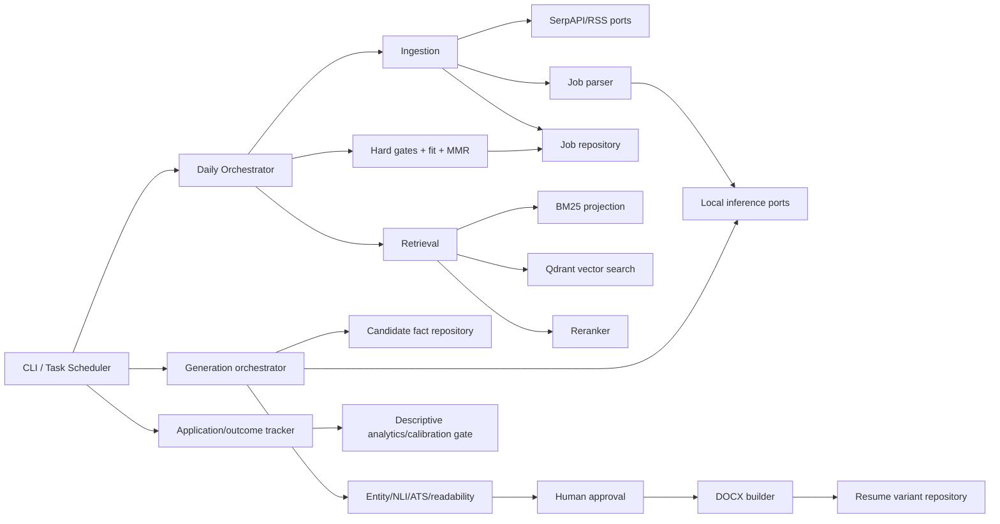

# ATS Local Job Assistant — Implementation Plan and Quality Strategy

**Version:** 1.0  
**Date:** 2026-08-01  
**Implementation root:** `C:\ATS`  
**Target:** Windows 11, Python 3.11, SQL Server 2022, Qdrant, bm25s, Ollama; single-user, local-first

## 1. Basis, scope, and decisions

This plan synthesizes:

- Modern ATS parsing/screening research (`1785500758863-copilot-tool-output-23734c.txt`).
- Local model/inference research (`1785507811564-copilot-tool-output-8f10ea.txt`).
- Callback/experimentation research (`1785510016608-copilot-tool-output-b0b669.txt`).
- Target architecture (`1785510711636-copilot-tool-output-bb515e.txt`).
- Implementation architecture/DFDs (`1785584781384-copilot-tool-output-258847.txt`).
- Reuse audit (`1785572792951-copilot-tool-output-6e9a79.txt`).
- Direct inspection of the relevant `C:\ATS` Python and Markdown sources.

### Product boundary

The system ingests jobs, builds a provenance-backed candidate fact base, parses job requirements, retrieves/ranks jobs, drafts fact-grounded resumes, requires human approval, and records application outcomes. It does **not** auto-apply, invent experience, send PII to cloud inference, or claim calibrated callback probabilities before enough labels exist.

### Binding architecture choices

1. Rules and three-valued hard gates (`pass/fail/unknown`) precede probabilistic ranking.
2. Every generated claim cites one or more immutable `ResumeFact` IDs.
3. Local inference is the default: Ollama + Qwen3; BGE-M3 on GPU or Nomic v1.5 on CPU; deterministic NLI where practical.
4. Retrieval is BM25 + dense retrieval + reciprocal-rank fusion (RRF) + cross-encoder reranking.
5. SQL Server is the system of record; BM25 and embedding caches are rebuildable projections.
6. Resume export requires deterministic entity checks, NLI verification, ATS validation, and explicit human approval.
7. Callback output is an explainable heuristic band until at least 100 closed outcomes; calibration follows only after evidence gates pass.
8. LinkedIn automation is disabled by default and outside the MVP.
9. The MVP exposes the `ats` CLI and in-process typed services; REST is deferred.

## 2. Repository and package structure

Convert `C:\ATS` from a flat script workspace into one installable package. Preserve current files during migration; archive only after equivalence tests pass.

```text
C:\ATS\
├─ pyproject.toml
├─ requirements.lock
├─ README.md
├─ .gitignore
├─ .env.example                         # names only; no values
├─ src\
│  └─ ats_local\
│     ├─ __init__.py
│     ├─ cli.py                         # ats ingest|rank|resume|track|doctor
│     ├─ config\
│     │  ├─ loader.py
│     │  ├─ models.yaml
│     │  ├─ scraper.yaml
│     │  ├─ scoring.yaml
│     │  ├─ markets.yaml
│     │  └─ schemas\                    # JSON schemas for model output/config
│     ├─ domain\
│     │  ├─ jobs.py                     # immutable domain dataclasses/enums
│     │  ├─ candidate.py
│     │  ├─ ranking.py
│     │  ├─ resume.py
│     │  └─ outcomes.py
│     ├─ ingestion\
│     │  ├─ ports.py                    # JobSource protocol
│     │  ├─ serpapi.py
│     │  ├─ rss.py
│     │  ├─ canonicalize.py
│     │  ├─ deduplicate.py
│     │  ├─ chunk.py
│     │  └─ orchestrator.py
│     ├─ candidate\
│     │  ├─ text_extract.py
│     │  ├─ fact_parser.py
│     │  ├─ skill_normalize.py
│     │  └─ provenance.py
│     ├─ job_parser\
│     │  ├─ requirement_rules.py
│     │  ├─ requirement_classifier.py
│     │  └─ schemas.py
│     ├─ retrieval\
│     │  ├─ bm25.py
│     │  ├─ dense.py
│     │  ├─ rrf.py
│     │  ├─ reranker.py
│     │  └─ index_manager.py
│     ├─ ranking\
│     │  ├─ hard_gates.py
│     │  ├─ evidence.py
│     │  ├─ fit_score.py
│     │  ├─ diversify.py
│     │  ├─ explain.py
│     │  └─ orchestrator.py
│     ├─ generation\
│     │  ├─ fact_retriever.py
│     │  ├─ gap_detector.py
│     │  ├─ bullet_selector.py
│     │  ├─ rewriter.py
│     │  ├─ entity_checker.py
│     │  ├─ nli.py
│     │  ├─ provenance.py
│     │  └─ orchestrator.py
│     ├─ validation\
│     │  ├─ rules.py
│     │  ├─ ats.py
│     │  ├─ keywords.py
│     │  ├─ readability.py
│     │  └─ result.py
│     ├─ documents\
│     │  ├─ docx_builder.py
│     │  ├─ styles.py
│     │  └─ pdf_converter.py
│     ├─ tracking\
│     │  ├─ applications.py
│     │  ├─ outcomes.py
│     │  └─ analytics.py
│     ├─ inference\
│     │  ├─ ports.py                    # Generator/Embedder/Reranker/NLI protocols
│     │  ├─ ollama.py
│     │  ├─ infinity.py
│     │  ├─ model_router.py
│     │  └─ schemas.py
│     ├─ persistence\
│     │  ├─ connection.py
│     │  ├─ repositories.py
│     │  ├─ unit_of_work.py
│     │  └─ migrations\
│     │     ├─ 001_core.sql
│     │     ├─ 002_jobs.sql
│     │     ├─ 003_retrieval.sql
│     │     ├─ 004_tracking.sql
│     │     ├─ 005_outbox.sql
│     │     └─ 006_security.sql
│     ├─ scheduling\
│     │  ├─ credit_ledger.py
│     │  └─ daily_pipeline.py
│     ├─ approval\
│     │  ├─ cli.py
│     │  └─ diff.py
│     └─ observability\
│        ├─ logging.py
│        ├─ metrics.py
│        └─ health.py
├─ prompts\                             # versioned, reviewed prompt assets
├─ tests\
│  ├─ unit\
│  ├─ contract\
│  ├─ integration\
│  ├─ component\
│  ├─ e2e\
│  ├─ performance\
│  ├─ security\
│  └─ fixtures\
│     ├─ jobs\
│     ├─ resumes\
│     ├─ expected\
│     ├─ serpapi\
│     └─ nli\
├─ tools\                               # developer-only scripts
├─ deploy\
│  ├─ install.ps1
│  ├─ uninstall.ps1
│  ├─ Invoke-DailyPipeline.ps1
│  ├─ ats-daily.xml
│  └─ check-health.ps1
├─ docs\
│  ├─ adr\
│  ├─ operations\
│  └─ schemas\
├─ data\                                # gitignored runtime data
│  ├─ bm25\
│  ├─ embeddings\
│  ├─ dlq\
│  ├─ exports\
│  └─ logs\
└─ archive\                             # legacy, read-only after cutover
```

`ats_local.domain` must depend on no infrastructure package. Ingestion, ranking, generation, and tracking use protocols defined at their boundaries; persistence and inference implement those protocols.

## 3. Component ownership

Ownership is by engineering role until named owners are assigned. `CODEOWNERS` should encode these paths.

| Area | Accountable owner | Reviewers | Operational responsibility |
|---|---|---|---|
| `domain`, schemas, ADRs | Principal engineer | Data + ML | Compatibility and architecture |
| `ingestion`, `scheduling` | Data ingestion engineer | Security | Source health, credit budget, DLQ |
| `candidate`, provenance | Resume intelligence engineer | Security + QA | Fact integrity and PII handling |
| `job_parser`, `retrieval`, `ranking` | Search/ML engineer | Data + QA | Relevance, gates, explanations |
| `generation`, `validation`, `documents`, `approval` | Resume intelligence engineer | Search/ML + QA | Grounding and export quality |
| `inference` | ML platform engineer | Security | Model compatibility/latency |
| `persistence`, migrations | Data engineer/DBA | Principal engineer | Schema, backup, restore, performance |
| `tracking`, analytics | Analytics engineer | Privacy + QA | Outcome definitions and calibration |
| `deploy`, CI, observability | Windows platform engineer | DBA + Security | Installation, scheduler, recovery |
| Tests/fixtures/release gate | Quality engineer | Component owner | Test evidence and release sign-off |
| Secrets/threat model | Security owner | Platform + Principal | Key rotation, ACLs, dependency review |

## 4. Reuse/refactor/replace/archive matrix

No legacy file moves until its target has characterization tests and accepted parity.

| Exact source | Symbol/lines | Action | Target | Required change/equivalence |
|---|---|---|---|---|
| `google_jobs_scraper_FIXED.py` | `is_sql_server_job`, 50–77 | Refactor | `ingestion/serpapi.py::is_relevant_job` | Preserve positive/negative behavior; config-driven terms |
| same | `search_google_jobs`, 79–126 | Refactor | `SerpApiJobSource.fetch` | Inject client/key; typed result; retry; no globals; return failures |
| same | `remove_duplicates`, 128–144 | Merge/refactor | `ingestion/deduplicate.py` | Casefold and normalize URL/title/company; allow missing link |
| same | `analyze_jobs_by_region`, 146–173 | Refactor | `canonicalize.py::classify_region` | Externalize market rules |
| `google_jobs_scraper_beast_mode.py` | `remove_duplicates`, 114–131 | Refactor baseline | `deduplicate.py` | Use as dual-key characterization source |
| same | `analyze_jobs_by_region`, 133–163 | Refactor baseline | `canonicalize.py` | Merge broader region vocabulary |
| `debug_serpapi.py` | eight manual probes | Replace | `tests/contract/test_serpapi_live.py` | Assertions; opt-in marker; no response PII in logs |
| `smart_scheduler.py` | constants, 11–15 | Refactor | `config/scraper.yaml` | Monthly budget and per-source costs validated |
| same | `load_credit_tracker`, `save_credit_tracker`, `record_search`, 17–48 | Refactor | `CreditLedger` | Fix `json.dump` call; lock + atomic replace + rollover |
| `comprehensive_ats_validation_all_platforms.py` | `validate_comprehensive`, 10+ | Refactor | `validation/ats.py::ATSValidator` | Return typed findings, never print-only |
| same | `prohibited_chars`, 38–49 | Reuse data/refactor | `validation/rules.py` | Unicode tests and configurable severity |
| `ats_comprehensive_validator.py` | `PROHIBITED_CHARS`, 43–70; quantity regex, 185–196 | Merge/refactor | `validation/rules.py` | Deduplicate with platform validator |
| `ats_validator.py` | `ATSValidator`, 12+ | Replace cloud core; reuse façade concepts | `validation/ats.py` + local inference | Remove Gemini dependency/default; no hidden cost claims |
| same | `_extract_text`, 285–302 | Merge/refactor | `candidate/text_extract.py` | DOCX/TXT/PDF typed failures |
| same | `_load_core_prompt`, 304–310 | Replace | config/prompt loader | No absolute path; validate version/hash |
| same | quick prompt line 84 | Replace defect | local structural rules | Remove comment leaked into prompt |
| same | `_get_cached_master_prompt`, 335–338 | Remove stub | inference cache | Implement real content-hash cache if needed |
| `ats_score_calculator.py` | `check_keywords`, 69–87 | Refactor | `validation/keywords.py` | Pass text explicitly; no global candidate data |
| `keyword_density_analysis.py` | `analyze_resume`, 4–60 | Refactor | `validation/keywords.py` | Token-aware phrase matching; JD-derived terms; no unsupported “optimal” bands |
| `extract_keywords_and_search.py` | `extract_keywords_from_resume`, 9–95 | Split/refactor | `candidate/skill_normalize.py` | Escape patterns; inject path/taxonomy |
| `extract_all_resumes.py` | `extract_text_from_docx`, 24–33; `extract_text_from_pdf`, 35–46 | Refactor | `candidate/text_extract.py` | Use `pypdf`; remove runtime package installation |
| `legacy_resume_builder.py` | margins, 15–21; heading pattern, 47–50; bullets, 119–122 | Refactor | `documents/styles.py`, `docx_builder.py` | Data-driven, no embedded candidate PII/content |
| `create_final_resume_v2.py` | text-to-DOCX conversion | Refactor | `documents/docx_builder.py` | Canonical content model and deterministic styles |
| `RAG_MASTER_PROMPT.md` | full | Reuse as reviewed input | `prompts/master-prompt-v1.md` | Add schema, version, model compatibility tests |
| `MASTER_ATS_VALIDATION_PROMPT.md` | full | Reuse as reviewed input | `prompts/ats-validation-v1.md` | Local model contract; remove cloud assumptions |
| `RAG_JOB_SEARCH_ARCHITECTURE_REVIEW.md` | DDL 118–185 | Refactor | SQL migrations | Parameterized vectors; corrected processing state |
| `requirements.txt` | one dependency | Replace | `pyproject.toml` + lock | Hash/lock direct and transitive dependencies |
| older scraper variants | entire files | Archive | `archive/scrapers` | Keep provenance manifest; do not execute |
| remaining `create_*`, `patch_*`, `fix_*`, `add_*` | entire files | Archive after parity | `archive/legacy-resume` | Retain representative goldens, not runners |
| PDF converters | multiple scripts | Replace | `documents/pdf_converter.py` | One adapter, optional feature, smoke-tested on Windows |

**Immediate security prerequisite:** rotate every exposed SerpAPI key, remove literals from all current and archived source, and inspect any future Git history before publishing. Never copy secret values into test fixtures or this plan.

## 5. Dependency graph and contracts



### Allowed dependency direction

`domain <- application components <- adapters/infrastructure <- CLI/deploy`. Components may communicate through typed IDs and protocols, never by importing another component's SQL implementation. The model router owns model names and hardware fallback. SQL repositories own transactions; callers never embed SQL.

### External/runtime dependencies

| Dependency | Purpose | Policy |
|---|---|---|
| Python 3.11 x64 | Runtime | Pin minor version in CI/install |
| SQL Server 2022 Developer | Relational ACID system of record | Local only; migrations idempotent |
| Qdrant | Dense vector projection | Loopback only; rebuildable from SQL |
| ODBC Driver 18 + `pyodbc` | SQL access | Encryption enabled; parameterized SQL only |
| Ollama | local generation | Bind loopback; health and model digest checks |
| `python-docx`, `pypdf` | document I/O | Reject encrypted/malformed/oversize documents |
| `bm25s` (preferred) | lexical index | Rebuildable versioned projection |
| `sentence-transformers`/FastEmbed | embedding/NLI adapters | Behind protocols; CPU fallback |
| `pydantic` | contracts/config/model output | Reject unknown/invalid fields |
| `tenacity` | bounded retries | Retry transient failures only |
| `filelock` | credit ledger lock | Atomic writes remain mandatory |
| `keyring` | Credential Manager | Production secret source |
| `structlog` | structured logging | PII redaction processor |
| `pytest`, `pytest-cov`, `hypothesis` | quality | Dev dependencies only |

## 6. Epics, stories, and acceptance criteria

### Epic E0 — Secure and establish the engineering baseline

**S0.1 Secret remediation.** Rotate exposed credentials and replace literals with Credential Manager lookup.  
**AC:** repository secret scan is clean; missing credential fails with actionable error; logs contain neither key nor full connection string.

**S0.2 Package/build baseline.** Create package, lock file, CLI skeleton, lint/type/test config.  
**AC:** a clean Windows machine runs `install.ps1`, `ats doctor`, and unit tests without modifying global Python.

**S0.3 Legacy characterization.** Capture behavior of selected functions before moving code.  
**AC:** goldens cover relevance filtering, deduplication, regions, credit ledger, ATS rules, text extraction, and DOCX output.

### Epic E1 — Canonical storage and configuration

**S1.1 Configuration contracts.** Validate model, scraper, scoring, market, and path configuration.  
**AC:** invalid weight sums, unknown model profiles, malformed paths, and negative credits fail before pipeline work begins.

**S1.2 Database migrations.** Create core, vector, and tracking migrations.  
**AC:** upgrade from empty DB succeeds; rerun is safe; down/restore procedure is tested; constraints and indexes match schema documentation.

**S1.3 Repositories/unit of work.** Implement parameterized CRUD and transaction boundaries.  
**AC:** duplicate job upsert is idempotent; failed aggregate write rolls back; no caller exposes connection/cursor.

### Epic E2 — Reliable job ingestion

**S2.1 SerpAPI adapter.** Typed pagination, budget check, retry, raw-response quarantine.  
**AC:** 429/5xx follow bounded backoff; 4xx schema errors enter DLQ; one API call consumes one recorded credit exactly once.

**S2.2 Canonicalization/dedup.** Normalize URL, title, company, location; exact and near-duplicate clusters.  
**AC:** same job with tracking parameters or casing becomes one canonical job; distinct same-title jobs remain distinct.

**S2.3 RSS adapter.** Add free, allowlisted feeds.  
**AC:** malformed entries are quarantined without aborting the batch; source attribution is retained.

### Epic E3 — Provenance-backed candidate fact base

**S3.1 Document extraction.** Extract DOCX/PDF/TXT with source offsets.  
**AC:** output preserves paragraph order; unsupported/encrypted/corrupt files return typed failures; no runtime installs.

**S3.2 Fact parsing and approval.** Parse employment, skills, achievements, dates, metrics and retain source spans.  
**AC:** every fact has candidate, document hash, source section/span, parser version, confidence; user can correct or reject.

**S3.3 Skill normalization.** Canonical skills plus aliases and evidence levels.  
**AC:** “T-SQL” variants converge; an adjacent skill is never promoted to direct evidence.

### Epic E4 — Job requirement parsing

**S4.1 Rule-first classifier.** Identify mandatory, preferred, legal, and disqualifier requirements.  
**AC:** deterministic patterns handle explicit language; ambiguous items may invoke local model; raw text and confidence are stored.

**S4.2 Structured-output inference.** Enforce JSON schema and record prompt/model versions.  
**AC:** malformed output is retried once with repair, then DLQ; unknown fields are rejected; no output is executed.

### Epic E5 — Retrieval, ranking, and explanations

**S5.1 BM25/dense/RRF.** Produce independent top-300 lists, fuse with `k=60`.  
**AC:** acronym exact-match tests and semantic paraphrase tests both pass; results are deterministic for fixed versions.

**S5.2 Hard gates.** Apply work authorization, location, employment type, salary floor.  
**AC:** missing evidence yields `unknown`, never `fail`; each gate produces evidence and reason.

**S5.3 Rerank/fit/MMR.** Rerank top 100, score dimensions, diversify top 25 to top 10.  
**AC:** max two per company and role family; score is reproducible; all dimensions and version appear in explanation JSON.

### Epic E6 — Grounded resume generation

**S6.1 Fact retrieval/gap detection/bullet selection.**  
**AC:** mandatory unsupported requirements are visible; selection cites facts; configurable length and diversity rules pass.

**S6.2 Constrained rewrite.**  
**AC:** schema-conformant bullets contain no new numbers, dates, companies, titles, or technologies; failures never reach export.

**S6.3 Claim verification.**  
**AC:** deterministic entity allowlist plus NLI labels every claim; `unsupported` or `contradicted` blocks approval by default.

**S6.4 Human approval and document export.**  
**AC:** reviewer sees source, diff, evidence, and flags per bullet; explicit approval is audited; DOCX and provenance sidecar hashes match.

### Epic E7 — ATS and recruiter quality

**S7.1 Generic ATS validator.**  
**AC:** detects prohibited characters, tables, missing canonical sections, malformed dates, and parse-roundtrip losses; returns structured findings.

**S7.2 Keyword/readability/top-third.**  
**AC:** scores are transparent, JD-specific, and avoid unsupported universal density claims; all thresholds are configurable and versioned.

### Epic E8 — Tracking and responsible learning

**S8.1 Applications/interactions/outcomes.**  
**AC:** state transitions are validated; no-response is censored until configured window closes; edits are auditable.

**S8.2 Analytics.**  
**AC:** report callback/interview/offer conversion by source, role, geography, freshness, and score band with denominator and confidence warning.

**S8.3 Calibration gate.**  
**AC:** no probability language below 100 closed labels; Brier score/ECE and holdout evaluation required before enabling calibrated predictions.

### Epic E9 — Windows operations

**S9.1 Scheduler and recovery.**  
**AC:** task runs under least privilege; overlapping runs are prevented; checkpoint resume does not double-charge or duplicate jobs.

**S9.2 Health/backup.**  
**AC:** health command checks DB, Ollama, models, disk, credentials, index versions; restore drill recovers an accepted snapshot.

## 7. Phased milestones and sequencing

| Milestone | Scope | Exit gate |
|---|---|---|
| M0, days 1–3 | Secret rotation, Git/package baseline, characterization tests | Clean secret scan; CI green; legacy snapshot manifest |
| M1, week 1 | Config, migrations, repositories, logs, health | Empty-DB install and backup/restore pass |
| M2, weeks 2–3 | SerpAPI adapter, ledger, canonicalization, dedup, RSS, DLQ | Replayable ingestion of frozen responses; no duplicate/credit drift |
| M3, weeks 3–4 | Text extraction, fact schema/parser, fact approval | Golden master resume produces approved immutable facts |
| M4, weeks 5–6 | Requirement parser, BM25/dense/RRF, hard gates, scoring/explanation | Offline ranking benchmark meets quality thresholds |
| M5, weeks 7–8 | Reranker, MMR, daily Top-10, reports | Deterministic daily run completes within hardware budget |
| M6, weeks 9–10 | Grounded rewrite, entity/NLI checks, approval, DOCX | Zero unsupported claims in release golden set |
| M7, week 11 | ATS/readability quality suite, Windows scheduler/installer | End-to-end shadow run and failover/retry tests pass |
| M8, week 12 | Tracking, analytics, cutover | Two-week shadow comparison accepted; rollback rehearsal passed |
| Later | Calibration ≥100 outcomes; LTR only with evidence; optional LinkedIn separately reviewed | Model governance and privacy approval |

**Critical path:** M0 → M1 → M2; M1 → M3; M2 + M3 → M4 → M5 → M6 → M7 → M8. Tracking schema can begin after M1, but learned ranking cannot precede sufficient outcomes.

## 8. Quality strategy

### Test pyramid and release targets

| Layer | Share | Scope | Gate |
|---|---:|---|---|
| Unit/property | 60% | domain rules, normalization, RRF, gates, scores, entity checks, state transitions | ≥90% branch on domain/rules; mutation score target ≥75% |
| Contract/component | 20% | SerpAPI/RSS/Ollama schemas, repositories, DOCX parser, model adapters | Frozen contracts always; live tests opt-in |
| Integration | 12% | SQL migrations/vector queries, BM25 cache, Credential Manager, Task Scheduler harness | Windows CI/nightly |
| End-to-end | 6% | frozen job → Top-10; JD+facts → approved DOCX; tracking | release/nightly |
| Non-functional | 2% | performance, resilience, security, restore | release candidate |

Coverage is a diagnostic, not the acceptance criterion. The critical invariant suite (provenance, no invented entities, unknown gate handling, idempotent ingestion, secret redaction) must be 100% covered.

### Concrete test cases

| ID | Test | Expected |
|---|---|---|
| SEC-01 | Scan current/archived Python/config/log fixtures for token patterns | No credential value committed |
| CFG-01 | Scoring weights total 1.02 | Startup rejects config |
| LED-01 | Two processes record credits concurrently | Valid JSON; exact sum; no lost update |
| LED-02 | Process interruption during save | Previous ledger remains readable |
| ING-01 | SerpAPI 429, then success | Backoff and single successful persisted batch |
| ING-02 | Same source job replayed twice | One `JobDescription`, stable source identity |
| ING-03 | URLs differ only by UTM parameters | One canonical job |
| ING-04 | Same title/company but different city/source ID | Not incorrectly collapsed |
| ING-05 | Missing share URL | Fallback fingerprint still deduplicates |
| ING-06 | SQL text and malicious quote sequence in JD | Stored as data through parameters |
| TXT-01 | DOCX with table/header contact | Extractor records limitations; validator flags table/header |
| TXT-02 | Scanned PDF | Typed OCR-required result; no silent empty text |
| FACT-01 | Metric “4.5 PB” source span | Exact metric and span hash retained |
| FACT-02 | “Familiar with PostgreSQL” | `adjacent`, not direct experience |
| REQ-01 | “Must have 5 years SQL Server” | Mandatory, min years 5 |
| REQ-02 | “Azure preferred” | Preferred, not gate |
| REQ-03 | Sponsorship absent | Eligibility `unknown`, retained |
| RET-01 | Query “T-SQL APRC” | Exact technical job ranks in BM25 candidates |
| RET-02 | Semantic paraphrase without exact keyword | Dense candidate retrieves it |
| RRF-01 | Fixed two rank lists | Hand-calculated `1/(60+r)` scores match |
| RANK-01 | Three jobs from same company dominate | Final Top-10 includes at most two |
| RANK-02 | Same inputs/version rerun | Identical ranking and explanations |
| GEN-01 | Model adds unsupported “30%” | Entity checker blocks bullet |
| GEN-02 | Model changes “Microsoft” to “Oracle” | Entity checker blocks bullet |
| GEN-03 | NLI contradicts source | Export unavailable; reason shown |
| GEN-04 | Partial evidence | Labeled partial and requires explicit reviewer handling |
| APP-01 | Export without approval event | Rejected |
| DOC-01 | Golden content to DOCX and parse back | Sections/order/text preserved; no tables |
| ATS-01 | Fancy bullets/em dash/nonbreaking hyphen | Structured violations with code points |
| ATS-02 | Keyword repeated excessively | Stuffing/repetition warning, no fabricated ranking percentile |
| TRK-01 | `submitted → callback → interview → offer` | Valid |
| TRK-02 | `rejected → interview` without correction | Invalid transition |
| CAL-01 | 99 closed outcomes | Probability mode disabled |
| OPS-01 | Crash after SQL commit before checkpoint | Replay idempotent; no credit duplication |
| OPS-02 | Ollama unavailable | Job ingestion continues where independent; inference items checkpointed |
| PERF-01 | 1,000 frozen jobs, reference hardware tier | Daily pipeline within configured SLA and memory cap |
| REST-01 | Restore SQL backup + rebuild projections | Row counts/hashes and Top-10 golden recover |

### Fixtures and golden datasets

1. **`jobs-v1`**: 200 de-identified/frozen job responses across sources, duplicates, malformed records, missing dates/salary, sponsorship unknown, and adversarial text.
2. **`serpapi-contract-v1`**: sanitized JSON pages for success, empty result, pagination, 429, 500, and schema drift. Never refresh automatically.
3. **`candidate-facts-v1`**: de-identified resume text with approved facts, exact spans, metrics, dates, direct/partial/adjacent/none evidence.
4. **`resume-adversarial-v1`**: five required goldens—unsupported metric, adjacent skill, date/employer contradiction, keyword stuffing, ATS structural failure—plus scanned PDF and corrupt DOCX.
5. **`ranking-benchmark-v1`**: 50 candidate-query scenarios with graded relevance (0–3), mandatory gate truth, and diversity labels. Report Recall@100, nDCG@10, MRR, gate false-negative count, and company/role diversity.
6. **`nli-sql-domain-v1`**: at least 100 entailment/partial/unsupported/contradiction pairs involving SQL Server terminology and numbers; dual-reviewed.
7. **`docx-golden-v1`**: canonical single-column DOCX plus normalized XML/text expectations. Compare semantic XML, not ZIP timestamps/relationship IDs.
8. **`pipeline-golden-v1`**: fixed config/model mocks producing exact Top-10 explanations and resume provenance.

All fixtures have a manifest containing license/source, sanitization method, SHA-256, schema version, expected result, and reviewer. Real personal data remains outside Git under ACL-restricted `data\`.

### Quality thresholds

- Gate false negatives on labeled mandatory disqualifiers: 0 in release set.
- Unsupported generated entities/numbers in release goldens: 0.
- Provenance completeness: 100% of emitted claims.
- Ingestion replay idempotency: 100%.
- Ranking baseline: no regression >2% nDCG@10 or >3% Recall@100 without approved rationale.
- Structured model-output validity: ≥99% after one repair attempt; remaining items fail closed.
- Daily batch: target ≤10 minutes on Tier-2 reference hardware; configurable ≤30 minutes CPU-only.
- Logs: 0 known secrets/PII bodies; IDs and hashes only.

## 9. Windows CI/CD and release engineering

### Pull-request pipeline (GitHub Actions/Azure Pipelines, `windows-2025`)

1. Checkout with clean workspace and long paths enabled.
2. Install pinned Python 3.11, create `.venv`, install locked hashes.
3. Run secret scan and dependency vulnerability/license review.
4. Run `ruff format --check`, `ruff check`, and `mypy --strict` on `src`.
5. Run unit/property tests in parallel with coverage and mutation smoke set.
6. Run contract tests against frozen responses and mock Ollama server.
7. Build wheel; install wheel into a second clean venv; run `ats doctor --offline`.
8. Generate DOCX golden and compare normalized content.
9. Publish JUnit, coverage, benchmark delta, SBOM, wheel, and hashes.

### Nightly Windows pipeline

- Provision disposable SQL Server 2022 test database and Qdrant instance; run migration/checksum and projection rebuild tests.
- Start local/mock inference; run SQL/vector, Credential Manager, DOCX/PDF, and E2E suites.
- Run sanitized live SerpAPI contract only if protected secret and explicit budget switch are present.
- Execute performance baseline and backup/restore/rebuild drill.
- Quarantine flaky tests; no automatic rerun may turn red into green without reporting the original failure.

### Release pipeline

- Signed tag; reproducible wheel + SBOM + SHA-256.
- Migration dry run on restored production backup.
- Install into versioned directory: `C:\ATS\releases\<version>`.
- Keep `C:\ATS\current` junction and `C:\ATS\previous`.
- Stop/disable scheduled task, back up DB/config/index manifests, deploy, migrate, smoke test, switch junction, re-enable task.
- Release is manual-approved by component owner, QA, DBA, and security for schema/secret changes.
- Never deploy model weights from CI; installer verifies configured local model digest/license.

## 10. Migration, cutover, and rollback

### Migration stages

1. **Inventory/freeze:** hash current scripts/prompts/data outputs; record which files contain credentials; rotate keys before copying.
2. **Side-by-side package:** new code writes to `ats_shadow` DB and `data\shadow`; legacy remains read-only except its normal output.
3. **Seed:** import sanitized job CSV via a versioned importer; import master resume only through fact review. Preserve source paths/hashes.
4. **Projection build:** build BM25/embedding indexes from SQL rows; store model/index versions and row-count/hash manifest.
5. **Shadow operation (minimum 10 daily runs/two weeks):** compare ingested counts, duplicate clusters, Top-10 overlap, gate decisions, API credits, and runtime. New generation remains draft-only.
6. **Acceptance:** investigate every hard-gate disagreement; require zero unsupported-claim golden failures; obtain user acceptance of Top-10 and DOCX diff.
7. **Cutover:** stop task, final DB/config backup, apply migrations, switch `current`, install new task XML, smoke `doctor/ingest --dry-run/rank`.
8. **Stabilization:** retain legacy scripts and prior DB/index snapshot for 30 days; archive after two successful restore drills.

### Rollback triggers

- Migration fails or row/hash reconciliation differs.
- Credit accounting differs by any call.
- Hard-gate false negative or provenance loss.
- Unsupported claim reaches approvable state.
- Daily pipeline misses SLA for three runs or fails two consecutive runs.
- Secret/PII appears in logs or exports unexpectedly.

### Rollback procedure

1. Disable scheduled task and capture failure bundle with redacted logs.
2. Switch `current` junction to `previous`.
3. Restore pre-cutover SQL backup if any non-backward-compatible migration executed.
4. Restore config and projection manifests; rebuild BM25/embedding projections if their versions differ.
5. Re-enable prior scheduled task and run offline smoke test.
6. Reconcile external API credits separately; never replay a fetch blindly.
7. Open incident/ADR amendment; no forward retry until root cause and regression test exist.

Migrations use expand/migrate/contract: add nullable/new tables first, dual-read/write only where required, backfill with checkpoints, verify, then remove old structures in a later release. Projection files are never authoritative and are rebuilt rather than rolled back in place.

## 11. Definition of Done

A story is done only when:

- Acceptance criteria and negative/error paths have automated tests.
- Domain/API/SQL/config contracts are typed, versioned, and documented.
- No hardcoded path, candidate PII, secret, model name, threshold, or scoring weight exists outside approved config/domain constants.
- SQL is parameterized; transactions, idempotency, retry, timeout, and cancellation behavior are explicit.
- Model output is schema-validated and fails closed; prompt/model/dataset versions are persisted.
- Every generated claim has provenance; deterministic entity and NLI checks complete; human approval is enforced where applicable.
- Structured logs/metrics contain correlation IDs and are proven redacted.
- Threat model/privacy impact and dependency/SBOM changes are reviewed.
- Unit, contract, integration, golden, benchmark, and Windows smoke gates relevant to the change pass.
- Migration, backup, rollback, and operator documentation are updated and rehearsed for stateful changes.
- Code owner and QA approve; no critical/high vulnerabilities or unresolved P0/P1 defects remain.

A milestone additionally requires its exit gate, signed evidence bundle, updated risk register, and user-visible acceptance demonstration.

## 12. Coding and data standards

- Python 3.11; `src` layout; UTF-8; four spaces; type hints on all public APIs; `mypy --strict`.
- Ruff formatting/linting; 100-character target line; Google-style docstrings only for public APIs/non-obvious invariants.
- `pathlib.Path`; no absolute `C:\ATS` literals in library code. Resolve paths from a validated application root.
- Domain dataclasses/enums are immutable where practical. Use `Decimal` for money/weights and timezone-aware UTC `datetime`.
- No work at import time, `input()`, `print()` in library code, mutable globals, runtime `pip install`, or catch-all exception swallowing.
- Exceptions are typed by boundary (`SourceTransientError`, `ContractError`, `PersistenceError`); add context without secrets.
- All network/model/database calls have explicit timeouts, bounded retries, correlation IDs, and circuit/failure behavior.
- JSON/config/model output is Pydantic-validated with `extra="forbid"`; schemas carry versions.
- SQL objects use singular PascalCase; columns PascalCase; PK/FK/check/unique constraints named; UTC `datetime2`; migrations forward-only with tested restore rollback.
- Repositories exclusively own SQL and use bound parameters. Least-privilege DB principal; no `db_owner` for runtime.
- Content hashes use SHA-256 over documented canonical UTF-8; store algorithm and canonicalization version.
- Logs are structured and redact emails, phones, URLs with tokens, resume text, prompts containing PII, and credentials. Default retention: 30 days.
- Tests use Arrange/Act/Assert and descriptive behavior names. A bug fix begins with a failing regression test.
- Prompt changes are code changes: review diff, schema, threat cases, golden benchmark, semantic version, and rollback.
- Weights/thresholds are hypotheses in versioned config, never vendor facts.
- Generated documents remain single-column and avoid tables, headers/footers for contact data, exotic bullets, and unsupported characters.

## 13. ADR backlog

| ADR | Decision |
|---|---|
| ADR-001 | Local-first privacy boundary and no cloud inference by default |
| ADR-002 | Modular monolith/package rather than services |
| ADR-003 | SQL Server 2022 as system of record; Qdrant as rebuildable vector store |
| ADR-004 | BM25 + dense + RRF + cross-encoder retrieval |
| ADR-005 | Three-valued hard-gate semantics |
| ADR-006 | Immutable candidate facts and claim-level provenance |
| ADR-007 | Local model routing by hardware profile and model digest |
| ADR-008 | Deterministic entity check + NLI + human approval |
| ADR-009 | Credential Manager and secret lifecycle |
| ADR-010 | Versioned schema/prompt/model/index/score lineage |
| ADR-011 | Job identity, exact dedup, and near-duplicate clustering |
| ADR-012 | Config/JSON schema compatibility policy |
| ADR-013 | Windows Task Scheduler orchestration and idempotent checkpoints |
| ADR-014 | Rebuildable BM25/embedding projections |
| ADR-015 | Heuristic callback bands and ≥100-label calibration gate |
| ADR-016 | DOCX canonical format and semantic golden comparison |
| ADR-017 | PII logging, encryption, retention, backup, and deletion |
| ADR-018 | LinkedIn adapter disabled and separately governed |
| ADR-019 | Error/DLQ/retry policy |
| ADR-020 | Legacy archive and strangler cutover |

## 14. Risk register

| ID | Risk | L/I | Mitigation | Trigger/owner |
|---|---|---|---|---|
| R1 | Exposed SerpAPI credentials abused | H/H | Rotate immediately; history scan; Credential Manager | Any unauthorized usage / Security |
| R2 | Resume/JD PII leaks through logs, fixtures, backups | M/H | Redaction, ACLs, sanitized fixtures, retention/deletion | PII scan hit / Security |
| R3 | Model invents claims | M/H | Fact allowlist, NLI, fail-closed, approval, goldens | Unsupported entity / Generation |
| R4 | Hard gate wrongly excludes valid job | M/H | Three-valued logic, evidence, zero-FN release set | Gate disagreement / Ranking |
| R5 | Source API schema/availability drift | H/M | Contract tests, typed adapters, DLQ, RSS fallback | Contract failure rate >5% / Ingestion |
| R6 | Credit ledger corruption/double charge | M/M | Lock, atomic file/SQL ledger, idempotency key | Reconciliation mismatch / Ingestion |
| R7 | Qdrant/model dimension or collection-version mismatch | M/H | Capability probe, projection tests, model-dimension checks | `doctor` mismatch / maintainer |
| R8 | Model unavailable/too slow on user hardware | M/M | Hardware probe, smaller model fallback, checkpoints | SLA/memory breach / ML platform |
| R9 | Embedding/prompt/model drift silently changes ranking | M/H | Persist versions/digests; benchmark gate | >2% nDCG regression / Search |
| R10 | NLI misreads SQL domain claims | M/H | Domain-labeled set, threshold calibration, human gate | Class error review / ML |
| R11 | Dedup merges distinct jobs or misses duplicates | M/M | Layered identity, clustering not deletion, labeled pairs | Precision/recall regression / Ingestion |
| R12 | ATS validator embeds unsupported folklore | M/M | Label evidence vs heuristic; configurable rules | Uncited universal claim / QA |
| R13 | Sparse outcomes overfit callback model | H/H | Descriptive analytics first; ≥100 gate; holdout/calibration | Label threshold not met / Analytics |
| R14 | Selection bias makes learned ranking harmful | H/H | Log propensities/visibility; cautious IPTW analysis | Offline/online divergence / Analytics |
| R15 | Windows scheduler overlaps or runs without dependencies | M/M | Mutex, preflight, checkpoints, service health | Concurrent-run alert / Platform |
| R16 | Migration corrupts facts/provenance | L/H | Expand-contract, checksums, backups, shadow run | Hash mismatch / DBA |
| R17 | Legacy archive still contains secrets/PII | H/H | Sanitize before archive; restricted ACL; no publish | Scan finding / Security |
| R18 | Dependency/model license prevents intended use | M/H | SBOM/license allowlist; model card record | New/relicensed artifact / Principal |
| R19 | Optional LinkedIn automation violates terms/account safety | M/H | Disabled; separate legal/ToS review; manual URL input | Enable request / Product+Security |
| R20 | Single-machine disk/service failure | M/H | SQL backups, manifest, projection rebuild, restore drills | Health/restore failure / Platform |

## 15. Prioritized first 30 development tasks

Tasks are in execution order; P0 blocks all feature work.

| # | Pri | Task | Dependency | Completion evidence |
|---:|---|---|---|---|
| 1 | P0 | Rotate all exposed SerpAPI credentials and record revocation | — | Old keys rejected; new key only in Credential Manager |
| 2 | P0 | Scan/sanitize current files, archives, logs, outputs, and any Git history | 1 | Clean secret report; remediation manifest |
| 3 | P0 | Create Git baseline, `.gitignore`, `CODEOWNERS`, protected main/review policy | 2 | Clean status and owner rules |
| 4 | P0 | Capture legacy inventory, file hashes, sample outputs, and archive manifest | 2 | Signed/hash manifest |
| 5 | P0 | Fix `smart_scheduler.py:33` locally to prevent further ledger corruption | 4 | Regression test demonstrates fixed save |
| 6 | P0 | Add `pyproject.toml`, `src` package, locked dependencies, CLI/doctor skeleton | 3 | Clean-venv wheel smoke pass |
| 7 | P0 | Configure Windows PR CI: secret, Ruff, mypy, pytest, wheel smoke | 6 | Green pipeline |
| 8 | P0 | Write characterization tests for selected legacy functions | 4,6 | Goldens for filter/dedup/region/ATS/extraction/DOCX |
| 9 | P1 | Add typed settings and JSON-schema-validated YAML configs | 6 | Invalid-config suite |
| 10 | P1 | Implement structured logging, PII redaction, correlation IDs, health checks | 6,9 | Redaction tests + `ats doctor` |
| 11 | P1 | Write ADR-001 through ADR-010 and security/privacy threat model | 3,9 | Approved ADRs/threat review |
| 12 | P1 | Implement SQL connection factory, least-privilege bootstrap, unit of work | 9,11 | Integration/rollback tests |
| 13 | P1 | Author `001_core.sql` through `006_security.sql` | 12 | Empty/repeat/restore migration tests |
| 14 | P1 | Implement typed repositories and idempotent job upsert | 13 | Parameterization + transaction tests |
| 15 | P1 | Refactor `CreditLedger` with lock, atomic write, monthly rollover/idempotency | 5,9 | Concurrency/crash suite |
| 16 | P1 | Refactor SerpAPI adapter with injected client, timeout, retry, pagination | 9,14,15 | Frozen contract/component tests |
| 17 | P1 | Implement canonicalization and exact dedup from FIXED/beast behavior | 8,14 | Labeled duplicate-pair suite |
| 18 | P1 | Add ingestion DLQ/checkpoints and orchestrator | 16,17 | Crash/replay E2E |
| 19 | P1 | Add RSS/career-feed adapter behind `JobSource` protocol | 18 | Malformed/feed contract tests |
| 20 | P1 | Refactor DOCX/PDF/TXT extraction; remove runtime installs/PyPDF2 | 8,9 | Extraction golden suite |
| 21 | P1 | Implement `ResumeFact`, provenance hashes/spans, and review/import CLI | 13,20 | 100% provenance golden |
| 22 | P1 | Implement canonical skill/alias/evidence model | 21 | Direct/adjacent classification tests |
| 23 | P1 | Implement rule-first requirement classifier and local structured fallback | 13,22 | Requirement golden + schema failure tests |
| 24 | P1 | Build/version BM25 and embedding projections with cache invalidation | 14,21,23 | Rebuild/manifests/Recall benchmark |
| 25 | P1 | Implement dense retrieval, RRF, hard gates, evidence and fit scoring | 24 | Hand-calculated/gate/ranking tests |
| 26 | P1 | Add cross-encoder reranker, MMR, explanations, and Top-10 report | 25 | nDCG/diversity/determinism gates |
| 27 | P1 | Implement fact retrieval, gap detector, bullet selector, constrained rewriter | 21,23,26 | Generation schema/provenance tests |
| 28 | P0 | Implement numeric/entity checker, domain NLI verifier, and fail-closed policy | 27 | Zero unsupported claims in goldens |
| 29 | P0 | Implement approval CLI, data-driven DOCX builder, semantic DOCX goldens | 28 | Cannot export without audited approval |
| 30 | P1 | Run Windows E2E shadow deployment, backup/restore, cutover/rollback rehearsal | 10–29 | Two-week comparison and signed release evidence |

After task 30: build application/outcome UX and descriptive analytics; do not enable probability calibration until the evidence gate is met. Treat LinkedIn integration as a separate initiative, not an extension of the MVP.

## 16. Final implementation gates

Development may start only after tasks 1–8. Ranking may start only after canonical facts and requirements exist. Resume generation may start only after fact provenance is accepted. Export may start only after entity/NLI blockers and approval are implemented. Cutover may occur only after shadow operation, backup/restore, rollback rehearsal, credit reconciliation, and zero unsupported-claim release results.


