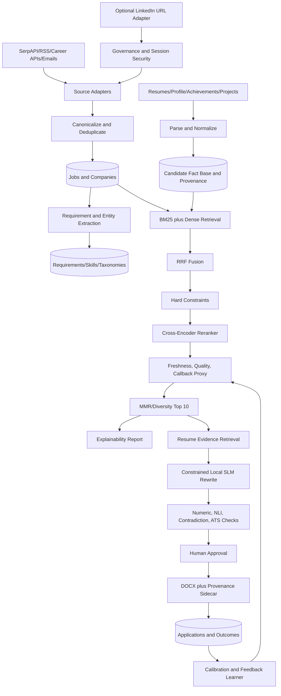
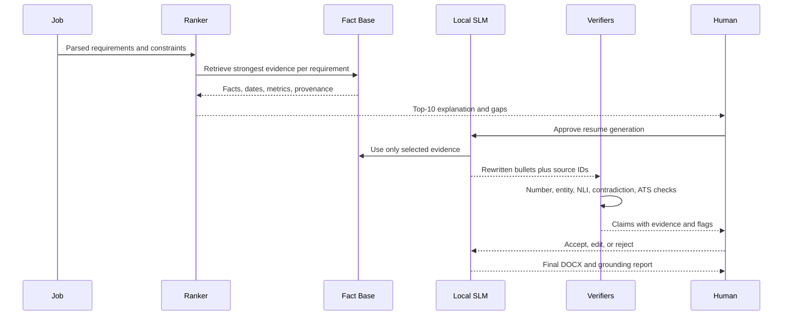

# Executive Summary

This report synthesizes eleven research tracks covering the existing `C:\ATS` RAG pipeline, all relevant files in that directory, ATS parsing, `joeyism/linkedin_scraper` v3.1.2, local small language models (SLMs), job matching and resume-tailoring algorithms, recruiter callback optimization, evaluation, target architecture, schemas, and production prompts.

**Current state:** The system is approximately 15-20% built. SerpAPI scraping, basic embeddings (`all-MiniLM-L6-v2`), SQL Server 2025 vector storage, Gemini analysis, and many DOCX-generation scripts exist. The highest-value missing capabilities are hybrid lexical/semantic retrieval, cross-encoder reranking, hard eligibility gates, deduplication and diversification, a provenance-backed resume fact base, claim verification, application outcome tracking, and a closed feedback loop.

Seven conflicts require resolution: inconsistent LLM names across documents; SerpAPI in code versus JSearch in architecture documents; unsafe vector insertion; `LLMAnalyzed` on the wrong table; referenced tables without DDL; an unsupported 60% cache-hit assumption; and incompatible cost estimates. The target architecture resolves these by making deterministic code authoritative, placing all model selection in configuration, introducing canonical schemas, and measuring rather than assuming operational metrics.

The recommended direction is a **single-user, fully local, zero-per-token-cost assistant** on Windows. Use Qwen3 for constrained generation, BGE-M3 or Nomic for embeddings, Qwen3-Reranker for reranking, and a compact DeBERTa NLI model for claim verification. Keep job acquisition modular: retain SerpAPI/RSS/company feeds as primary sources and treat `linkedin_scraper` as an optional, manually governed adapter because its search scraper is currently broken, authenticated automation conflicts with LinkedIn's terms, selectors are fragile, and session cookies are high-value credentials.

Three actions precede feature development: remove plaintext API keys, parameterize vector inserts, and protect any LinkedIn session state. Next, build the candidate fact base and outcome schema. Only then add hybrid ranking and grounded resume generation.

# Current RAG Architecture Review

## Implemented components

The complete `C:\ATS` inventory confirms these working or substantially implemented surfaces:[^2]

| Layer | Component | Evidence | Status |
|---|---|---|---|
| Ingestion | SerpAPI Google Jobs scraper and credit budgeting | `C:\ATS\google_jobs_scraper_beast_mode.py`, `smart_scheduler.py` | Implemented |
| Embedding | `all-MiniLM-L6-v2`, 384 dimensions, CPU | `RAG_JOB_SEARCH_ARCHITECTURE_REVIEW.md:248-349` | Implemented |
| Storage | SQL Server 2025 `VECTOR(384)` and `VECTOR_DISTANCE()` | `RAG_JOB_SEARCH_ARCHITECTURE_REVIEW.md:118-185` | Designed/partly implemented |
| Analysis | Gemini batch scoring and JSON output | `RAG_JOB_SEARCH_ARCHITECTURE_REVIEW.md:468-495` | Implemented |
| Resume output | More than 25 `python-docx` generation scripts | `C:\ATS\create_*.py` | Implemented |
| Validation | ATS format and keyword-density scripts | `ats_comprehensive_validator.py`, `keyword_density_analysis.py` | Implemented |
| Scheduling | Windows Task Scheduler workflow | Review document around line 833 | Implemented |

The directory also contains architecture diagrams, extension proposals, review documents, reports, generated resumes, job data exports, and utility scripts. Many documents describe a future state rather than executable behavior. The system should therefore maintain an explicit capability registry with `implemented`, `experimental`, and `proposed` states.

## Strengths

1. **Practical local data plane:** SQL Server vector support fits the user's database expertise and avoids a separate vector database during the MVP.
2. **Cost-aware ingestion:** SerpAPI credit budgeting and scheduled runs are suitable foundations for production operations.
3. **Existing output pipeline:** DOCX generation and ATS validation provide reusable last-mile components.
4. **Domain focus:** Existing prompts and documents recognize SQL Server, Azure SQL, Query Store, performance, reliability, Dataverse, and platform engineering signals.
5. **Batch orientation:** Daily ingestion and ranking match the user's top-10 workflow better than a chat-only interface.
6. **Extensible design documents:** The architecture already anticipates skills, gaps, matching, caching, and learning resources even though not all are implemented.

## Gaps, contradictions, and risks

| Finding | Severity | Resolution |
|---|---:|---|
| Vector inserted through an f-string containing serialized JSON | Critical | Parameterized SQL binding |
| API keys present in source files | Critical | Windows Credential Manager or environment-backed secret provider |
| MiniLM silently truncates long JDs around 512 tokens | Critical | Chunking plus BGE-M3/Nomic migration |
| `LLMAnalyzed` queried on `Jobs` but defined on `JobMatches` | High | Put processing state on `Jobs`; score state on `JobMatches` |
| No hard eligibility gate | High | Filter work authorization, location, employment type, salary before ranking |
| Pure dense retrieval | High | BM25 plus dense retrieval, RRF, then reranker |
| No reliable duplicate handling | High | Canonical URL, normalized hash, semantic duplicate cluster |
| Four referenced tables lack DDL | High | Canonical migration set and foreign keys |
| No application/outcome tables | High | Add applications, events, interactions, and outcomes |
| No fact-level provenance | High | Candidate fact base with source hashes and evidence links |
| No generated-claim verifier | High | Numeric checks, NLI, contradiction rules, and human approval |
| Model names differ across code/docs | Medium | One model registry/configuration file |
| Similarity score is fed into LLM fit scoring | Medium | Deterministic scoring; LLM explains but does not anchor the score |
| Cache and cost assumptions conflict | Medium | Instrument actual calls, latency, cache hits, and energy use |
| Dependency manifest is incomplete | Medium | Pin all runtime and model dependencies |
| No automated tests | Medium | Parser, schema, scoring, grounding, and golden-resume tests |

## Anti-pattern assessment

The current system exhibits blind vector similarity, no canonical skills taxonomy, weak required/preferred separation, no explicit distinction between resume facts and inferred capabilities, limited scoring explainability, no recruiter review layer, no genuine ATS parser simulation, no robust duplicate detection, incomplete freshness ranking, no company/role quality model, and no callback feedback loop. These are architecture gaps, not prompt problems.

# Research Findings: ATS, LinkedIn, Recruiter Search, and Job Matching

## Evidence labels

- **[FACT]** Publicly documented by a platform, source code, paper, model card, or official documentation.
- **[PRACTICE]** Common recruiter/engineering practice supported by multiple practitioner sources but not guaranteed across vendors.
- **[INFERENCE]** Reasonable approximation of proprietary systems.
- **[RECOMMENDATION]** Proposed design for this system.

## ATS parsing and screening

**[FACT]** Modern parsers generally perform document text extraction, section segmentation, named-entity extraction, and structured field mapping. Common entities include employers, titles, dates, education, skills, certifications, and contact details.[^3] ATS products vary substantially, so there is no universal score or guaranteed ranking formula.

| Concern | What systems commonly do | Design implication |
|---|---|---|
| Titles | Extract title near employer/date blocks; normalize against taxonomies | Use clear `Title | Employer | Location | Dates`; store raw and normalized titles |
| Dates | Calculate tenure and recency | Use `Month YYYY - Month YYYY`; avoid floating date columns |
| Skills | Index explicit skills and contextual mentions | Keep a skills section, but support each important skill in experience |
| Requirements | Apply knockout filters before textual relevance | Separate legal/disqualifier requirements from scored requirements |
| Keywords | Boolean, lexical, and semantic retrieval vary by product | Use natural exact terms plus normalized synonyms; avoid stuffing |
| Format | Tables, headers, columns, icons, and text boxes can parse inconsistently | Use a single-column DOCX with standard headings |
| Recency | Recent relevant experience is often easier for recruiters to trust | Weight evidence by recency without deleting older depth |

**[PRACTICE]** Recruiter searches commonly combine titles, skills, domain terms, location, experience, and Boolean operators. Recruiters scan recent roles, the top third, measurable impact, unexplained gaps, title inflation, and evidence that skills were actually used. A resume can be parser-friendly but recruiter-hostile if it is repetitive, stuffed with keywords, vague, or unnaturally mirrors the JD.

**[RECOMMENDATION]** Build two evaluators: a deterministic parseability/coverage checker and a recruiter-readability checker. Never ask the same generator to assign an authoritative ATS score to its own output.

## LinkedIn and job recommendations

**[FACT]** Public LinkedIn research and engineering material supports hybrid candidate/job representations, behavioral signals, and learning-to-rank concepts, but exact production weights are proprietary.[^6] Do not claim that profile completeness, clicks, applications, network proximity, or freshness have specific undocumented weights.

**[INFERENCE]** A practical local approximation combines:

1. hard constraints;
2. title/seniority normalization;
3. lexical skill and phrase matching;
4. dense semantic similarity;
5. cross-encoder relevance;
6. evidence strength and recency;
7. posting freshness;
8. source/company quality;
9. referral opportunity;
10. observed application outcomes.

## `joeyism/linkedin_scraper` review

The repository was reviewed at commit `b1cdc1c0e85bee8764d62565d229c682e5eb81bb`, version 3.1.2, Apache 2.0.[^4]

| Component | Finding | Integration decision |
|---|---|---|
| Runtime | Version 3 replaced Selenium with asynchronous Playwright | Isolate behind an adapter and pinned version |
| `JobScraper` | Individual job URL extraction is the most usable path | Optional manual import of saved URLs |
| `CompanyScraper` | Useful company metadata | Optional enrichment with caching |
| `CompanyPostsScraper` | Can retrieve company post signals | Low priority; not needed for MVP |
| `JobSearchScraper` | Test is skipped because the search selector is broken | Do not use for scheduled discovery |
| `PersonScraper` | Fragile and privacy-sensitive | Exclude from default product scope |
| Model mismatch | README fields do not fully match current `Job` model | Validate adapter output against local schema |
| Session state | Playwright storage state contains authentication cookies | Encrypt, restrict ACLs, never sync or log |
| Failure behavior | Selector changes can produce empty results | Assertions, extraction health metrics, dead-letter capture |

**[FACT]** LinkedIn's agreement restricts automated authenticated scraping; the `hiQ` litigation does not create a general safe harbor for authenticated automation.[^4] **[RECOMMENDATION]** Make this connector disabled by default, manually triggered, rate-limited, and limited to user-supplied job/company URLs. Do not bypass access controls, CAPTCHAs, or rate limits. Prefer company career APIs/RSS, email alerts, browser exports, or licensed job data.

## Fully local SLM stack

No per-token charges does not mean zero cost: there are hardware, electricity, maintenance, and latency costs. It does mean no cloud inference bill and keeps resume/job PII local.

| Hardware | Generator | Embedding | Reranker | Expected use |
|---|---|---|---|---|
| CPU, 16 GB RAM | Phi-4-mini Q4 or Qwen3-4B Q4 | Nomic Embed v1.5 | small BGE reranker | Parsing, light rewriting, slower batch |
| CPU, 32-64 GB | Qwen3-8B Q4 | BGE-M3 | Qwen3-Reranker 0.6B | Recommended CPU-first system |
| NVIDIA 8 GB | Qwen3-8B Q4 | BGE-M3 | Qwen3-Reranker 0.6B | Strong daily workflow |
| NVIDIA 12-16 GB | Qwen3-14B Q4 or Qwen3-8B higher quantization | BGE-M3 or Qwen3-Embedding-4B | Qwen3-Reranker 0.6B | Better critique and strategy |
| NVIDIA 24 GB | Qwen3-32B Q4 | Qwen3-Embedding-4B/8B | larger reranker if justified | Maximum local quality |

**[RECOMMENDATION]** Use Ollama on native Windows for simplicity; use `llama.cpp` directly when grammar constraints and tuning matter; use `infinity-emb` for embedding/reranking APIs; use vLLM in WSL2 only when throughput justifies operational complexity.[^5] Route simple extraction to Qwen3-4B, constrained rewriting to Qwen3-8B, complex weekly analysis to 14B where hardware permits, and claim verification to a deterministic NLI model rather than another generative model.

# Gaps in the Current System

1. **Candidate facts are monolithic.** Resume sections and bullets need first-class entities, source locations, hashes, dates, metrics, and confidence.
2. **Eligibility is not separated from relevance.** Work authorization, mandatory certifications, location, and salary are gates, not soft similarity signals.
3. **Required and preferred requirements are not reliably separated.**
4. **Skill depth and recency are absent.** A keyword appearing once is not equal to repeated recent production evidence.
5. **Title and seniority taxonomies are absent.**
6. **Dense retrieval can overvalue broad conceptual similarity and miss exact technical terms.**
7. **Current scoring can be circular and uncalibrated.**
8. **There is no recruiter-oriented quality layer.**
9. **Generated claims lack mandatory evidence and contradiction checks.**
10. **ATS validation is format/keyword oriented but not a parser round trip.**
11. **No outcome store exists, preventing model calibration or learning-to-rank.**
12. **Company quality, source reliability, ghost/stale posts, and referral opportunity are not modeled.**
13. **No systematic evaluation dataset exists.**
14. **Scraping credentials and personal data require stronger security controls.**
15. **Documents overstate future capabilities as if implemented.**

# Recommended Target Architecture





## Storage and indexes

- SQL Server remains the transactional source of truth.
- Store canonical entities and provenance relationally.
- Maintain separate logical retrieval indexes for candidate facts, achievements, skills/evidence, jobs/requirements, recruiter feedback, and outcomes.
- Use full-text/BM25-compatible retrieval outside SQL Server if SQL full-text ranking is insufficient; retain IDs in SQL.
- Store embeddings only for atomic chunks and meaningful aggregates, not just whole documents.
- Keep model version, embedding version, taxonomy version, parser version, and prompt version on every derived artifact.

## Service boundaries

| Service | Contract |
|---|---|
| Job ingestion | `ingest(source_payload) -> canonical_job_id, warnings` |
| Resume parser | `parse(document) -> sections, entities, source_spans` |
| Job parser | `parse(job_text) -> requirements, constraints, title, seniority` |
| Skill normalizer | `normalize(raw_skill) -> canonical_skill, aliases, confidence` |
| Matcher | `match(candidate_id, job_id) -> dimension scores and evidence` |
| Ranker | `rank(candidate_id, date) -> top jobs, explanations` |
| Resume generator | `generate(job_id, selected_fact_ids) -> draft and provenance` |
| Claim verifier | `verify(draft, fact_ids) -> claim verdicts` |
| ATS simulator | `evaluate(docx, requirements) -> parseability and coverage` |
| Readability scorer | `score(resume_text) -> scan/readability findings` |
| Tracker | `record(application/event/interaction)` |
| Feedback learner | `calibrate(outcomes, model_version) -> weights and report` |

# Daily Top-10 Job Matching Algorithm

1. Collect jobs from approved source adapters.
2. Canonicalize URL, company, title, location, and description.
3. Remove exact duplicates using normalized fingerprints.
4. Cluster near duplicates by company, normalized title, location, description similarity, and posting window.
5. Parse required, preferred, legal, and disqualifying requirements.
6. Normalize skills, title, seniority, domain, work mode, and location.
7. Apply hard gates where facts are known. Treat unknown sponsorship as unknown, not false.
8. Retrieve candidates through BM25 and dense search.
9. Fuse ranks with RRF.
10. Cross-encode the top candidates.
11. Compute structured fit dimensions from candidate evidence.
12. Penalize missing mandatory requirements and weak/old evidence.
13. Add freshness, company/source quality, career strategy, and referral opportunity.
14. Estimate callback probability only as a labeled proxy until sufficient outcomes exist.
15. Diversify using MMR and constraints such as maximum two jobs per company.
16. Produce top 10 with evidence, gaps, confidence, and action: apply, seek referral, save, or skip.

## Hard-gate policy

Use three-valued logic:

- `pass`: known compliant;
- `fail`: known disqualifier;
- `unknown`: retain with penalty and explicit verification task.

Never eliminate a job because sponsorship, salary, or remote policy is missing from the posting. Eliminate only when a mandatory conflict is explicit or user policy says unknown is unacceptable.

## Explanation payload

```json
{
  "job_id": 123,
  "rank": 2,
  "decision": "APPLY",
  "callback_band": "MEDIUM",
  "top_reasons": ["Azure SQL reliability evidence", "seniority fit", "posted 18 hours ago"],
  "requirements": {
    "covered": [{"requirement_id": 9, "fact_ids": [41, 77]}],
    "partial": [{"requirement_id": 12, "reason": "related evidence only"}],
    "missing": [{"requirement_id": 15, "mandatory": false}]
  },
  "risks": ["sponsorship not stated"],
  "resume_strategy": "Lead with Azure SQL reliability, Query Store, and incident/RCA impact",
  "score_version": "ranker-1.0"
}
```

# Resume Tailoring and ATS Optimization Engine

## Truthful fact-base rule

Every generated sentence must cite one or more immutable `ResumeFact` or `Achievement` IDs. Every source entity stores source document, section/span, original text, dates, confidence, and a content hash. Inferred capabilities are separate objects and cannot be emitted as experience claims.

## Generation flow

1. Extract requirements into mandatory/preferred/context/legal classes.
2. Retrieve candidate facts for each requirement.
3. Mark each requirement covered, partial, unsupported, or conflicting.
4. Select bullets using relevance, impact, recency, seniority, and diversity.
5. Reorder sections and bullets without altering chronology.
6. Rewrite only with allowed facts and entities.
7. Check every number, date, employer, title, technology, and certification against sources.
8. Run NLI entailment and contradiction checks.
9. Run ATS structural checks and a parser round trip.
10. Run keyword coverage and repetition checks.
11. Run recruiter readability checks.
12. Present source evidence for human approval.
13. Generate single-column DOCX and a provenance/coverage JSON report.

## Output package

- targeted professional summary;
- aligned skills section containing only supported skills;
- reordered and constrained experience bullets;
- optional projects where evidence is stronger than work-history evidence;
- supported impact metrics;
- missing-skill strategy;
- requirement and keyword coverage report;
- readability report;
- truthfulness/grounding report;
- source IDs for every changed sentence.

## Missing-skill handling

Do not imply possession. Use one of:

1. omit unsupported optional skill;
2. state adjacent transferable experience truthfully;
3. add a project only after the user actually completes and documents it;
4. recommend learning before application;
5. skip the role when the requirement is mandatory and central.

## Twenty algorithms

| # | Algorithm / status | Purpose and I/O | Suggested implementation | Pros / cons | Failure modes and validation |
|---:|---|---|---|---|---|
| 1 | BM25 / Required | Exact lexical retrieval; candidate/job text -> ranked IDs | Field boosts for titles, skills, requirements | Strong acronyms; weak paraphrases | Tokenization/title bias; validate P@K and acronym set |
| 2 | Dense similarity / Required | Semantic recall; chunks -> vectors/scores | BGE-M3 or Nomic; atomic chunks | Handles paraphrase; can blur hard requirements | Long-text dilution; evaluate domain hard negatives |
| 3 | Hybrid retrieval / Required | Combine lexical and dense candidates | Parallel BM25+dense | Better recall; more operations | Score incompatibility; compare ablations |
| 4 | RRF / Required | Rank fusion; rank lists -> fused rank | `sum(1/(60+rank))` | Robust, simple; discards score magnitude | Duplicate domination; test NDCG against each retriever |
| 5 | Cross-encoder reranking / Required | Precise pair relevance | Qwen3-Reranker 0.6B on top 100 | Strong precision; slower | Domain calibration; human-labeled reranking test |
| 6 | Skill graph matching / Optional | Related/transferable skills | ESCO/O*NET plus curated DBA edges | Explainable adjacency; taxonomy maintenance | False equivalence; expert-review edges |
| 7 | Requirement classifier / Required | MUST/PREFERRED/LEGAL/DISQUALIFIER | Rules first, Qwen3-4B for ambiguity | Enables gates; language ambiguity | "preferred" buried in prose; labeled F1 |
| 8 | Seniority classifier / Required | Normalize level and responsibility | Title rules plus responsibility evidence | Avoids role-level mismatch | Title inflation; validate on manually labeled jobs |
| 9 | Title normalization / Required | Map raw titles to canonical role families | Alias table plus embeddings/taxonomy | Supports matching; loses niche nuance | Architect/engineer ambiguity; confusion matrix |
| 10 | Entity extraction / Required | Extract skills, dates, employers, metrics | spaCy/rules plus local SLM repair | Structured facts; parser errors propagate | Date/entity swaps; span-level precision/recall |
| 11 | Duplicate detection / Required | Collapse same posting | URL/hash plus semantic clustering | Cleaner top 10; may merge distinct roles | Requisitions with similar text; pairwise labeled set |
| 12 | Job clustering / Optional | Organize similar opportunities | HDBSCAN/agglomerative over embeddings and metadata | Diversity/analytics; unstable clusters | Parameter sensitivity; silhouette plus human review |
| 13 | Multi-objective ranking / Required | Optimize fit, strategy, freshness, outcomes | Weighted score with gates | Explainable; weights subjective | Proxy domination; sensitivity analysis |
| 14 | Learning-to-rank / Future | Learn ordering from outcomes/preferences | LambdaMART after enough labels | Captures interactions; bias/overfit | Selection bias and sparse positives; temporal holdout |
| 15 | Outcome feedback scoring / Required later | Calibrate weights and bands | Logistic regression, IPTW, isotonic/Platt | Measurable improvement; delayed labels | No-response censoring; Brier/ECE and time split |
| 16 | Resume bullet selection / Required | Choose strongest supported bullets | Weighted relevance/impact/recency/diversity | Better scanability; may omit strategic depth | Metrics overweighted; recruiter review and ablation |
| 17 | Resume gap detection / Required | Identify unsupported requirements | Exact/semantic evidence thresholds plus rules | Prevents false claims; threshold sensitive | Adjacent skill mistaken for direct skill; expert test set |
| 18 | ATS parse simulation / Required | Validate structural extraction | DOCX-to-text parser, section/date/entity assertions | Deterministic; not vendor-identical | False confidence; test multiple parsers/manual inspection |
| 19 | Recruiter readability / Required | Improve human scan quality | length, repetition, top-third, grade, action-impact checks | Human-focused; heuristics can oversimplify | Gaming readability; blinded recruiter review |
| 20 | Callback probability / Future | Estimate response likelihood | Regularized logistic model after >=100 outcomes; calibrate later | Prioritizes effort; biased personal sample | Sparse data/proxies/drift; Brier, ECE, temporal tests |

# Recruiter Callback Optimization Strategy

## What the system should automate

- source consolidation, freshness, duplicate detection;
- hard-requirement and evidence mapping;
- resume fact retrieval, ordering, and first draft;
- deterministic validation and unsupported-claim flags;
- recruiter/company context summaries;
- draft outreach and follow-up reminders;
- application/outcome tracking;
- weekly analysis by source, role, score band, timing, resume version, and referral.

## What remains human-reviewed

- whether to use LinkedIn automation;
- final interpretation of ambiguous requirements;
- every resume claim and any new metric;
- recruiter messages;
- application submission and knockout answers;
- referrals and personal introductions;
- model/weight changes that materially alter targeting.

## Strategy

1. Apply selectively to roles passing mandatory gates with strong recent evidence.
2. Prefer exact or adjacent title/seniority matches.
3. Lead the top third with role identity, domain, and three strongest evidence themes.
4. Apply early when a quality tailored application is ready; do not sacrifice quality solely for speed.
5. Prefer direct company applications where practical.
6. Seek referrals for high-value roles; do not treat network proximity as merit.
7. Generate concise outreach grounded in a genuine role/company connection.
8. Follow up once after roughly five business days unless instructed otherwise.
9. Align LinkedIn and resume facts; do not create contradictory titles/dates.
10. Track no response as censored until a defined observation window closes.

## Feedback loop

Store the job, source, score components, posting age, resume variant, application date, referral status, interaction history, callback, interview stages, rejection, offer, and user decision. Use a 21-30 day no-response window. Begin with descriptive analytics. Fit a regularized callback model only after at least 100 labeled outcomes, calibrate after roughly 200, and consider learning-to-rank only with a much larger, less biased dataset.[^7]

# Data Model and Schema Design

## Core relational entities

| Entity | Important fields |
|---|---|
| CandidateProfile | preferences, locations, work authorization, salary floor, career direction |
| ResumeFact | source span, normalized text, dates, fact type, confidence, hash |
| Achievement | action, context, impact, supported metrics, evidence IDs |
| Skill | canonical name, aliases, taxonomy IDs, category |
| SkillEvidence | skill ID, fact/project ID, depth, recency, evidence level |
| Project | dates, role, technology, outcomes, evidence |
| Employer / Role | canonical organization, title, dates, seniority |
| JobDescription | source, URL, raw/clean text, posting date, status, hashes |
| JobRequirement | class, skill/title/domain, minimum years, confidence |
| Company | industry, size, locations, source quality, sponsorship evidence |
| Recruiter | minimal contact metadata and consent/source |
| JobScore | score dimensions, penalties, model/version, explanation |
| ResumeVariant | job ID, content hash, source fact IDs, scores, approval |
| Application | job/resume/source/referral/date/status |
| RecruiterInteraction | channel, direction, date, content reference |
| Outcome | callback/interview/rejection/offer/no-response window |
| FeedbackSignal | accept/skip/save/edit/reason and model context |

## Compact DDL

```sql
CREATE TABLE dbo.ResumeFact (
  FactID bigint IDENTITY PRIMARY KEY,
  CandidateID bigint NOT NULL,
  FactType varchar(40) NOT NULL,
  OriginalText nvarchar(2000) NOT NULL,
  NormalizedText nvarchar(2000) NULL,
  SourceDocument nvarchar(500) NOT NULL,
  SourceSection nvarchar(200) NULL,
  SourceStart int NULL, SourceEnd int NULL,
  StartDate date NULL, EndDate date NULL,
  Confidence decimal(5,4) NOT NULL,
  ContentHash binary(32) NOT NULL UNIQUE,
  EmbeddingVersion varchar(50) NULL,
  CreatedAt datetime2 NOT NULL DEFAULT sysutcdatetime()
);

CREATE TABLE dbo.JobDescription (
  JobID bigint IDENTITY PRIMARY KEY,
  Source varchar(50) NOT NULL,
  SourceJobID nvarchar(200) NULL,
  CanonicalURL nvarchar(1000) NULL,
  RawTitle nvarchar(300) NOT NULL,
  NormalizedTitle nvarchar(300) NULL,
  CompanyName nvarchar(300) NULL,
  LocationText nvarchar(300) NULL,
  Seniority varchar(40) NULL,
  RawText nvarchar(max) NOT NULL,
  CleanText nvarchar(max) NOT NULL,
  PostedAt datetime2 NULL,
  IngestedAt datetime2 NOT NULL DEFAULT sysutcdatetime(),
  ExactHash binary(32) NOT NULL,
  DuplicateClusterID bigint NULL,
  ParserVersion varchar(50) NOT NULL,
  CONSTRAINT UQ_Job_Source UNIQUE(Source, SourceJobID)
);

CREATE TABLE dbo.JobRequirement (
  RequirementID bigint IDENTITY PRIMARY KEY,
  JobID bigint NOT NULL REFERENCES dbo.JobDescription(JobID),
  RequirementText nvarchar(1500) NOT NULL,
  RequirementClass varchar(30) NOT NULL,
  CanonicalSkillID bigint NULL,
  MinimumYears decimal(4,1) NULL,
  IsMandatory bit NOT NULL,
  Confidence decimal(5,4) NOT NULL
);

CREATE TABLE dbo.JobScore (
  JobScoreID bigint IDENTITY PRIMARY KEY,
  JobID bigint NOT NULL REFERENCES dbo.JobDescription(JobID),
  CandidateID bigint NOT NULL,
  RequiredCoverage decimal(6,5) NOT NULL,
  PreferredCoverage decimal(6,5) NOT NULL,
  SeniorityFit decimal(6,5) NOT NULL,
  TitleFit decimal(6,5) NOT NULL,
  DomainFit decimal(6,5) NOT NULL,
  EvidenceStrength decimal(6,5) NOT NULL,
  Freshness decimal(6,5) NOT NULL,
  CallbackEstimate decimal(6,5) NULL,
  Penalties decimal(6,5) NOT NULL,
  FinalScore decimal(6,5) NOT NULL,
  ScoreVersion varchar(50) NOT NULL,
  ExplanationJSON nvarchar(max) NOT NULL,
  ScoredAt datetime2 NOT NULL DEFAULT sysutcdatetime()
);

CREATE TABLE dbo.ResumeVariant (
  ResumeVariantID bigint IDENTITY PRIMARY KEY,
  CandidateID bigint NOT NULL,
  JobID bigint NOT NULL REFERENCES dbo.JobDescription(JobID),
  ContentHash binary(32) NOT NULL,
  GeneratorVersion varchar(50) NOT NULL,
  ProvenanceJSON nvarchar(max) NOT NULL,
  ATSScore decimal(6,2) NULL,
  ReadabilityScore decimal(6,2) NULL,
  UnsupportedClaimCount int NOT NULL DEFAULT 0,
  ApprovedAt datetime2 NULL
);

CREATE TABLE dbo.Application (
  ApplicationID bigint IDENTITY PRIMARY KEY,
  JobID bigint NOT NULL REFERENCES dbo.JobDescription(JobID),
  ResumeVariantID bigint NOT NULL REFERENCES dbo.ResumeVariant(ResumeVariantID),
  AppliedAt datetime2 NOT NULL,
  Source varchar(50) NOT NULL,
  ReferralPresent bit NOT NULL,
  PostingAgeHours decimal(10,2) NULL,
  ScoreAtApplication decimal(6,5) NOT NULL,
  Status varchar(40) NOT NULL
);

CREATE TABLE dbo.Outcome (
  OutcomeID bigint IDENTITY PRIMARY KEY,
  ApplicationID bigint NOT NULL REFERENCES dbo.Application(ApplicationID),
  OutcomeType varchar(40) NOT NULL,
  OccurredAt datetime2 NOT NULL,
  Feedback nvarchar(max) NULL
);
```

Add indexes on job posted date/status/title/location, requirement class/skill, score candidate/date/final score, fact candidate/type/dates, and application date/status. Encrypt contact/PII columns at the application layer, apply restrictive NTFS ACLs, and define retention for raw emails/session data.

# Ranking and Scoring Formula

## Structured fit

All components are normalized to `[0,1]`.

```text
Positive =
  0.25 RequiredSkillCoverage
+ 0.08 PreferredSkillCoverage
+ 0.08 SeniorityFit
+ 0.08 TitleFit
+ 0.10 DomainFit
+ 0.10 EvidenceStrength
+ 0.05 TechnologyStackFit
+ 0.04 CareerDirectionFit
+ 0.04 LocationCompensationFit
+ 0.04 CompanyQuality
+ 0.05 Freshness
+ 0.03 ReferralOpportunity
+ 0.06 CallbackProxy

Penalty =
  0.30 MissingMandatorySkillPenalty
+ 0.08 ApplicationCompetitionPenalty
+ 0.10 EligibilityUncertaintyPenalty
+ 1.00 ExplicitDisqualifierPenalty
+ 1.00 AlreadyAppliedPenalty
+ 0.50 DuplicatePenalty

FinalScore = 100 * clamp(Positive - Penalty, 0, 1)
```

Initial weights are recommendations, not facts. Run sensitivity analysis and calibrate from outcomes. Missing mandatory requirements should also trigger an action policy:

- central mandatory gap: skip;
- ambiguous mandatory gap: human review;
- learnable noncentral gap: save/learn;
- preferred gap: retain with explanation.

## Evidence strength

```text
EvidenceStrength(requirement) =
  max over linked evidence:
  0.35 directness
+ 0.25 depth
+ 0.20 recency
+ 0.10 quantified impact
+ 0.10 source confidence
```

## Retrieval/ranking

1. BM25 top 300.
2. Dense top 300.
3. RRF with `k=60`.
4. Cross-encoder rerank top 100.
5. Structured fit and penalties.
6. MMR top 25 to final 10, with maximum-per-company and role-family constraints.

## Callback probability bands

Before calibration, label bands as heuristic:

- High: strong mandatory coverage, evidence, eligibility, recency, and title fit;
- Medium: good fit with one uncertainty or weaker evidence;
- Low: substantial gap or unverified eligibility.

After enough data, use calibrated probability ranges and display confidence intervals. Do not show precise percentages from an uncalibrated model.

# RAG Improvements

1. Chunk resume by fact, bullet, project, achievement, and role context rather than arbitrary token windows.
2. Chunk JDs by requirement groups and sections while retaining a whole-document representation.
3. Store raw and normalized entities in metadata.
4. Maintain independent indexes for facts, achievements, skills/evidence, jobs/requirements, feedback, and application history.
5. Use BM25 and dense retrieval together.
6. Expand queries through a versioned title/skill/domain taxonomy.
7. Rerank with a cross-encoder.
8. Retrieve only evidence allowed for the requested resume section.
9. Require citations from generated bullets to facts.
10. Detect hallucinations through entity/number allowlists and NLI.
11. Verify titles, dates, companies, tools, metrics, and certifications.
12. Retrieve skill evidence rather than skill names alone.
13. Distinguish missing, adjacent, partial, and conflicting evidence.
14. Add outcome-aware calibration only after sufficient labels.
15. Version and evaluate every parser, taxonomy, model, prompt, and score.

# Evaluation Metrics

## Job recommendation

| Metric | Initial gate |
|---|---:|
| Precision@10 | >= 0.60 on a human-labeled set |
| NDCG@10 | >= 0.55 |
| Duplicate rate in top 10 | 0 |
| Explicit mandatory mismatch rate | < 5% |
| Unknown eligibility rate | Measured and shown, not hidden |
| User apply/save acceptance | Track by score band |
| Recall of manually identified high-fit jobs | >= 0.80 on curated test days |

## Resume tailoring

| Metric | Gate |
|---|---:|
| DOCX parse success | >= 98% in selected parser suite |
| Mandatory keyword coverage when supported | >= 80% |
| Unsupported claim count | 0 before export |
| Contradicted claim count | 0 |
| Bullet source coverage | 100% |
| Human relevance score | >= 4/5 |
| Recruiter readability | >= 4/5 blinded review |
| Dates/titles/employers preserved | 100% |

## Outcomes

- callback and interview rate by score band;
- time-to-response;
- source performance;
- resume variant performance;
- referral conversion;
- application timing performance;
- calibration Brier score and expected calibration error;
- subgroup/geography disparity;
- user edits and rejected generated bullets.

## Evaluation design

Create a versioned benchmark containing at least 200 jobs with labels for eligibility, requirements, relevance, duplicates, and recommendation grade. Create adversarial resume tests with unsupported metrics, adjacent skills, title/date contradictions, and keyword stuffing. Use temporal train/test splits for outcomes. Measure inter-rater agreement. Never tune and report on the same set.

# Implementation Roadmap

## Phase 1: MVP and security

- remove secrets and parameterize SQL;
- finish dependency manifest and migrations;
- inventory candidate facts with provenance;
- canonical job/requirement schema;
- hard constraints and exact deduplication;
- deterministic scoring and explanations;
- application/outcome tracking;
- local Qwen3 and embedding runtime smoke tests.

## Phase 2: Better ranking and tailoring

- BGE-M3/Nomic migration;
- BM25+dense retrieval and RRF;
- cross-encoder reranking;
- title/seniority/skill taxonomy;
- near-duplicate clusters and MMR;
- evidence-backed bullet selection;
- ATS parser round trip and readability checks.

## Phase 3: Feedback and analytics

- dashboards by source, role, geography, score band, and resume version;
- callback/interview/no-response windows;
- user accept/skip/edit feedback;
- model/prompt/version telemetry;
- weekly gap and targeting report.

## Phase 4: Learning-to-rank and callback model

- regularized logistic callback model after enough outcomes;
- calibration and drift reports;
- propensity/selection-bias analysis;
- evaluate LambdaMART only when labels justify complexity;
- guarded A/B tests of bullet selection or ordering, never truthfulness.

## Phase 5: Full assistant

- governed source connectors;
- recruiter interaction workflows;
- referral suggestions;
- calendar/reminder integration;
- portfolio/project evidence alignment;
- richer local model routing;
- approval-centered UI;
- no automatic job submission.

# Prompt Library

All prompts use structured JSON and conservative failure behavior. Grammar-constrained decoding is preferred where supported.

## 1. Job parsing

```text
SYSTEM: Extract only facts present in JOB_TEXT. Return valid JSON.
OUTPUT: title, company, location, work_mode, employment_type, salary,
posted_date, seniority, responsibilities, qualifications.
For missing fields use null. Include source_span for each value.
Never infer sponsorship or salary.
```

## 2. Requirement extraction

```text
Classify each statement as MUST_HAVE, PREFERRED, LEGAL, DISQUALIFIER,
RESPONSIBILITY, or CONTEXT. Return text, normalized entity, minimum years,
confidence, and source span. "Preferred" must not become mandatory.
If ambiguous, set AMBIGUOUS and explain briefly.
```

## 3. Resume fact retrieval

```text
Given REQUIREMENT and CANDIDATE_FACTS, return only fact IDs that directly or
partially support it. Label DIRECT, PARTIAL, ADJACENT, or NONE.
Do not infer experience from a skill name. Quote the supporting source text.
```

## 4. Resume tailoring

```text
Create a section plan using only APPROVED_FACT_IDS. Preserve employers, titles,
dates, chronology, and seniority. Prioritize direct recent evidence and impact.
Return selected fact IDs per section and excluded facts with reasons.
Do not draft unsupported content.
```

## 5. Bullet rewriting

```text
Rewrite SOURCE_BULLET for REQUIREMENT.
Rules: add no company, title, date, technology, responsibility, or metric;
all numbers and named entities must appear in source; <=25 words; active voice;
preserve meaning. Return bullet and source_fact_ids only.
```

## 6. ATS critique

```text
Audit parsed resume text and structure. Report standard sections, date parsing,
title/employer association, supported mandatory keyword coverage, repetition,
tables/columns/headers, and missing fields. Do not claim vendor-specific score.
```

## 7. Recruiter critique

```text
Act as a skeptical recruiter for TARGET_ROLE. Evaluate top-third clarity,
seniority, recent relevance, evidence, impact, repetition, jargon, and naturalness.
Return severity-ranked fixes. Flag content that appears copied from the JD.
```

## 8. Unsupported claim detection

```text
For each DRAFT_SENTENCE, compare cited facts. Return ENTAILED, PARTIAL,
UNSUPPORTED, or CONTRADICTED; list unsupported spans and entity/number mismatches.
When uncertain choose PARTIAL or UNSUPPORTED. Never repair the claim.
```

## 9. Top-10 explanation

```text
Explain ranking using supplied score dimensions only. List covered, partial,
missing, and unknown requirements with fact IDs. Recommend APPLY, REFERRAL,
SAVE, or SKIP. State confidence and the largest uncertainty.
```

## 10. Callback optimization

```text
Using JOB, SCORE, COMPANY, NETWORK, and APPLICATION_HISTORY, recommend timing,
source, referral/outreach, resume emphasis, and one follow-up. Do not invent
contacts or claim causal certainty. Separate evidence, heuristic, and experiment.
```

# Risks, Failure Modes, and Guardrails

| Risk | Guardrail |
|---|---|
| Fabricated resume claim | Fact allowlist, provenance, number/entity checks, NLI, human approval |
| Keyword stuffing | Density/repetition checks and recruiter readability review |
| ATS mythology | Label facts/practice/inference; no universal ATS score |
| False mandatory classification | Confidence and human review for ambiguous requirements |
| Adjacent skill represented as direct | Evidence relationship types and strict prompt |
| Stale/ghost/duplicate jobs | freshness, source quality, status checks, clustering |
| Overweighting network proximity | use only as action suggestion; fairness audits |
| Selection bias in outcomes | track skipped jobs/preferences, propensity analysis, temporal tests |
| Model drift | versioning, golden sets, regression gates |
| Local SLM schema errors | grammar constraints, JSON schema validation, deterministic fallback |
| Personal-data exposure | local inference, encryption, ACLs, redacted logs, retention |
| Scraper account risk | disabled-by-default LinkedIn adapter; no bypassing controls |
| Silent selector breakage | extraction assertions and monitoring |
| Automatic application harm | human approval and no auto-submit |

# Self-Challenge

1. Public ATS information does not reveal every vendor's ranking internals. The system should optimize parseability and evidence, not a mythical universal score.
2. Commercial resume vendors publish many callback and rejection statistics. Their direction may be useful, but magnitudes are uncertain.
3. Fresh applications may correlate with better employers, active recruiters, or stronger applicants. Freshness is useful but not proven causal.
4. A local 4B/8B model may underperform a large cloud model on ambiguous requirements or nuanced writing. Deterministic structure, routing, and human review are essential.
5. NLI trained on general-language datasets may misjudge SQL Server and database terminology. Build a domain-specific validation set before relying on thresholds.
6. Callback labels reflect employer behavior, labor market conditions, geography, work authorization, and selection policy—not pure candidate quality.
7. A single user's outcomes are sparse. Complex learning-to-rank can overfit; transparent weighted scoring may remain superior for a long time.
8. Company quality and application competition are difficult to observe and can become noisy proxies.
9. Resume tailoring can become unnatural if every phrase mirrors the JD. The recruiter critic must explicitly penalize copied language and repetition.
10. The most important bottleneck may be eligibility or market selection, not resume wording. The system must report structural constraints honestly.

# Final Top 10 Engineering Recommendations

1. **Remove plaintext credentials and parameterize every database write.**
2. **Create the canonical candidate fact base with immutable provenance before generating another tailored bullet.**
3. **Implement eligibility and mandatory-requirement gates before semantic ranking.**
4. **Add canonical job, requirement, score, application, interaction, and outcome schemas.**
5. **Replace monolithic MiniLM vectors with chunked BGE-M3/Nomic embeddings.**
6. **Implement BM25+dense retrieval, RRF, and a compact cross-encoder reranker.**
7. **Add exact/near duplicate handling, freshness, and MMR top-10 diversification.**
8. **Move Gemini tasks to local Qwen3 routing and enforce JSON schemas.**
9. **Make claim verification and per-bullet human approval mandatory.**
10. **Measure real outcomes and calibrate transparent scores before adopting learning-to-rank.**

# Confidence Assessment

| Area | Confidence | Basis |
|---|---|---|
| Current architecture and file gaps | High | Direct review of architecture documents and directory inventory |
| `linkedin_scraper` behavior | High | Repository source/tests at a verified commit |
| Local model specifications | High | Official model cards and runtime documentation |
| Retrieval/ranking algorithms | High | Established papers and public implementations |
| ATS parsing mechanics | Medium-high | Official APIs/docs, papers, and practitioner evidence |
| Recruiter search behavior | Medium | Practitioner studies and common practice |
| Callback uplift magnitudes | Low-medium | Often commercial or observational sources |
| Freshness effect size | Medium-low | Useful correlation, uncertain causality |
| Cold-start callback weights | Low-medium | Engineering heuristic pending personal outcomes |
| NLI threshold on database resumes | Medium | Must be calibrated on domain-specific examples |

Assumptions: user hardware is unknown; work-authorization and location preferences must be configured rather than inferred; source availability and terms can change; the current directory contains proposals not yet reflected in executable code. All initial ranking weights are starting hypotheses and must be calibrated.

# Footnotes

[^1]: `C:\ATS\RAG_Architecture.html` and `C:\ATS\RAG_JOB_SEARCH_ARCHITECTURE_REVIEW.md`, reviewed in research artifact `1785478520288-copilot-tool-output-d01de1.txt`.
[^2]: Complete `C:\ATS` inventory and implemented-versus-proposed assessment in research artifact `1785479103952-copilot-tool-output-d905d2.txt`.
[^3]: ATS research artifact `1785500758863-copilot-tool-output-23734c.txt`, drawing on Greenhouse Harvest API documentation, Jobscan recruiter research, O*NET, Lightcast Open Skills, and cited resume-parsing papers. Vendor behavior varies.
[^4]: [`joeyism/linkedin_scraper`](https://github.com/joeyism/linkedin_scraper) at commit `b1cdc1c0e85bee8764d62565d229c682e5eb81bb`; detailed source review in artifact `1785505643850-copilot-tool-output-6dfd4f.txt`.
[^5]: Local-model research artifact `1785507811564-copilot-tool-output-8f10ea.txt`, citing official Qwen3, BGE-M3, Nomic Embed, Qwen3-Reranker, Ollama, llama.cpp, and vLLM documentation/model cards.
[^6]: Matching research artifact `1785508563805-copilot-tool-output-9a8b5a.txt`, including Robertson and Zaragoza on BM25, Cormack et al. on RRF, Reimers and Gurevych on SBERT, public LinkedIn engineering material, ESCO/O*NET, and HRGraph.
[^7]: Callback and feedback research artifact `1785510016608-copilot-tool-output-b0b669.txt`; many uplift estimates are observational or commercial and are treated as lower-confidence evidence.
[^8]: Grounded resume-generation and algorithm research artifact `1785509342962-copilot-tool-output-a66efa.txt`, including hallucination detection, resume matching, NER, constrained decoding, and readability sources.
[^9]: Integrated target architecture artifact `1785510711636-copilot-tool-output-bb515e.txt`.
[^10]: Schema, API, and prompt design artifact `1785511674347-copilot-tool-output-ca01e0.txt`.
[^11]: Adversarial risk and evaluation review artifact `1785512335997-copilot-tool-output-d41a71.txt`.


